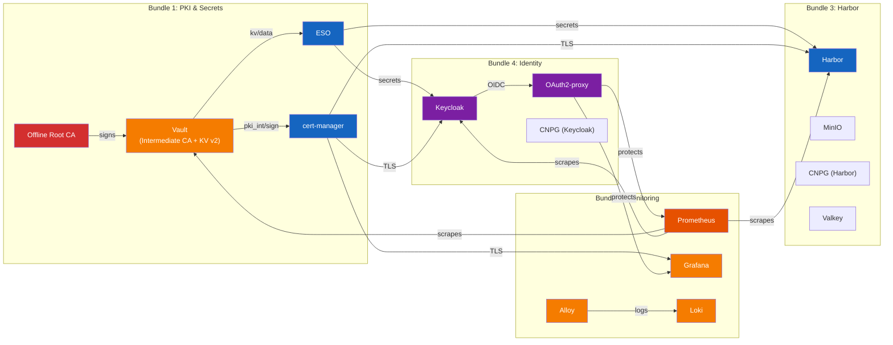

# harvester-rke2-svcs

[](https://github.com/<GITHUB_ORG>/harvester-rke2-svcs/actions/workflows/ci.yml) [](LICENSE)

Platform services for RKE2 clusters. Deploys four service bundles covering
PKI/secrets management, monitoring, container registry, and identity/SSO --
providing a complete foundation for production workloads.

## Architecture



See [docs/architecture.md](docs/architecture.md) for detailed diagrams
covering the PKI hierarchy, deployment phases, and data flows.

## Quick Start

**Prerequisites:** `kubectl`, `helm`, `jq`, `openssl`, `htpasswd`, and
cluster-admin access to an RKE2 cluster.

```bash
# 1. Generate a Root CA (once)
cd services/pki
./generate-ca.sh root -o "My Organization" -d roots/
cd ../..

# 2. Configure environment
cp scripts/.env.example scripts/.env
# Edit scripts/.env: set DOMAIN, ROOT_CA_KEY, passwords

# 3. Deploy Bundle 1 -- PKI & Secrets
./scripts/deploy-pki-secrets.sh

# 4. Deploy Bundle 2 -- Monitoring
./scripts/deploy-monitoring.sh

# 5. Deploy Bundle 3 -- Harbor
./scripts/deploy-harbor.sh

# 6. Deploy Bundle 4 -- Identity (Keycloak + OAuth2-proxy)
./scripts/deploy-keycloak.sh
./scripts/setup-keycloak.sh    # Realm, OIDC clients, groups (post-deploy)
```

Each deploy script runs ordered, idempotent phases. See
[docs/getting-started.md](docs/getting-started.md) for the full step-by-step
guide including verification and troubleshooting.

## Service Bundles

| Bundle | Services | Status |
|--------|----------|--------|
| PKI & Secrets | Vault, cert-manager, ESO, PKI tooling | Active |
| Monitoring | Prometheus, Grafana, Alertmanager, Loki, Alloy | Active |
| Harbor | Harbor registry, MinIO, CNPG PostgreSQL, Valkey Sentinel | Active |
| Identity | Keycloak, OAuth2-proxy, CNPG PostgreSQL | Active |

## Structure

```
services/                    # One directory per service (Kustomize + Helm values)
  pki/                       # Offline Root CA generation tooling
  vault/                     # 3-replica HA Vault with Raft storage
  cert-manager/              # ClusterIssuer + RBAC for Vault PKI
  external-secrets/          # ESO controller configuration
  monitoring-stack/          # Prometheus, Grafana, Alertmanager, Loki, Alloy
    helm/                    # kube-prometheus-stack Helm values + scrape configs
    loki/                    # Loki StatefulSet (single-binary mode)
    alloy/                   # Grafana Alloy DaemonSet (log collection)
    grafana/                 # Dashboards, Gateway, HTTPRoute
    prometheus/              # Gateway, HTTPRoute, basic-auth middleware
    alertmanager/            # Gateway, HTTPRoute, basic-auth middleware
    prometheus-rules/        # PrometheusRules (alerts)
    service-monitors/        # ServiceMonitors (scrape targets)
  harbor/                    # Harbor container registry
    minio/                   # MinIO object storage (S3 backend)
    postgres/                # CNPG PostgreSQL HA cluster
    valkey/                  # Valkey Redis Sentinel (cache/session)
    monitoring/              # Dashboards, alerts, ServiceMonitors
  keycloak/                  # Keycloak identity provider
    keycloak/                # Deployment, services, HPA, RBAC
    postgres/                # CNPG PostgreSQL HA cluster
    oauth2-proxy/            # OAuth2-proxy instances + middleware
    monitoring/              # Dashboards, alerts, ServiceMonitors
scripts/                     # Deploy scripts and utility modules
  deploy-pki-secrets.sh      # Bundle 1 orchestrator (7 phases)
  deploy-monitoring.sh       # Bundle 2 orchestrator (6 phases)
  deploy-harbor.sh           # Bundle 3 orchestrator (8 phases)
  deploy-keycloak.sh         # Bundle 4 orchestrator (7 phases)
  setup-keycloak.sh          # Post-deploy Keycloak config via Admin API (6 phases)
  .env.example               # Environment variable template
  utils/                     # Shell utility modules
    log.sh                   # Colored logging + phase timing
    helm.sh                  # Idempotent Helm operations
    vault.sh                 # Vault CLI via kubectl exec
    wait.sh                  # K8s readiness polling
    subst.sh                 # CHANGEME_* token substitution
    basic-auth.sh            # htpasswd-based basic-auth secret creation
docs/                        # Architecture and getting started guides
```

## Day-2 Operations

```bash
# Unseal Vault after pod restart
./scripts/deploy-pki-secrets.sh --unseal-only

# Health check all components
./scripts/deploy-pki-secrets.sh --validate
./scripts/deploy-monitoring.sh --validate
./scripts/deploy-harbor.sh --validate
./scripts/deploy-keycloak.sh --validate

# Re-run a single phase
./scripts/deploy-pki-secrets.sh --phase 5

# Resume from a specific phase
./scripts/deploy-pki-secrets.sh --from 3
```

## Documentation

- [Architecture Overview](docs/architecture.md) -- PKI hierarchy, monitoring
  pipeline, Harbor storage architecture, identity flow, deployment phases, and
  component relationships
- [Getting Started Guide](docs/getting-started.md) -- step-by-step deployment
  of all four bundles, verification, and troubleshooting
- [Contributing](CONTRIBUTING.md) -- how to add services, coding conventions,
  and PR process

## Requirements

- RKE2 cluster with kubeconfig access
- `kubectl`, `helm`, `jq`, `openssl`, `htpasswd`
- Root CA key (offline, for initial PKI setup only)
- CNPG operator installed (for Harbor and Keycloak PostgreSQL clusters)
- Redis operator installed (for Valkey Sentinel)

## License

This project is licensed under the [Apache License 2.0](LICENSE).
