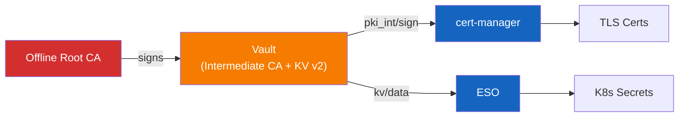

# harvester-rke2-svcs

[](https://github.com/derhornspieler/harvester-rke2-svcs/actions/workflows/ci.yml) [](LICENSE)

PKI and secrets management bundle for RKE2 clusters. Deploys
[HashiCorp Vault](https://www.vaultproject.io/),
[cert-manager](https://cert-manager.io/), and
[External Secrets Operator](https://external-secrets.io/) with a two-tier PKI
hierarchy, automated TLS certificate issuance, and Vault-backed secret
synchronization.

## Architecture



See [docs/architecture.md](docs/architecture.md) for detailed diagrams
covering the PKI hierarchy, deployment phases, and data flows.

## Quick Start

**Prerequisites:** `kubectl`, `helm`, `jq`, `openssl`, and cluster-admin
access to an RKE2 cluster.

```bash
# 1. Generate a Root CA (once)
cd services/pki
./generate-ca.sh root -o "My Organization" -d roots/
cd ../..

# 2. Configure environment
cp scripts/.env.example scripts/.env
# Edit scripts/.env: set DOMAIN and ROOT_CA_KEY path

# 3. Deploy everything
./scripts/deploy-pki-secrets.sh
```

The deploy script runs 7 idempotent phases: cert-manager install, Vault
install + init + unseal, PKI intermediate setup, Vault K8s auth, cert-manager
integration, ESO install, and monitoring overlays.

See [docs/getting-started.md](docs/getting-started.md) for the full
step-by-step guide including verification and troubleshooting.

## Service Bundles

| Bundle | Services | Status |
|--------|----------|--------|
| PKI & Secrets | Vault, cert-manager, ESO, PKI tooling | Active |

## Structure

```
services/           # One directory per service (Kustomize + Helm values)
  pki/              # Offline Root CA generation tooling
  vault/            # 3-replica HA Vault with Raft storage
  cert-manager/     # ClusterIssuer + RBAC for Vault PKI
  external-secrets/ # ESO controller configuration
scripts/            # Deploy scripts and utility modules
  utils/            # Shell modules: log, helm, wait, vault, subst
docs/               # Architecture and getting started guides
```

## Day-2 Operations

```bash
# Unseal Vault after pod restart
./scripts/deploy-pki-secrets.sh --unseal-only

# Health check all components
./scripts/deploy-pki-secrets.sh --validate

# Re-run a single phase
./scripts/deploy-pki-secrets.sh --phase 5

# Resume from a specific phase
./scripts/deploy-pki-secrets.sh --from 3
```

## Documentation

- [Architecture Overview](docs/architecture.md) -- PKI hierarchy, deployment
  flow, data flow diagrams, and component relationships
- [Getting Started Guide](docs/getting-started.md) -- step-by-step deployment,
  verification, and troubleshooting
- [Contributing](CONTRIBUTING.md) -- how to add services, coding conventions,
  and PR process

## Requirements

- RKE2 cluster with kubeconfig access
- `kubectl`, `helm`, `jq`, `openssl`
- Root CA key (offline, for initial PKI setup only)

## License

This project is licensed under the [Apache License 2.0](LICENSE).
