# Architecture Overview

This document describes the architecture of all six service bundles deployed
onto RKE2 clusters. The bundles build on each other to provide a complete
platform foundation: PKI/secrets management, monitoring, container registry,
identity/SSO, GitOps, and Git/CI.

## Bundle Overview

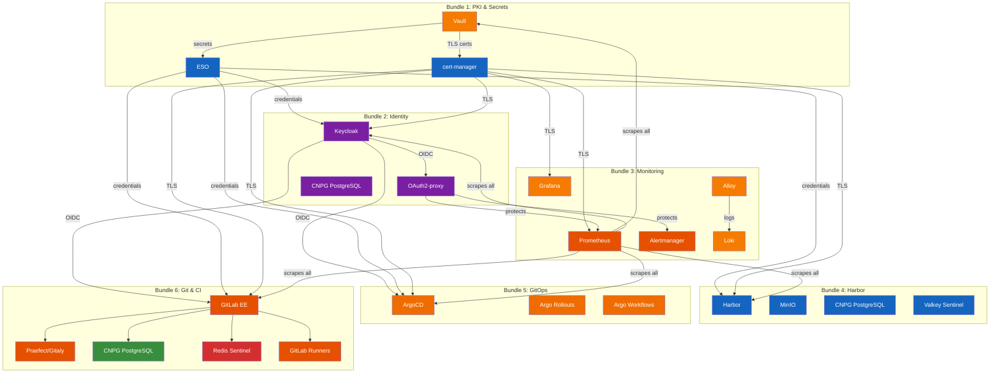

## Components

| Component | Role | Namespace | Bundle |
|-----------|------|-----------|--------|
| **Vault** | Secrets engine, intermediate CA, KV v2 store | `vault` | 1 |
| **cert-manager** | Requests and renews TLS leaf certificates from Vault | `cert-manager` | 1 |
| **External Secrets Operator (ESO)** | Syncs Vault KV v2 secrets to Kubernetes Secrets | `external-secrets` | 1 |
| **PKI tooling** | Offline Root CA generation and chain verification | Local (not deployed) | 1 |
| **Keycloak** | OIDC identity provider, realm/user/client management | `keycloak` | 2 |
| **OAuth2-proxy** | OIDC authentication proxy for Prometheus, Alertmanager, Hubble | `keycloak` | 2 |
| **CNPG PostgreSQL (Keycloak)** | HA PostgreSQL cluster for Keycloak | `database` | 2 |
| **Prometheus** | Metrics collection, alerting rules evaluation | `monitoring` | 3 |
| **Grafana** | Metrics and log visualization, dashboards | `monitoring` | 3 |
| **Alertmanager** | Alert routing, deduplication, notification | `monitoring` | 3 |
| **Loki** | Log aggregation (single-binary mode) | `monitoring` | 3 |
| **Alloy** | Log collection agent (DaemonSet), includes Hubble flow log collection | `monitoring` | 3 |
| **Cilium** | Network CNI (system chart), HelmChartConfig enables Hubble observability | `kube-system` | RKE2 system |
| **Hubble Relay** | Aggregates Cilium network events, exposes metrics for Prometheus | `kube-system` | 3 |
| **Hubble UI** | Web dashboard for network flow visualization, protected by OAuth2-proxy | `kube-system` | 2 |
| **Harbor** | Container image registry with vulnerability scanning | `harbor` | 4 |
| **MinIO** | S3-compatible object storage for Harbor | `minio` | 4 |
| **CNPG PostgreSQL (Harbor)** | HA PostgreSQL cluster for Harbor metadata | `database` | 4 |
| **Valkey Sentinel** | Redis-compatible cache with HA sentinel | `harbor` | 4 |
| **ArgoCD** | GitOps continuous delivery, HA server with OIDC SSO | `argocd` | 5 |
| **Argo Rollouts** | Progressive delivery (canary/blue-green) with Gateway API traffic management | `argo-rollouts` | 5 |
| **Argo Workflows** | Workflow engine for CI/CD pipelines and automation | `argo-workflows` | 5 |
| **AnalysisTemplates** | Automated rollout analysis (error-rate, latency, success-rate) | `argo-rollouts` | 5 |
| **GitLab EE** | Source code management, CI/CD, issue tracking | `gitlab` | 6 |
| **Praefect/Gitaly** | Git storage layer with Praefect for HA routing | `gitlab` | 6 |
| **CNPG PostgreSQL (GitLab)** | HA PostgreSQL cluster for GitLab metadata | `database` | 6 |
| **Redis Sentinel (GitLab)** | OpsTree Redis Sentinel for GitLab cache/session/queues | `gitlab` | 6 |
| **GitLab Runners** | Shared, security, and group runners for CI job execution | `gitlab-runners` | 6 |
| **CI Templates** | Reusable pipeline templates (build, test, scan, deploy, promote) | N/A (included in repo) | 6 |

---

## Network Security

### Network Policy Strategy

All service namespaces implement a default-deny-ingress policy with explicit allow rules. This ensures microsegmentation at the network layer:

- **Default-deny**: Every namespace with `NetworkPolicy` blocks ingress unless explicitly allowed
- **Traefik ingress**: RKE2's Traefik in `kube-system` namespace routes external traffic to services via Gateway API
- **Service-to-service**: Allowed only for declared dependencies (Prometheus scraping, Keycloak OIDC, etc.)
- **Pod anti-affinity**: All replicated workloads spread across nodes to improve resilience

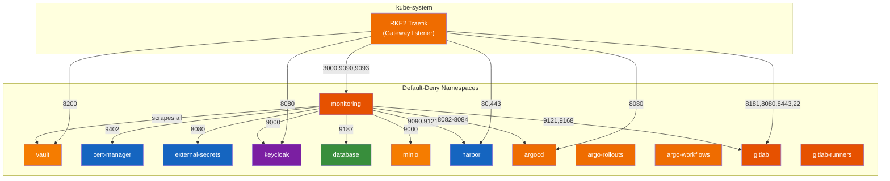

### Network Policy Files

Each bundle includes NetworkPolicy resources applied during its respective deployment phase:

| Bundle | Namespace(s) | NetworkPolicy File | Phase |
|--------|-------------|--------------------|-------|
| 1 | vault, cert-manager, external-secrets | `services/{vault,cert-manager,external-secrets}/networkpolicy.yaml` | 7 |
| 2 | keycloak, database | `services/keycloak/{,postgres}/networkpolicy.yaml` | 8 |
| 3 | monitoring | `services/monitoring-stack/networkpolicy.yaml` | 6 |
| 4 | harbor, minio, database | `services/harbor/{,minio}/networkpolicy.yaml` | 8 |
| 5 | argocd, argo-rollouts, argo-workflows | `services/argo/{argocd,argo-rollouts,argo-workflows}/networkpolicy.yaml` | 7 |
| 6 | gitlab, gitlab-runners, database | `services/gitlab/{,runners}/networkpolicy.yaml` | 9 |

All NetworkPolicy rules default-deny ingress and explicitly allow:
- Traefik ingress (from `kube-system` namespace)
- Service-to-service traffic (e.g., Keycloak PostgreSQL access, Harbor MinIO access)
- Prometheus scraping (from `monitoring` namespace) — includes Hubble relay metrics on port 4244
- Alloy log collection (from `monitoring` namespace) — reads Hubble flow logs via hostPath
- Required inter-component communication

---

## Bundle 1: PKI & Secrets

### PKI Hierarchy

The PKI follows a two-tier model. The Root CA is generated offline and never
enters the cluster. Vault holds the intermediate CA whose private key is
generated inside Vault's barrier encryption and never exported.

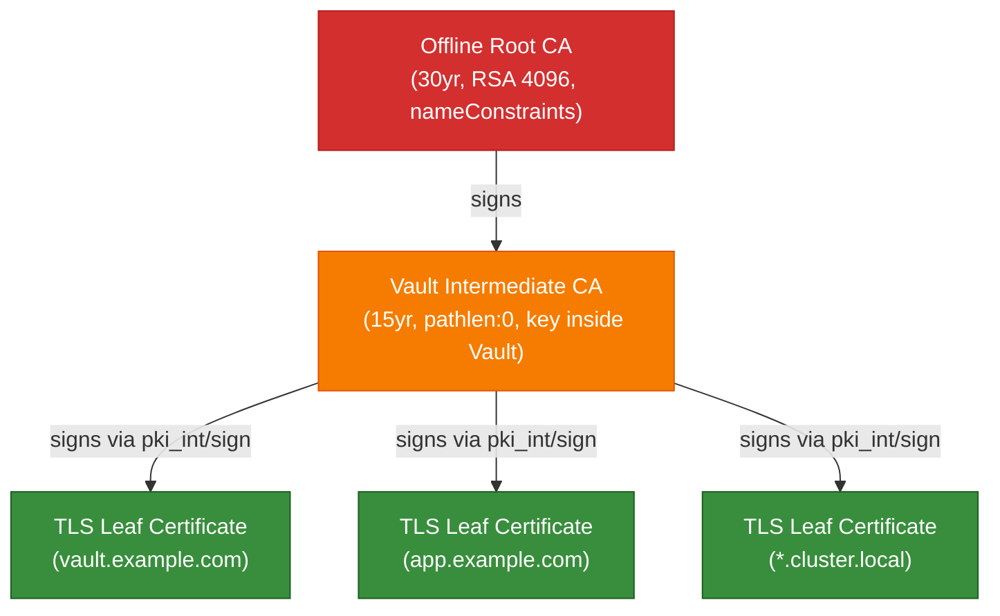

**Key constraints:**

- Root CA `nameConstraints` restrict all issued certificates to: your domain,
  `cluster.local`, and RFC 1918 IP ranges (10.0.0.0/8, 172.16.0.0/12,
  192.168.0.0/16).
- Vault intermediate has `pathlen:0`, meaning it can only sign leaf
  certificates, not sub-intermediates.
- cert-manager is a **requestor**, not a CA. It calls Vault's
  `pki_int/sign/<role>` endpoint and never holds any CA key material.

### Vault Architecture

Vault runs as a 3-replica StatefulSet with integrated Raft storage:

- **Unsealing:** Shamir's Secret Sharing with 5 key shares, threshold of 3.
  After any pod restart, Vault must be unsealed before it serves requests.
- **Storage:** Integrated Raft (no external Consul or etcd dependency).
  Data stored on PersistentVolumeClaims (10Gi each).
- **TLS:** Vault listens on HTTP internally (`tls_disable = 1`). TLS is
  terminated at the Traefik Gateway, which holds a cert-manager-issued
  certificate.
- **UI:** Enabled and accessible through the Gateway at
  `https://vault.example.com`.

### Data Flow: Certificate Issuance

```mermaid
sequenceDiagram
    participant GW as Gateway (Traefik)
    participant CM as cert-manager
    participant VI as ClusterIssuer<br/>(vault-issuer)
    participant V as Vault<br/>(pki_int)
    participant K as Kubernetes<br/>Secret

    GW->>CM: Gateway annotation triggers<br/>Certificate resource
    CM->>VI: Certificate request
    VI->>V: POST pki_int/sign/&lt;role&gt;<br/>(K8s auth via ServiceAccount)
    V-->>VI: Signed leaf cert + chain
    VI-->>CM: Certificate issued
    CM->>K: Create/update TLS Secret
    K-->>GW: Mount TLS Secret
```

### Data Flow: Secret Synchronization

```mermaid
sequenceDiagram
    participant ES as ExternalSecret
    participant SS as SecretStore
    participant V as Vault<br/>(KV v2)
    participant K as Kubernetes<br/>Secret

    ES->>SS: Reference secret path
    SS->>V: GET kv/data/&lt;path&gt;<br/>(K8s auth via ServiceAccount)
    V-->>SS: Secret data
    SS-->>ES: Reconcile
    ES->>K: Create/update Secret
    Note over ES,K: Refresh interval: 15 minutes
```

---

## Bundle 2: Identity

### Identity Architecture

Keycloak provides centralized OIDC identity management. OAuth2-proxy instances
sit in front of services that lack native OIDC support (Prometheus, Alertmanager,
Hubble), authenticating users against Keycloak before proxying requests.

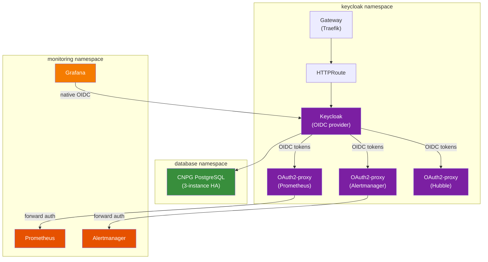

**Key design decisions:**

- **Keycloak** runs as a Deployment (not StatefulSet) with HPA. Session
  state is externalized to PostgreSQL, enabling horizontal scaling.
- **CNPG PostgreSQL** runs a 3-instance HA cluster in the shared `database`
  namespace (same namespace as Harbor's PostgreSQL, different cluster name).
- **OAuth2-proxy** runs as separate deployments per protected service, each
  with its own OIDC client credentials stored in Vault and synced via ESO.
- **Traefik ForwardAuth middleware** integrates OAuth2-proxy into the request
  path. The middleware checks authentication before forwarding to the upstream.
- **setup-keycloak.sh** is a post-deploy script that configures Keycloak via
  the Admin REST API: creates the realm, breakglass user, OIDC clients, groups,
  and authentication flows.
- **Grafana** uses native OIDC integration (configured in Helm values) rather
  than OAuth2-proxy.

### Identity Flow: OAuth2-proxy Authentication

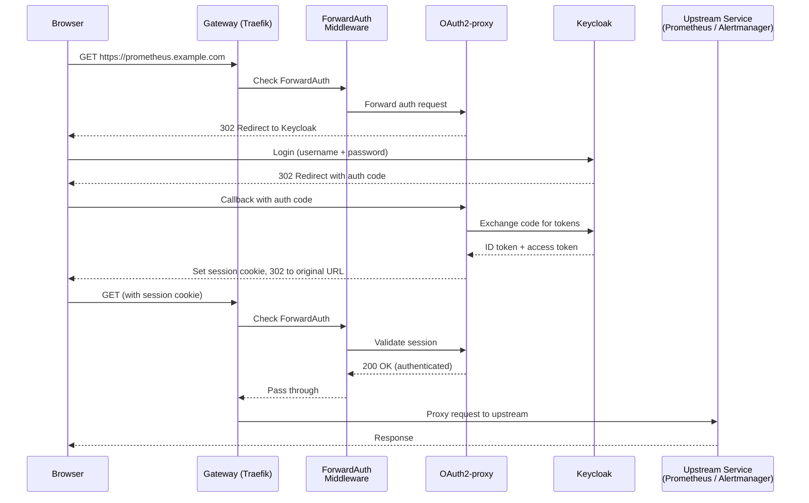

---

## Bundle 3: Monitoring

### Monitoring Architecture

The monitoring stack provides metrics collection, log aggregation, alerting,
and visualization across all bundles.

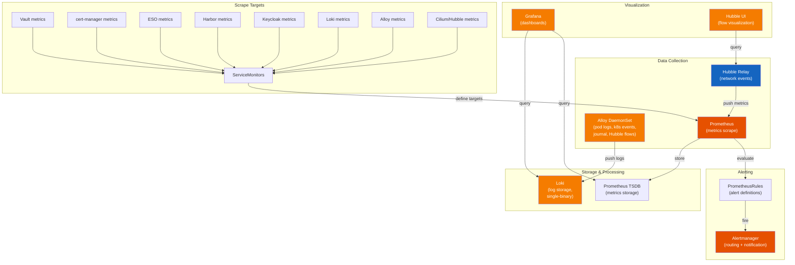

**Key design decisions:**

- **Loki** runs in single-binary mode as a StatefulSet. Logs are stored
  locally on PersistentVolumeClaims.
- **Alloy** replaces Promtail as the log collection agent. Runs as a
  DaemonSet on every node, scraping pod logs, Kubernetes events, systemd
  journal, and Hubble network flow logs from each node.
- **Hubble** (Cilium observability) provides L4/L7 network metrics and flow
  logs. Relay aggregates metrics, UI provides flow visualization. Flow logs
  are exported to `/var/run/cilium/hubble/events.log` on each node for Alloy
  collection.
- **kube-prometheus-stack** Helm chart provides Prometheus, Grafana,
  Alertmanager, and the Prometheus operator (including CRDs for
  ServiceMonitor, PrometheusRule, etc.).
- **OAuth2-proxy** protects Prometheus, Alertmanager, and Hubble UI ingress
  endpoints via Traefik ForwardAuth middleware (OIDC authentication).
  Grafana has its own native OIDC integration.
- **Dashboards** are deployed as ConfigMaps with the
  `grafana_dashboard: "1"` label for auto-discovery by the Grafana sidecar.

### Monitoring Coverage

Every service includes ServiceMonitors, PrometheusRules, and Grafana dashboards:

| Service | ServiceMonitor | PrometheusRules | Grafana Dashboard |
|---------|---------------|-----------------|-------------------|
| Vault | `/v1/sys/metrics` (30s) | VaultSealed, VaultDown, VaultLeaderLost | Seal status, Raft health, barrier ops |
| cert-manager | controller metrics (30s) | CertExpiringSoon, CertNotReady, CertManagerDown | Cert expiry timeline, readiness, sync rate |
| ESO | controller metrics (30s) | ESODown, SyncFailure, ReconcileErrors | Sync status, reconcile rate, errors |
| Harbor | core + registry metrics | HarborCoreDown, RegistryDown | Registry health, storage, request rates |
| MinIO | MinIO metrics | MinIODown, MinIODiskOffline | Disk usage, request rates, errors |
| Keycloak | Keycloak metrics | KeycloakDown, LoginFailureSpike | Login rates, session counts, realm health |
| Loki | Loki metrics | LokiDown, IngestionErrors | Ingestion rate, query latency, storage |
| Alloy | Alloy metrics | AlloyDown | Collection rate, pipeline health |
| Cilium/Hubble | Hubble relay metrics | CiliumAgentDown, CiliumHighDropRate, CiliumEndpointNotReady, CiliumPolicyImportErrors | Endpoint state, packet drops, policy changes, health |
| Hubble | DNS/HTTP/TCP/flow metrics | HubbleDNSErrorSpike, HubbleHTTPServerErrors, HubbleLostEvents | Flow rates, DNS errors, HTTP 5xx, event loss |
| CNPG | CNPG controller metrics | PostgreSQLDown, ReplicationLag | Replication lag, connections, WAL |
| Valkey | Redis exporter metrics | RedisDown, RedisMemoryHigh | Memory usage, hit ratio, connections |
| ArgoCD | ArgoCD server metrics | ArgoCDDown, SyncFailure | App sync status, repo server health |
| Argo Rollouts | Rollouts controller metrics | RolloutFailed, AnalysisFailed | Rollout progress, analysis results |
| Argo Workflows | Workflows controller metrics | WorkflowFailed | Workflow status, duration, error rates |
| GitLab | Webservice + Sidekiq metrics | GitLabDown, SidekiqQueueHigh | Request rates, job queues, latency |
| GitLab Runners | Runner metrics | RunnerDown, JobFailureRate | Job execution, queue wait time |

---

## Bundle 4: Harbor

### Harbor Architecture

Harbor provides a secure container image registry with vulnerability scanning,
backed by MinIO for S3-compatible object storage, CNPG PostgreSQL for metadata,
and Valkey (Redis-compatible) for caching and job queues.

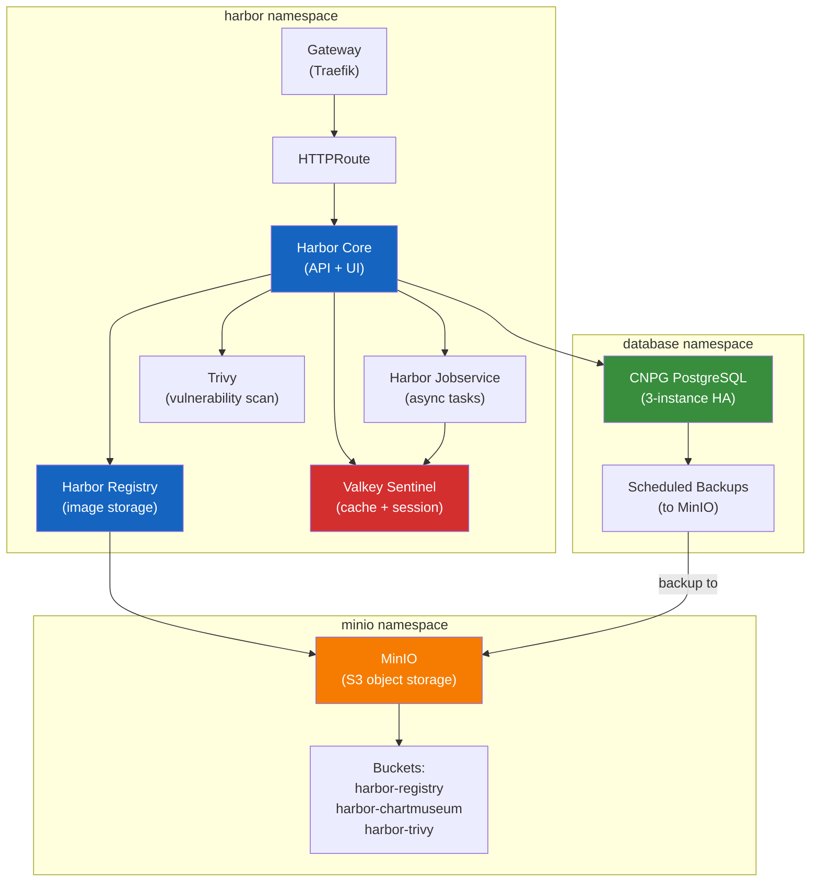

**Key design decisions:**

- **MinIO** runs as a single-replica deployment with PVC storage. Provides
  S3-compatible API for Harbor registry blobs, chart storage, and Trivy
  vulnerability database.
- **CNPG PostgreSQL** runs a 3-instance HA cluster in the `database`
  namespace. Scheduled backups target MinIO for WAL archiving and base backups.
- **Valkey** runs with Redis Sentinel for HA. Provides session storage,
  caching, and job queue backend for Harbor.
- **All credentials** are sourced from Vault via ESO ExternalSecrets. No
  passwords are stored in manifests or Helm values.
- **HorizontalPodAutoscalers** are configured for Harbor Core, Registry,
  and Trivy components.
- **TLS** is terminated at the Traefik Gateway with cert-manager-issued
  certificates from the Vault intermediate CA.

### Harbor Data Flow

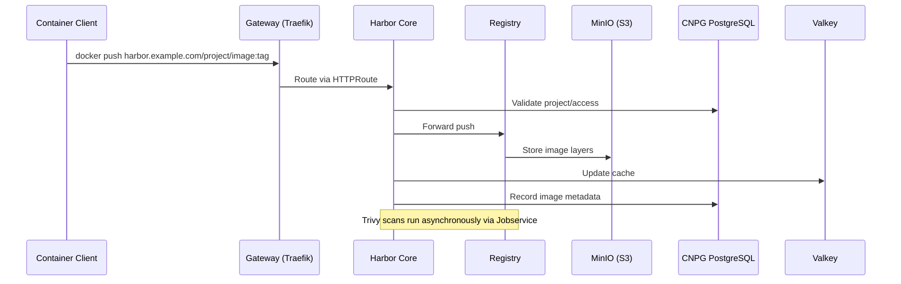

---

## Bundle 5: GitOps

### GitOps Architecture

The Argo GitOps platform provides continuous delivery (ArgoCD), progressive
delivery with canary/blue-green deployments (Argo Rollouts), and workflow
automation (Argo Workflows). Each component runs in its own namespace.

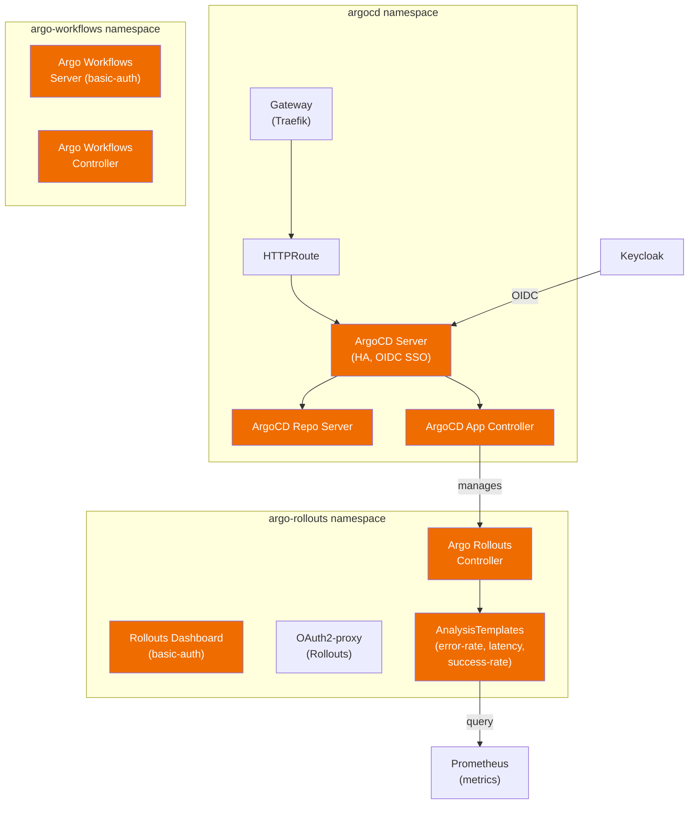

**Key design decisions:**

- **ArgoCD** runs in HA mode with native OIDC SSO via Keycloak. The server is
  exposed through a Traefik Gateway with cert-manager TLS.
- **Argo Rollouts** provides progressive delivery using Gateway API for traffic
  management. The dashboard is protected by basic-auth (with optional
  OAuth2-proxy).
- **Argo Workflows** provides a workflow engine for CI/CD automation. The server
  is protected by basic-auth.
- **AnalysisTemplates** define automated rollout analysis queries against
  Prometheus: error-rate, latency-check, and success-rate. These are used by
  Rollouts to gate canary promotions.
- **ESO SecretStores** are configured per namespace (`argocd`, `argo-rollouts`,
  `argo-workflows`) with Vault Kubernetes auth roles scoped to each namespace.
- **Monitoring** includes ServiceMonitors, PrometheusRules, and Grafana
  dashboards for all three Argo components.

---

## Bundle 6: Git & CI

### GitLab Architecture

GitLab EE provides source code management, CI/CD pipelines, and issue tracking.
It is backed by CNPG PostgreSQL for metadata, OpsTree Redis Sentinel for
caching/sessions/queues, and Praefect/Gitaly for Git repository storage. GitLab
Runners execute CI jobs in a dedicated namespace.

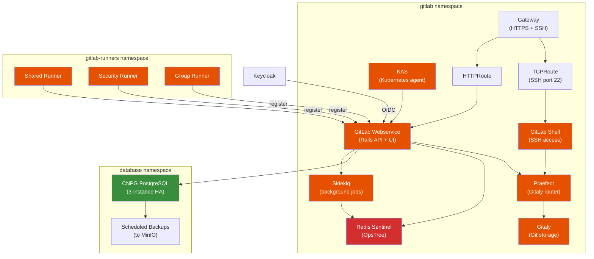

**Key design decisions:**

- **GitLab EE** is deployed via the official Helm chart with external
  PostgreSQL (CNPG) and external Redis (OpsTree Sentinel). The built-in
  PostgreSQL and Redis sub-charts are disabled.
- **Praefect/Gitaly** provides the Git storage layer. Praefect acts as a
  transparent proxy that routes Git RPCs to Gitaly nodes.
- **CNPG PostgreSQL** runs a 3-instance HA cluster in the shared `database`
  namespace. A Praefect user and database are created during Phase 3 for
  Praefect's metadata storage.
- **Redis Sentinel (OpsTree)** provides HA caching, session storage, and
  Sidekiq job queues. Deployed as RedisReplication + RedisSentinel CRDs.
- **GitLab Runners** are deployed as three separate Helm releases in the
  `gitlab-runners` namespace: shared (general workloads), security (SAST/DAST
  scanning), and group (platform-services team). Each runner has its own
  values file and resource limits.
- **CI Templates** provide reusable pipeline definitions: base stage ordering,
  individual jobs (build, test, lint, scan, deploy, promote, rollout,
  eso-provision), and composite patterns (microservice, library, infrastructure,
  platform-service).
- **All credentials** (Gitaly token, Praefect DB password, Redis password, OIDC
  client secret, root password, Harbor push credentials) are sourced from Vault
  via ESO ExternalSecrets.
- **TLS** is terminated at the Traefik Gateway for HTTPS traffic. SSH access
  uses a TCPRoute on port 22 for native Git-over-SSH.

### SSH TCP Routing

GitLab SSH access (for `git clone git@gitlab.example.com:...`) is handled by a
Gateway API TCPRoute, which forwards TCP port 22 traffic directly to the GitLab
Shell service without TLS termination:

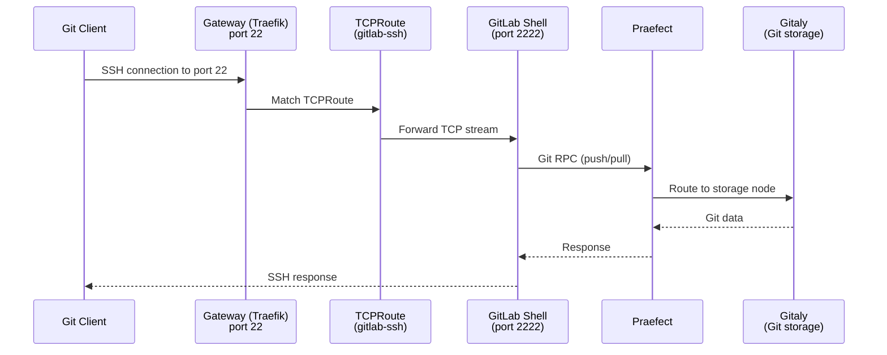

### GitLab Data Flow: CI Pipeline

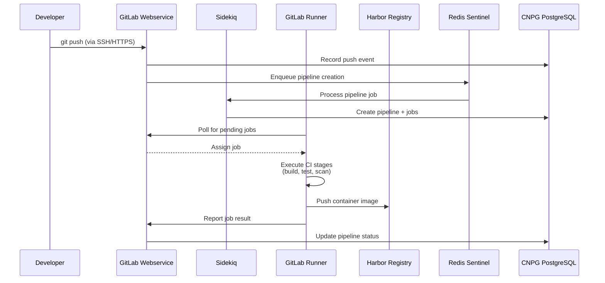

---

## Deployment Flow (All 6 Bundles)

The bundles are deployed in order, each building on the previous:

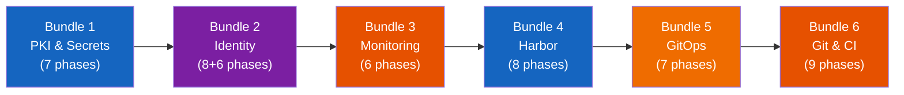

### Bundle 1: PKI & Secrets (7 Phases)

Script: `scripts/deploy-pki-secrets.sh`

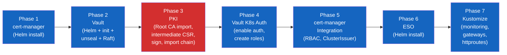

| Phase | Component | What happens |
|-------|-----------|--------------|
| 1 | cert-manager | Helm install with CRDs and Gateway API shim enabled |
| 2 | Vault | Helm install (3-replica HA Raft), initialize, unseal, join replicas |
| 3 | PKI | Import Root CA into Vault, generate intermediate CSR inside Vault, sign with offline Root CA key, import signed chain |
| 4 | Vault K8s Auth | Enable Kubernetes auth method, create `cert-manager-issuer` role, create cert-manager PKI policy, enable KV v2 engine |
| 5 | cert-manager Integration | Apply ServiceAccount + RBAC, apply ClusterIssuer pointing to Vault, verify TLS issuance |
| 6 | ESO | Helm install External Secrets Operator, verify controller readiness |
| 7 | Kustomize Overlays | Apply Gateway + HTTPRoute for Vault UI, apply ServiceMonitors, PrometheusRules, and Grafana dashboards for all services |

**Phase 3 requires the offline Root CA key.** This is the only phase that
needs the key. After Phase 3 completes, the Root CA key can be returned to
offline storage.

### Bundle 2: Identity (8 + 6 Phases)

Scripts: `scripts/deploy-keycloak.sh` + `scripts/setup-keycloak.sh`

**deploy-keycloak.sh (8 phases):**

| Phase | Component | What happens |
|-------|-----------|--------------|
| 1 | Shared Data Services | Install CNPG operator, deploy shared MinIO (skip if exists) |
| 2 | Namespaces | Create `keycloak`, `database` namespaces |
| 3 | ESO ExternalSecrets | Apply ExternalSecrets for Keycloak admin, DB, and OIDC credentials |
| 4 | PostgreSQL CNPG | Deploy 3-instance HA PostgreSQL cluster, configure scheduled backups |
| 5 | Keycloak | Deploy RBAC, services, Keycloak deployment, verify health endpoint |
| 6 | Gateway + HPA | Apply Gateway, HTTPRoute, HPA, verify TLS certificate |
| 7 | OAuth2-proxy | Deploy OAuth2-proxy instances for Prometheus, Alertmanager, Hubble; apply ForwardAuth middleware |
| 8 | Monitoring + NetworkPolicies | Apply dashboards, alerts, ServiceMonitors, and NetworkPolicies for Keycloak |

**setup-keycloak.sh (6 phases, post-deploy):**

| Phase | Component | What happens |
|-------|-----------|--------------|
| 1 | Create Realm | Create the `platform` realm with brute-force protection |
| 2 | Breakglass User | Create `admin-breakglass` user with password |
| 3 | OIDC Clients | Create clients: `grafana`, `prometheus-oidc`, `alertmanager-oidc`, `hubble-oidc` |
| 4 | Groups | Create `platform-admins` group, assign breakglass user, configure groups mapper |
| 5 | Auth Flow | Copy browser flow to `browser-prompt-login`, set as realm default |
| 6 | Validation | Print summary of all created resources |

### Bundle 3: Monitoring (6 Phases)

Script: `scripts/deploy-monitoring.sh`

| Phase | Component | What happens |
|-------|-----------|--------------|
| 1 | Namespace + Loki + Alloy | Create `monitoring` namespace, deploy Loki StatefulSet and Alloy DaemonSet |
| 2 | Scrape Configs Secret | Create additional Prometheus scrape configs as a Kubernetes Secret |
| 3 | kube-prometheus-stack | Helm install (Prometheus, Grafana, Alertmanager, operator) |
| 4 | PrometheusRules + ServiceMonitors | Apply alert rules, service monitors, and per-service monitoring from Bundle 1 |
| 5 | Gateways + HTTPRoutes + Auth | Create basic-auth secrets, apply ingress routes for Grafana, Prometheus, Alertmanager; deploy dashboards |
| 6 | Verify | Wait for Grafana, Prometheus, and TLS secrets to become ready |

### Bundle 4: Harbor (8 Phases)

Script: `scripts/deploy-harbor.sh`

| Phase | Component | What happens |
|-------|-----------|--------------|
| 1 | Namespaces | Create `harbor`, `minio`, `database` namespaces |
| 2 | ESO SecretStores | Create Vault K8s auth roles/policies, SecretStores, and ExternalSecrets for MinIO, PostgreSQL, Valkey |
| 3 | MinIO | Deploy MinIO with PVC, create S3 buckets for Harbor |
| 4 | PostgreSQL CNPG | Deploy 3-instance HA PostgreSQL cluster, configure scheduled backups |
| 5 | Valkey Sentinel | Deploy RedisReplication + RedisSentinel for Harbor cache |
| 6 | Harbor Helm | Helm install Harbor with substituted values |
| 7 | Ingress + HPAs | Apply Gateway, HTTPRoute, and HorizontalPodAutoscalers |
| 8 | Monitoring + Verify | Apply dashboards, alerts, and ServiceMonitors for Harbor, MinIO, Valkey |

### Bundle 5: GitOps (7 Phases)

Script: `scripts/deploy-argo.sh`

| Phase | Component | What happens |
|-------|-----------|--------------|
| 1 | Namespaces | Create `argocd`, `argo-rollouts`, `argo-workflows` namespaces |
| 2 | ESO SecretStores | Create Vault K8s auth roles/policies, SecretStores per namespace |
| 3 | ArgoCD Helm | Helm install ArgoCD (HA server with OIDC SSO) |
| 4 | Argo Rollouts Helm | Helm install Argo Rollouts with Gateway API traffic plugin |
| 5 | Argo Workflows Helm | Helm install Argo Workflows server and controller |
| 6 | Gateways + Auth | Apply Gateways, HTTPRoutes, basic-auth for Rollouts/Workflows dashboards, deploy AnalysisTemplates, wait for TLS |
| 7 | Monitoring + Verify | Apply dashboards, alerts, and ServiceMonitors for all three Argo components |

### Bundle 6: Git & CI (9 Phases)

Script: `scripts/deploy-gitlab.sh`

Script: `scripts/deploy-gitlab.sh`

| Phase | Component | What happens |
|-------|-----------|--------------|
| 1 | Namespaces | Create `gitlab`, `gitlab-runners`, ensure `database` namespace |
| 2 | ESO | SecretStores + ExternalSecrets for Gitaly, Praefect, Redis, OIDC, root password, Harbor push credentials |
| 3 | PostgreSQL CNPG | Deploy 3-instance HA PostgreSQL cluster, configure Praefect user/DB, scheduled backup |
| 4 | Redis | Deploy OpsTree RedisReplication + RedisSentinel |
| 5 | Gateway + TCPRoute | Apply Gateway (HTTPS + SSH), TCPRoute for SSH port 22, wait for TLS |
| 6 | GitLab Helm | Helm install GitLab EE, wait for migrations job (up to 30 min), wait for core deployments |
| 7 | Runners | Helm install shared, security, and group runners in `gitlab-runners` namespace |
| 8 | VolumeAutoscalers | Apply volume autoscaler resources for dynamic PVC scaling |
| 9 | Monitoring + Verify | Apply monitoring Kustomize, verify HTTPS health endpoint and SSH TCPRoute |

---

## Component Relationships

```mermaid
graph TB
    subgraph "Cluster Boundary"
        subgraph "vault namespace"
            V0["vault-0<br/>(leader)"]
            V1["vault-1"]
            V2["vault-2"]
            V0 <-->|Raft| V1
            V0 <-->|Raft| V2
            GW["Gateway<br/>(Traefik)"]
            HR["HTTPRoute"]
            GW --> HR --> V0
        end

        subgraph "cert-manager namespace"
            CM["cert-manager<br/>controller"]
            CI["ClusterIssuer<br/>(vault-issuer)"]
            SA["ServiceAccount<br/>(vault-issuer)"]
            CM --> CI
            CI -.->|K8s auth| SA
        end

        subgraph "external-secrets namespace"
            ESOC["ESO controller"]
        end

        subgraph "monitoring namespace"
            PromC["Prometheus"]
            GrafC["Grafana"]
            AMC["Alertmanager"]
            LokiC["Loki"]
            AlloyC["Alloy"]
        end

        subgraph "harbor namespace"
            HarborC["Harbor Core"]
            RegC["Harbor Registry"]
            ValkeyC["Valkey Sentinel"]
        end

        subgraph "minio namespace"
            MinIOC["MinIO"]
        end

        subgraph "keycloak namespace"
            KCC["Keycloak"]
            OAuthC["OAuth2-proxy (x3)"]
        end

        subgraph "argocd namespace"
            ArgoCDC["ArgoCD Server"]
        end

        subgraph "argo-rollouts namespace"
            RollC["Argo Rollouts"]
        end

        subgraph "argo-workflows namespace"
            WFC["Argo Workflows"]
        end

        subgraph "gitlab namespace"
            GLC["GitLab Webservice"]
            ShellC["GitLab Shell"]
            PraefectC["Praefect/Gitaly"]
            RedisGLC["Redis Sentinel"]
        end

        subgraph "gitlab-runners namespace"
            RunnersC["Runners (x3)"]
        end

        subgraph "database namespace"
            PGHarbor["harbor-pg<br/>(CNPG cluster)"]
            PGKC["keycloak-pg<br/>(CNPG cluster)"]
            PGGL["gitlab-pg<br/>(CNPG cluster)"]
        end

        subgraph "app namespaces"
            SS["SecretStore"]
            ESEC["ExternalSecret"]
            KSEC["K8s Secret"]
            ESEC --> SS
            SS --> KSEC
        end

        CI -->|"pki_int/sign"| V0
        SS -->|"kv/data/*"| V0
        ESOC -.->|manages| ESEC
        PromC -->|scrapes| V0
        PromC -->|scrapes| HarborC
        PromC -->|scrapes| KCC
        AlloyC -->|logs| LokiC
        HarborC --> PGHarbor
        HarborC --> MinIOC
        HarborC --> ValkeyC
        KCC --> PGKC
        OAuthC -->|OIDC| KCC
        ArgoCDC -->|OIDC| KCC
        GLC -->|OIDC| KCC
        GLC --> PGGL
        GLC --> PraefectC
        GLC --> RedisGLC
        RunnersC -->|register| GLC
        PromC -->|scrapes| ArgoCDC
        PromC -->|scrapes| GLC
    end

    subgraph "Offline"
        ROOT["Root CA Key<br/>(air-gapped)"]
    end

    ROOT -.->|"signs intermediate<br/>(Phase 3 only)"| V0

    style ROOT fill:#d32f2f,color:#fff
    style V0 fill:#f57c00,color:#fff
    style V1 fill:#f57c00,color:#fff
    style V2 fill:#f57c00,color:#fff
    style CM fill:#1565c0,color:#fff
    style ESOC fill:#1565c0,color:#fff
    style PromC fill:#e65100,color:#fff
    style GrafC fill:#f57c00,color:#fff
    style AMC fill:#e65100,color:#fff
    style LokiC fill:#f57c00,color:#fff
    style AlloyC fill:#f57c00,color:#fff
    style HarborC fill:#1565c0,color:#fff
    style RegC fill:#1565c0,color:#fff
    style MinIOC fill:#f57c00,color:#fff
    style ValkeyC fill:#d32f2f,color:#fff
    style KCC fill:#7b1fa2,color:#fff
    style OAuthC fill:#7b1fa2,color:#fff
    style PGHarbor fill:#388e3c,color:#fff
    style PGKC fill:#388e3c,color:#fff
    style ArgoCDC fill:#ef6c00,color:#fff
    style RollC fill:#ef6c00,color:#fff
    style WFC fill:#ef6c00,color:#fff
    style GLC fill:#e65100,color:#fff
    style ShellC fill:#e65100,color:#fff
    style PraefectC fill:#e65100,color:#fff
    style RedisGLC fill:#d32f2f,color:#fff
    style RunnersC fill:#e65100,color:#fff
    style PGGL fill:#388e3c,color:#fff
```

## Placeholder Substitution

YAML manifests use `CHANGEME_*` tokens that are replaced at deploy time by
`scripts/utils/subst.sh`:

| Token | Replaced with | Example |
|-------|---------------|---------|
| `CHANGEME_DOMAIN` | `$DOMAIN` | `example.com` |
| `CHANGEME_DOMAIN_DASHED` | `$DOMAIN_DASHED` | `example-com` |
| `CHANGEME_DOMAIN_DOT` | `$DOMAIN_DOT` | `example-dot-com` |
| `CHANGEME_VAULT_ADDR` | Vault internal URL | `http://vault.vault.svc.cluster.local:8200` |

## Directory Structure

```
harvester-rke2-svcs/
├── services/
│   ├── pki/                        # PKI tooling (offline, not deployed)
│   │   ├── generate-ca.sh          # Root CA, intermediate, leaf generation
│   │   ├── roots/                  # Root CA cert (key is gitignored)
│   │   └── intermediates/vault/    # Vault intermediate (key stays in Vault)
│   ├── vault/                      # Vault Helm values + Kustomize overlays
│   │   ├── vault-values.yaml       # 3-replica HA Raft configuration
│   │   ├── gateway.yaml            # Gateway API with cert-manager annotation
│   │   ├── httproute.yaml          # HTTPRoute to Vault service
│   │   └── monitoring/             # ServiceMonitor, alerts, dashboard
│   ├── cert-manager/               # cert-manager Kustomize overlays
│   │   ├── rbac.yaml               # ServiceAccount + Role for vault-issuer
│   │   ├── cluster-issuer.yaml     # ClusterIssuer -> Vault pki_int
│   │   └── monitoring/             # ServiceMonitor, alerts, dashboard
│   ├── external-secrets/           # ESO Kustomize overlays
│   │   └── monitoring/             # ServiceMonitor, alerts, dashboard
│   ├── monitoring-stack/           # Monitoring bundle
│   │   ├── namespace.yaml          # monitoring namespace
│   │   ├── kustomization.yaml      # Top-level Kustomize
│   │   ├── helm/                   # kube-prometheus-stack values + scrape configs
│   │   ├── loki/                   # Loki StatefulSet, ConfigMap, RBAC, Service
│   │   ├── alloy/                  # Alloy DaemonSet, ConfigMap, RBAC, Service
│   │   ├── grafana/                # Dashboards, Gateway, HTTPRoute
│   │   ├── prometheus/             # Gateway, HTTPRoute, basic-auth middleware
│   │   ├── alertmanager/           # Gateway, HTTPRoute, basic-auth middleware
│   │   ├── prometheus-rules/       # PrometheusRules (per-service alerts)
│   │   └── service-monitors/       # ServiceMonitors (scrape targets)
│   ├── harbor/                     # Harbor container registry
│   │   ├── harbor-values.yaml      # Harbor Helm values
│   │   ├── gateway.yaml            # Gateway API
│   │   ├── httproute.yaml          # HTTPRoute to Harbor core
│   │   ├── hpa-*.yaml              # HorizontalPodAutoscalers
│   │   ├── minio/                  # MinIO deployment, PVC, bucket job
│   │   ├── postgres/               # CNPG cluster, scheduled backup
│   │   ├── valkey/                 # RedisReplication + RedisSentinel
│   │   └── monitoring/             # Dashboards, alerts, ServiceMonitors
│   ├── keycloak/                   # Keycloak identity provider
│   │   ├── gateway.yaml            # Gateway API
│   │   ├── httproute.yaml          # HTTPRoute to Keycloak
│   │   ├── keycloak/               # Deployment, services, HPA, RBAC
│   │   ├── postgres/               # CNPG cluster, scheduled backup
│   │   ├── oauth2-proxy/           # OAuth2-proxy instances + middleware
│   │   └── monitoring/             # Dashboards, alerts, ServiceMonitors
│   ├── argo/                       # Argo GitOps platform
│   │   ├── argocd/                 # ArgoCD Helm values, Gateway, HTTPRoute
│   │   ├── argo-rollouts/          # Rollouts Helm values, OAuth2-proxy, basic-auth
│   │   ├── argo-workflows/         # Workflows Helm values, Gateway, basic-auth
│   │   ├── analysis-templates/     # AnalysisTemplates (error-rate, latency, success-rate)
│   │   └── monitoring/             # Dashboards, alerts, ServiceMonitors
│   └── gitlab/                     # GitLab EE + CI platform
│       ├── values-rke2-prod.yaml   # GitLab Helm values
│       ├── gateway.yaml            # Gateway (HTTPS + SSH)
│       ├── tcproute-ssh.yaml       # TCPRoute for SSH port 22
│       ├── gitaly/                 # Praefect/Gitaly ExternalSecret
│       ├── praefect/               # Praefect DB secret + token ExternalSecrets
│       ├── redis/                  # OpsTree RedisReplication + RedisSentinel
│       ├── oidc/                   # OIDC ExternalSecret for Keycloak SSO
│       ├── root/                   # Root password ExternalSecret
│       ├── runners/                # Shared, security, group runner Helm values + RBAC
│       ├── ci-templates/           # Reusable CI pipeline templates
│       └── monitoring/             # Dashboards, alerts, ServiceMonitors
├── scripts/
│   ├── deploy-pki-secrets.sh       # Bundle 1 orchestrator (7 phases)
│   ├── deploy-keycloak.sh          # Bundle 2 orchestrator (8 phases)
│   ├── setup-keycloak.sh           # Keycloak Admin API setup (6 phases)
│   ├── deploy-monitoring.sh        # Bundle 3 orchestrator (6 phases)
│   ├── deploy-harbor.sh            # Bundle 4 orchestrator (8 phases)
│   ├── deploy-argo.sh              # Bundle 5 orchestrator (7 phases)
│   ├── deploy-gitlab.sh            # Bundle 6 orchestrator (9 phases)
│   ├── .env.example                # Environment variable template
│   └── utils/                      # Shell utility modules
│       ├── log.sh                  # Colored logging + phase timing
│       ├── helm.sh                 # Idempotent Helm operations
│       ├── vault.sh                # Vault CLI via kubectl exec
│       ├── wait.sh                 # K8s readiness polling
│       ├── subst.sh                # CHANGEME_* token substitution
│       └── basic-auth.sh           # htpasswd-based basic-auth secrets
└── docs/
    └── plans/                      # Design documents
```
