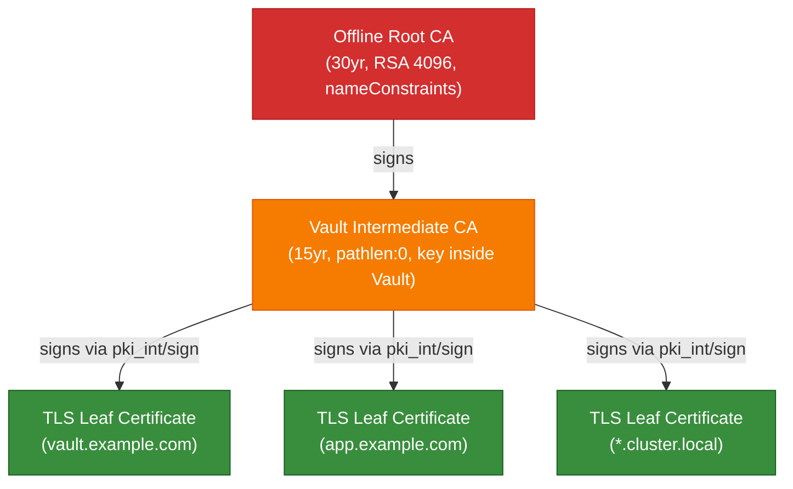
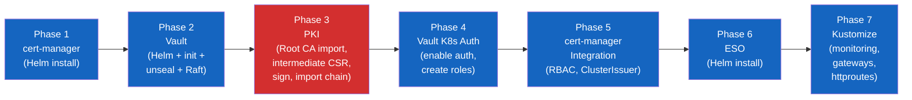
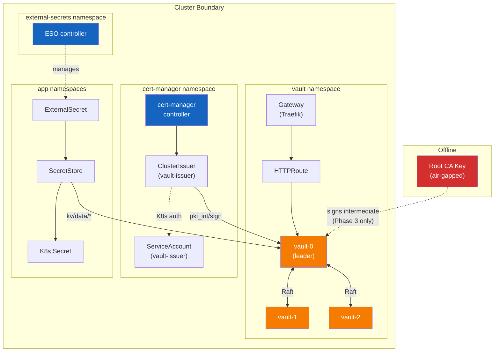

# Architecture Overview

This document describes the architecture of the PKI & Secrets bundle deployed
onto RKE2 clusters. The bundle provides TLS certificate management and secrets
synchronization as a foundation for all other cluster services.

## Components

| Component | Role | Namespace |
|-----------|------|-----------|
| **Vault** | Secrets engine, intermediate CA, KV v2 store | `vault` |
| **cert-manager** | Requests and renews TLS leaf certificates from Vault | `cert-manager` |
| **External Secrets Operator (ESO)** | Syncs Vault KV v2 secrets to Kubernetes Secrets | `external-secrets` |
| **PKI tooling** | Offline Root CA generation and chain verification | Local (not deployed) |

## PKI Hierarchy

The PKI follows a two-tier model. The Root CA is generated offline and never
enters the cluster. Vault holds the intermediate CA whose private key is
generated inside Vault's barrier encryption and never exported.



**Key constraints:**

- Root CA `nameConstraints` restrict all issued certificates to: your domain,
  `cluster.local`, and RFC 1918 IP ranges (10.0.0.0/8, 172.16.0.0/12,
  192.168.0.0/16).
- Vault intermediate has `pathlen:0`, meaning it can only sign leaf
  certificates, not sub-intermediates.
- cert-manager is a **requestor**, not a CA. It calls Vault's
  `pki_int/sign/<role>` endpoint and never holds any CA key material.

## Deployment Flow (7 Phases)

The bootstrap script (`scripts/deploy-pki-secrets.sh`) orchestrates the full
deployment in seven ordered phases. Each phase is idempotent and can be run
individually using `--phase N` or as a range with `--from N --to M`.



| Phase | Component | What happens |
|-------|-----------|--------------|
| 1 | cert-manager | Helm install with CRDs and Gateway API shim enabled |
| 2 | Vault | Helm install (3-replica HA Raft), initialize, unseal, join replicas |
| 3 | PKI | Import Root CA into Vault, generate intermediate CSR inside Vault, sign with offline Root CA key, import signed chain |
| 4 | Vault K8s Auth | Enable Kubernetes auth method, create `cert-manager-issuer` role, create cert-manager PKI policy, enable KV v2 engine |
| 5 | cert-manager Integration | Apply ServiceAccount + RBAC, apply ClusterIssuer pointing to Vault, verify TLS issuance |
| 6 | ESO | Helm install External Secrets Operator, verify controller readiness |
| 7 | Kustomize Overlays | Apply Gateway + HTTPRoute for Vault UI, apply ServiceMonitors, PrometheusRules, and Grafana dashboards for all services |

**Phase 3 requires the offline Root CA key.** This is the only phase that
needs the key. After Phase 3 completes, the Root CA key can be returned to
offline storage.

## Data Flow

### Certificate Issuance

```mermaid
sequenceDiagram
    participant GW as Gateway (Traefik)
    participant CM as cert-manager
    participant VI as ClusterIssuer<br/>(vault-issuer)
    participant V as Vault<br/>(pki_int)
    participant K as Kubernetes<br/>Secret

    GW->>CM: Gateway annotation triggers<br/>Certificate resource
    CM->>VI: Certificate request
    VI->>V: POST pki_int/sign/&lt;role&gt;<br/>(K8s auth via ServiceAccount)
    V-->>VI: Signed leaf cert + chain
    VI-->>CM: Certificate issued
    CM->>K: Create/update TLS Secret
    K-->>GW: Mount TLS Secret
```

### Secret Synchronization

```mermaid
sequenceDiagram
    participant ES as ExternalSecret
    participant SS as SecretStore
    participant V as Vault<br/>(KV v2)
    participant K as Kubernetes<br/>Secret

    ES->>SS: Reference secret path
    SS->>V: GET kv/data/&lt;path&gt;<br/>(K8s auth via ServiceAccount)
    V-->>SS: Secret data
    SS-->>ES: Reconcile
    ES->>K: Create/update Secret
    Note over ES,K: Refresh interval: 15 minutes
```

## Component Relationships



## Vault Architecture

Vault runs as a 3-replica StatefulSet with integrated Raft storage:

- **Unsealing:** Shamir's Secret Sharing with 5 key shares, threshold of 3.
  After any pod restart, Vault must be unsealed before it serves requests.
- **Storage:** Integrated Raft (no external Consul or etcd dependency).
  Data stored on PersistentVolumeClaims (10Gi each).
- **TLS:** Vault listens on HTTP internally (`tls_disable = 1`). TLS is
  terminated at the Traefik Gateway, which holds a cert-manager-issued
  certificate.
- **UI:** Enabled and accessible through the Gateway at
  `https://vault.<your-domain>`.

## Monitoring

Every service includes a monitoring overlay applied in Phase 7:

| Service | ServiceMonitor | PrometheusRules | Grafana Dashboard |
|---------|---------------|-----------------|-------------------|
| Vault | `/v1/sys/metrics` (30s) | VaultSealed, VaultDown, VaultLeaderLost | Seal status, Raft health, barrier ops |
| cert-manager | controller metrics (30s) | CertExpiringSoon, CertNotReady, CertManagerDown | Cert expiry timeline, readiness, sync rate |
| ESO | controller metrics (30s) | ESODown, SyncFailure, ReconcileErrors | Sync status, reconcile rate, errors |

## Placeholder Substitution

YAML manifests use `CHANGEME_*` tokens that are replaced at deploy time by
`scripts/utils/subst.sh`:

| Token | Replaced with | Example |
|-------|---------------|---------|
| `CHANGEME_DOMAIN` | `$DOMAIN` | `example.com` |
| `CHANGEME_DOMAIN_DASHED` | `$DOMAIN_DASHED` | `example-com` |
| `CHANGEME_DOMAIN_DOT` | `$DOMAIN_DOT` | `example-dot-com` |
| `CHANGEME_VAULT_ADDR` | Vault internal URL | `http://vault.vault.svc.cluster.local:8200` |

## Directory Structure

```
harvester-rke2-svcs/
├── services/
│   ├── pki/                        # PKI tooling (offline, not deployed)
│   │   ├── generate-ca.sh          # Root CA, intermediate, leaf generation
│   │   ├── roots/                  # Root CA cert (key is gitignored)
│   │   └── intermediates/vault/    # Vault intermediate (key stays in Vault)
│   ├── vault/                      # Vault Helm values + Kustomize overlays
│   │   ├── vault-values.yaml       # 3-replica HA Raft configuration
│   │   ├── gateway.yaml            # Gateway API with cert-manager annotation
│   │   ├── httproute.yaml          # HTTPRoute to Vault service
│   │   └── monitoring/             # ServiceMonitor, alerts, dashboard
│   ├── cert-manager/               # cert-manager Kustomize overlays
│   │   ├── rbac.yaml               # ServiceAccount + Role for vault-issuer
│   │   ├── cluster-issuer.yaml     # ClusterIssuer -> Vault pki_int
│   │   └── monitoring/             # ServiceMonitor, alerts, dashboard
│   └── external-secrets/           # ESO Kustomize overlays
│       └── monitoring/             # ServiceMonitor, alerts, dashboard
├── scripts/
│   ├── deploy-pki-secrets.sh       # Bootstrap orchestrator (7 phases)
│   ├── .env.example                # Environment variable template
│   └── utils/                      # Shell utility modules
│       ├── log.sh                  # Colored logging + phase timing
│       ├── helm.sh                 # Idempotent Helm operations
│       ├── vault.sh                # Vault CLI via kubectl exec
│       ├── wait.sh                 # K8s readiness polling
│       └── subst.sh               # CHANGEME_* token substitution
└── docs/
    └── plans/                      # Design documents
```
