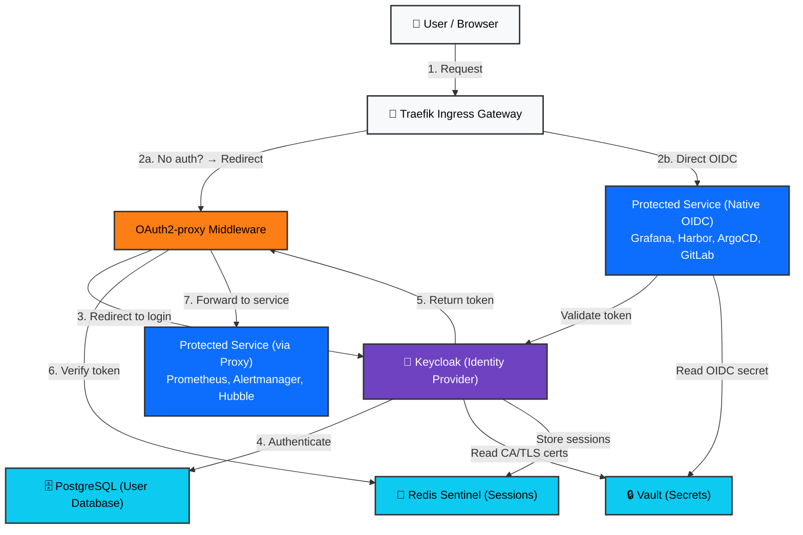
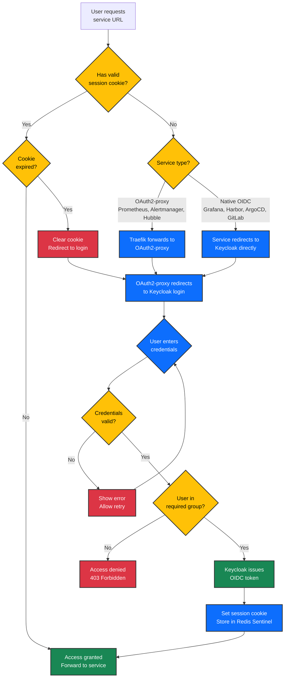

# Authentication & Identity Ecosystem

## Executive Summary

All platform users authenticate through a single identity provider (Keycloak) using industry-standard OIDC protocols. Services either integrate OIDC directly or use an authentication proxy (OAuth2-proxy) as a gateway. This centralized identity system eliminates per-service credential management and provides unified access control through group-based roles. Users log in once and gain access to the services their group membership authorizes.

---

## Overview Diagram: How Authentication Works

The following diagram shows how users authenticate and access protected services:



### Authentication Decision Tree



**The Flow (Plain English):**

1. A user visits any protected service URL (e.g., `prometheus.&lt;DOMAIN&gt;`)
2. The Traefik gateway intercepts the request and checks authentication status:
   - **OAuth2-proxy path** (Prometheus, Alertmanager, Hubble): Unauthenticated requests are redirected to OAuth2-proxy, which redirects the browser to Keycloak's login page
   - **Native OIDC path** (Grafana, Harbor, ArgoCD, GitLab): These services handle OIDC negotiation directly
3. The user enters their credentials at Keycloak
4. Keycloak validates the username and password against its PostgreSQL database
5. Keycloak issues an OIDC token containing the user's identity and group memberships
6. The token is returned to the browser and forwarded to the protected service
7. The service validates the token and grants access based on the user's groups
8. Sessions are stored in Redis Sentinel to prevent re-authentication for 30 minutes per service

---

## How It Works: The User Experience

### Before Authentication

Users see a login page branded for the platform. There is no per-service authentication — all services redirect here.

### After Authentication

Users receive an OIDC token containing:
- **username** and **email** — unique identity
- **groups** — list of group names (e.g., `platform-admins`, `infra-engineers`)
- **additional claims** — user attributes, expiration time, signature

Services use the `groups` claim to make access decisions. For example:
- Prometheus requires membership in `platform-admins` OR `infra-engineers`
- Hubble requires `platform-admins` OR `infra-engineers` OR `network-engineers`
- Grafana and Harbor require `platform-admins`

### Session Management

Each service maintains its own session cookie via OAuth2-proxy or built-in session store. A session lasts 30 minutes of inactivity. After timeout, the user must re-authenticate at Keycloak (but this happens invisibly if they still have a valid Keycloak session — they don't see a login screen).

**Why force re-auth on each service?** This is intentional. We use a setting called `prompt=login` to require re-authentication every time. This prevents stale sessions on shared workstations: if someone logs out or their permissions change, the change takes effect immediately on their next request.

---

## OIDC Client Inventory

The following clients are registered in Keycloak and correspond to protected services:

| Client ID | Service | Method | PKCE Enabled | Purpose |
|-----------|---------|--------|--------------|---------|
| `grafana-oidc` | Grafana Dashboards | Native OIDC | Yes (S256) | User analytics and visualization |
| `prometheus-oidc` | Prometheus Metrics | OAuth2-proxy | Yes (S256) | Infrastructure metrics collection |
| `alertmanager-oidc` | Alert Manager | OAuth2-proxy | Yes (S256) | Alert routing and notifications |
| `hubble-oidc` | Hubble Network UI | OAuth2-proxy | Yes (S256) | Network flow visualization |
| `harbor-oidc` | Harbor Registry | Native OIDC | Yes (S256) | Container image repository |
| `argocd-oidc` | ArgoCD | Native OIDC | No | Continuous deployment orchestrator |
| `gitlab-oidc` | GitLab | Native OIDC | No | Git repository and CI/CD platform |

**PKCE (S256)** is enabled on most clients. PKCE is a security layer that prevents credential interception in the authorization flow. ArgoCD and GitLab are legacy OAuth2-Connect clients that do not implement PKCE parameters, so PKCE is disabled for them.

---

## Access Control Groups

Users gain access to services by membership in groups. Groups are managed in Keycloak:

| Group | Members | Access Grants |
|-------|---------|----------------|
| `platform-admins` | Senior engineers | All services: Grafana, Prometheus, Alertmanager, Hubble, Harbor, ArgoCD, GitLab |
| `infra-engineers` | Infrastructure team | Prometheus, Alertmanager, Hubble, ArgoCD |
| `network-engineers` | Network team | Hubble (network flows only) |

To grant a user access to services:
1. Create a user in Keycloak (username, email, password)
2. Add the user to the appropriate group
3. The next time they log in, their token includes the group(s)
4. Services automatically grant access based on group membership

---

## Security Controls & Break-Glass Access

### Defense in Depth

- **PKCE S256**: All OAuth2-proxy and modern OIDC clients use PKCE, preventing credential interception
- **Secure Cookies**: Session cookies are marked `Secure` and `SameSite=Lax`, preventing cross-site attacks
- **Short Token Lifespan**: OIDC tokens expire in 5 minutes; refresh tokens are stored server-side
- **Group-Based RBAC**: No hard-coded access lists; all permissions flow through Keycloak groups
- **Credential Rotation**: All OIDC client secrets are rotated automatically and stored in Vault

### Break-Glass Emergency Access

If Keycloak becomes unavailable or compromised, there is a break-glass mechanism:

- One local user: `admin-breakglass` (credentials stored in Vault)
- This user can bypass Keycloak and log in directly to a few critical services
- **Rarity**: This is used only in emergencies and should trigger an incident review

---

## Technical Reference

### Keycloak Deployment

| Component | Version | Replicas | Namespace | Storage |
|-----------|---------|----------|-----------|---------|
| Keycloak | 26.0 | 2 (HPA: 2–5) | `keycloak` | None (stateless) |
| PostgreSQL (CNPG) | 16.6 | 3 (HA) | `database` | 10Gi per instance |

**Environment Variables** (scripts/.env):
```bash
KC_ADMIN_PASSWORD=""          # Keycloak admin bootstrap password
KEYCLOAK_DB_PASSWORD=""       # PostgreSQL password
KC_REALM="platform"           # Realm name
BREAKGLASS_PASSWORD=""        # Break-glass user temporary password
```

### Keycloak Realm Configuration

```yaml
Realm: platform
Brute Force Protection: Enabled (5 failures → 15min lockout)
Session Timeout: 30 minutes idle / 1 hour max
Access Token Lifespan: 5 minutes
Authorization Code Lifespan: 2 minutes
Default Client Scopes: openid, profile, email, roles, groups
Authentication Flow: browser-prompt-login (forces re-auth on every login)
```

The `prompt=login` browser flow is intentional: it prevents silent SSO across services, ensuring that permission changes and logouts take immediate effect.

### OAuth2-Proxy Instances

OAuth2-proxy acts as a reverse proxy middleware in front of Prometheus, Alertmanager, and Hubble:

| Instance | Namespace | Upstream | Replicas | Configuration |
|----------|-----------|----------|----------|---|
| `oauth2-proxy-prometheus` | `monitoring` | Prometheus (port 9090) | 1 | Groups: `platform-admins`, `infra-engineers` |
| `oauth2-proxy-alertmanager` | `monitoring` | Alertmanager (port 9093) | 1 | Groups: `platform-admins`, `infra-engineers` |
| `oauth2-proxy-hubble` | `kube-system` | Hubble UI (port 8090) | 1 | Groups: `platform-admins`, `infra-engineers`, `network-engineers` |

**Common Configuration:**
- Provider: `keycloak-oidc`
- PKCE: `code-challenge-method=S256`
- Session Store: Redis Sentinel (`redis://valkey-sentinel.harbor:26379`)
- Session TTL: 1800 seconds (30 minutes)
- CA Trust: Vault root CA at `/etc/ssl/certs/vault-root-ca.pem`
- Headers Forwarded to Upstream:
  - `X-Auth-Request-User` — username
  - `X-Auth-Request-Email` — user email
  - `X-Auth-Request-Groups` — comma-separated group list

### Secrets Management (Vault Paths)

All OIDC client credentials are stored in Vault and synced via ExternalSecrets Operator (ESO):

| Secret Path | Used By | Contents |
|-------------|---------|----------|
| `kv/oidc/prometheus-oidc` | OAuth2-proxy (Prometheus) | `client-secret`, `cookie-secret` |
| `kv/oidc/alertmanager-oidc` | OAuth2-proxy (Alertmanager) | `client-secret`, `cookie-secret` |
| `kv/oidc/hubble-oidc` | OAuth2-proxy (Hubble) | `client-secret`, `cookie-secret` |
| `kv/oidc/grafana-oidc` | Grafana (native OIDC) | `client-secret` |
| `kv/oidc/harbor-oidc` | Harbor (native OIDC) | `client-secret` |
| `kv/oidc/argocd-oidc` | ArgoCD (native OIDC) | `client-secret` |
| `kv/oidc/gitlab-oidc` | GitLab (native OIDC) | `client-secret` |
| `kv/services/keycloak/admin-secret` | Setup scripts | `KC_BOOTSTRAP_ADMIN_USERNAME`, `KC_BOOTSTRAP_ADMIN_PASSWORD` |
| `kv/services/keycloak/platform-admin` | Keycloak users | `username`, `password`, `email` for primary admin |

**Credential Lifecycle:**
1. Credentials are generated during `setup-keycloak.sh` phase 3
2. Client secrets are read from Keycloak and written to Vault
3. ESO polls Vault every 15 seconds and syncs to K8s `Secret` objects
4. Services (OAuth2-proxy, Grafana, Harbor, etc.) mount these secrets as environment variables or config files
5. Secrets are never logged or stored in YAML files; they live only in Vault and K8s secrets

### Service Integration Patterns

#### OAuth2-Proxy Pattern (Prometheus, Alertmanager, Hubble)

```
Browser Request
  ↓
Traefik Gateway
  ↓
OAuth2-proxy (authentication check)
  ├─ No session? → Redirect to Keycloak login
  ├─ Session valid? → Forward to upstream
  └─ Check group membership
  ↓
Upstream Service (Prometheus/Alertmanager/Hubble)
```

OAuth2-proxy uses Traefik's `ForwardAuth` middleware to intercept requests before they reach the upstream service. The upstream service is not exposed to the internet directly.

#### Native OIDC Pattern (Grafana, Harbor, ArgoCD, GitLab)

```
Browser Request
  ↓
Traefik Gateway
  ↓
Service (Grafana/Harbor/ArgoCD/GitLab)
  ├─ No session? → Initiate OIDC flow with Keycloak
  ├─ Redirect to Keycloak login
  ├─ User logs in at Keycloak
  ├─ Keycloak redirects back with token
  └─ Service validates token and creates session
```

These services implement OIDC natively using standard OAuth2 client libraries. No proxy is needed. Credentials are pulled from Vault and injected at deployment time.

### Monitoring & Alerts

**Keycloak Metrics:**
- Scrape target: `http://keycloak:9000/metrics` (Prometheus format)
- Scrape interval: 30 seconds
- Alerts (7 rules):
  - `KeycloakDown` (5m) — critical
  - `KeycloakAllReplicasDown` (1m) — critical
  - `KeycloakHighServerErrorRate` (5m, >1 5xx/s) — critical
  - `KeycloakHighLoginFailureRate` (5m, >30% failures) — warning
  - `KeycloakHighTokenLatency` (5m, p99 >2s) — warning
  - `KeycloakJvmHeapPressure` (10m, >90% heap) — warning
  - `KeycloakHighGCPause` (5m, avg >500ms) — warning

**Grafana Dashboard:**
- Name: "Keycloak Overview"
- Auto-provisioned via ConfigMap label `grafana_dashboard: "1"`
- Location: Grafana → Dashboards → Security folder

### Deployment & Setup

**Phase 1: Infrastructure** (deploy-keycloak.sh phases 1–6)
```bash
scripts/deploy-keycloak.sh
```
- Create `keycloak` namespace
- Deploy ExternalSecrets (pulls Vault credentials)
- Deploy CNPG PostgreSQL 3-replica cluster
- Deploy Keycloak pods (2 replicas, HPA 2–5)
- Deploy Traefik Gateway and HTTPRoute
- Deploy OAuth2-proxy instances (Prometheus, Alertmanager, Hubble)
- Deploy monitoring (ServiceMonitor, PrometheusRule, Grafana dashboard)

**Phase 2: Configuration** (setup-keycloak.sh phases 1–6)
```bash
scripts/setup-keycloak.sh
```
- Create `platform` realm
- Create platform admin user
- Create 7 OIDC clients (grafana, prometheus-oidc, alertmanager-oidc, hubble-oidc, argocd, harbor, gitlab)
- Create `platform-admins` group and assign primary admin
- Generate OIDC client secrets and seed into Vault
- Create Vault policies and K8s auth roles for ESO
- Apply ExternalSecrets to `monitoring` and `kube-system` namespaces
- Configure realm authentication flow (`browser-prompt-login`)

### Verification

After deployment, check the health of the identity ecosystem:

```bash
# Keycloak pods running
kubectl get pods -n keycloak -l app=keycloak

# PostgreSQL cluster healthy
kubectl get cluster keycloak-pg -n database

# OAuth2-proxy pods running
kubectl get pods -n monitoring -l app.kubernetes.io/name=oauth2-proxy
kubectl get pods -n kube-system -l app.kubernetes.io/name=oauth2-proxy

# ExternalSecrets synced (all should show 0 errors)
kubectl get externalsecrets -n keycloak
kubectl get externalsecrets -n monitoring
kubectl get externalsecrets -n kube-system

# OIDC discovery endpoint (from outside cluster)
curl -sf https://keycloak.&lt;DOMAIN&gt;/realms/platform/.well-known/openid-configuration | jq .

# Keycloak readiness
kubectl exec -n keycloak deploy/keycloak -- curl -sf http://localhost:9000/health/ready
```

All pods should be `Running`, all ExternalSecrets should show `SecretSynced`, and the OIDC discovery endpoint should return valid JSON.

---

## Integration with Other Ecosystems

- **PKI & Certificates**: Keycloak's TLS certificate is issued by cert-manager, signed by the Vault intermediate CA
- **Secrets & Configuration**: OAuth2-proxy credentials (client secrets, cookie secrets) are stored in Vault and synced by ESO
- **Data & Storage**: User identities and sessions are stored in PostgreSQL (CNPG) and Redis Sentinel
- **Observability & Monitoring**: Keycloak exports metrics to Prometheus; alerts are sent to Alertmanager

---

## Related Documentation

- [Keycloak Service README](../../services/keycloak/README.md) — Per-service architecture and alerts
- [setup-keycloak.sh](../../scripts/setup-keycloak.sh) — Configuration script with phase-by-phase breakdown
- [Secrets & Configuration Ecosystem](./secrets-configuration.md) — How credentials reach services
- [Networking & Ingress Ecosystem](./networking-ingress.md) — How Traefik routes authenticated requests
