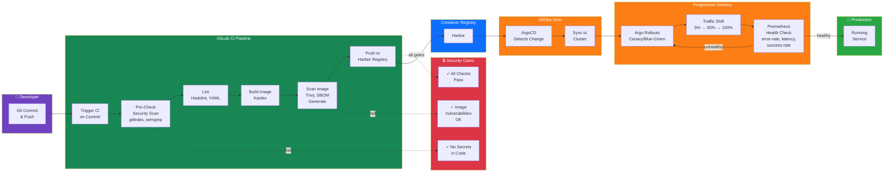
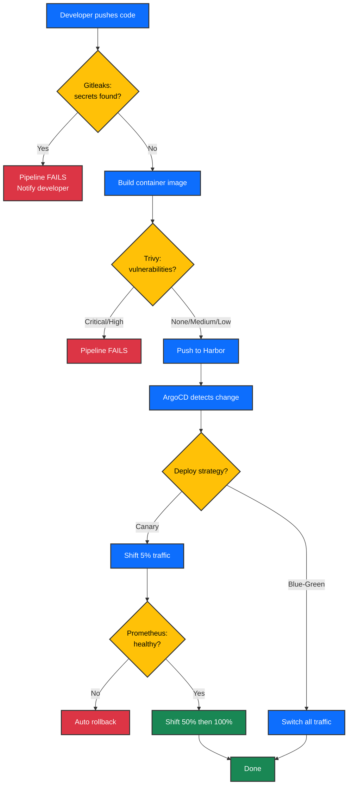

# CI/CD Pipeline Ecosystem

**Story:** How code goes from developer commit to production deployment

## Executive Summary

Code committed to GitLab triggers an automated CI/CD pipeline that builds container images, scans them for security vulnerabilities, pushes them to the Harbor registry, and automatically deploys them to the cluster using ArgoCD with progressive delivery controls. At every stage, security gates prevent insecure code from reaching production. Argo Rollouts gradually shifts traffic to new versions while monitoring health metrics automatically, rolling back on anomalies within seconds.

## Overview Diagram

This diagram shows the complete flow from developer to production:



### Pipeline Decision Tree



## How It Works

### 1. Developer Commits Code

A developer commits code to a GitLab repository and pushes to a branch. The push triggers a GitLab CI pipeline automatically.

### 2. Security Pre-Check

The pipeline runs security scanning immediately:
- **gitleaks**: scans for hardcoded secrets (API keys, passwords, tokens)
- **Semgrep**: static analysis for code vulnerabilities and unsafe patterns

If secrets are found, the pipeline fails and the code does not proceed. The developer must remove the secret, rotate any exposed credentials, and recommit.

### 3. Lint & Validation

The pipeline validates code quality:
- **Hadolint**: container image dockerfile best practices
- **YAML/manifest linting**: syntactic correctness

### 4. Build Container Image

The pipeline builds a container image using **Kaniko**, a tool that builds images inside Kubernetes without requiring Docker daemon. The image is tagged with the commit SHA and branch name.

### 5. Vulnerability Scan & SBOM

The built image is scanned using **Trivy**:
- Detects known CVEs in base images and dependencies
- Generates a Software Bill of Materials (SBOM) for supply chain compliance
- Fails if critical vulnerabilities are found (configurable threshold)

### 6. Push to Harbor

Once all scans pass, the image is pushed to **Harbor**, the organization's container registry. Harbor serves as a pull-through cache for external registries (Docker Hub, ghcr.io, quay.io, Kubernetes) and stores all internally-built images with complete metadata and vulnerability scan results.

### 7. ArgoCD Detects Change

ArgoCD continuously watches the Harbor registry and the Git repository containing deployment manifests. When a new image is pushed, ArgoCD detects the change and prepares to sync the cluster state.

### 8. Progressive Delivery with Argo Rollouts

Instead of switching all traffic to the new version immediately, **Argo Rollouts** uses a **canary** or **blue-green** strategy:

**Canary:**
- Deploy new version alongside old version
- Shift 5% of traffic to new version (old version: 95%)
- Monitor health for 5 minutes
- If healthy: shift to 50%, monitor, shift to 100%
- If unhealthy: immediately roll back to old version

**Blue-Green:**
- Deploy new version (green) without serving traffic
- Run health checks
- Switch all traffic to new version (green)
- Keep old version (blue) ready for instant rollback

### 9. Automated Health Monitoring

While traffic is shifting, **Prometheus** continuously evaluates health metrics:
- **Error Rate**: HTTP 5xx errors < 2% (threshold configurable)
- **Latency**: p99 request latency < 500ms
- **Success Rate**: HTTP 2xx requests >= 98%

These metrics are defined in **AnalysisTemplates** and checked every 2 minutes. If any metric exceeds the threshold, Argo Rollouts immediately halts traffic shifting and rolls back to the previous healthy version.

### 10. Full Deployment (or Rollback)

Once the canary reaches 100% traffic and health checks pass, the rollout is complete. If any health metric fails at any stage, traffic is rolled back to the old version within seconds, and the new version is marked failed for investigation.

## Pipeline Patterns

GitLab CI uses template patterns to standardize pipelines across different project types:

| Pattern | Use Case | Stages | Push to Harbor | Deploy |
|---------|----------|--------|---|---|
| **Microservice** | Application code (Python, Go, Node) | Pre-check → Lint → Build → Scan → Push → Deploy | Yes | Yes (canary) |
| **Platform Service** | Core platform component | Pre-check → Lint → Build → Scan → Push → Deploy | Yes | Yes (blue-green) |
| **Library** | Shared code or SDK (no container) | Pre-check → Lint → Test | No | No (Git tag only) |
| **Infrastructure** | Terraform, Helm charts, manifests | Lint → Validate → Test | No | Yes (manual approval) |

All patterns enforce the same security gates. A developer cannot merge code that fails gitleaks or image vulnerability scans.

## Security Gates

Every deployment is protected by multiple mandatory security checkpoints:

| Gate | Tool | Purpose | Failure Action |
|------|------|---------|---|
| **Secrets Detection** | gitleaks | Prevents hardcoded credentials from entering the repository | Pipeline fails, developer must remove secret |
| **Code Analysis** | semgrep | Detects unsafe code patterns, OWASP Top 10 violations | Pipeline fails, developer fixes violation |
| **Image Build Validation** | hadolint | Enforces Dockerfile best practices (non-root, minimal layers) | Pipeline fails, developer fixes Dockerfile |
| **Vulnerability Scan** | Trivy | Detects known CVEs in base image and dependencies | Pipeline fails if critical CVEs found |
| **SBOM Generation** | Trivy (SPDX format) | Creates supply chain attestation for compliance | Must complete before image push |
| **Registry Policy** | Harbor | Only internally-signed images allowed; external registries blocked | Deployment fails if image not from Harbor |
| **Manifest Validation** | kube-apiserver dry-run | Ensures manifests are syntactically correct before applying | Deployment fails if manifest invalid |

Code cannot reach production without passing all gates.

## Technical Reference

### GitLab Runner Configuration

Three runner types execute pipelines:

| Runner | Name | Executor | CPU/Memory | Node Pool | Use Case |
|--------|------|----------|-----------|-----------|----------|
| **Shared** | kubernetes:shared | Kubernetes Pod | 2 CPU, 2Gi | compute | General builds, default |
| **Security** | kubernetes:security | Kubernetes Pod | 4 CPU, 4Gi | compute | SAST, DAST, scanning |
| **Group** | kubernetes:platform | Kubernetes Pod | 2 CPU, 2Gi | compute | Platform-specific builds |

Each runner spawns one pod per CI job on the compute node pool. Pods are garbage-collected after job completion.

Runner configuration is stored in Kubernetes as `release-runners` Helm charts. Configuration includes:
- `KUBERNETES_PRIVILEGED_ENABLED: "true"` for Docker-in-Docker (security runner only)
- `FF_USE_FASTZIP=true` for artifact compression
- `FF_USE_DIRECT_DOWNLOAD=true` for faster artifact fetching
- Timeout: 15 minutes (per job)

### Harbor Integration

Harbor stores all CI-built images with metadata:

- **Pull-through cache**: Docker Hub, ghcr.io, quay.io, registry.k8s.io configured as upstream registries
- **Trivy integration**: Scans all pushed images automatically, results visible in Harbor UI
- **SBOM storage**: All images have SPDX SBOMs attached
- **Retention policy**: Keep images for 90 days; delete older untagged images
- **Credential rotation**: Registry push credentials synced from Vault via ESO

Push credentials are managed:
```yaml
vault_path: kv/services/gitlab/harbor-push
fields:
  - username: gitlab-ci
  - password: (rotated every 90 days)
```

### ArgoCD Application Structure

Each deployed application is defined as an ArgoCD Application CRD:

```yaml
apiVersion: argoproj.io/v1alpha1
kind: Application
metadata:
  name: <service-name>
spec:
  project: default
  source:
    repoURL: https://gitlab.&lt;DOMAIN&gt;/platform/deploy-manifests.git
    path: <service-name>/
    targetRevision: HEAD
  destination:
    server: https://kubernetes.default.svc
    namespace: <service-name>
  syncPolicy:
    automated:
      prune: true
      selfHeal: true
    syncOptions:
      - Validate=true
```

ArgoCD syncs every 3 minutes (or on webhook trigger). If the cluster state differs from Git, ArgoCD automatically corrects it (self-healing).

### Argo Rollouts Configuration Example

A canary rollout that shifts traffic progressively:

```yaml
apiVersion: argoproj.io/v1alpha1
kind: Rollout
metadata:
  name: my-service
spec:
  replicas: 3
  strategy:
    canary:
      steps:
        - setWeight: 5    # 5% traffic to new version
          duration: 5m
        - analysis:
            templates:
              - name: success-rate
                args:
                  service-name: my-service
                  threshold: "98"
        - setWeight: 50   # 50% traffic
          duration: 5m
        - analysis:
            templates:
              - name: error-rate
              - name: latency-check
        - setWeight: 100  # 100% traffic (complete)
      trafficRouter:
        istio: {}  # or: gatewayAPI: {}
```

### AnalysisTemplate Prometheus Queries

Three templates are deployed in the cluster for automated canary validation:

**success-rate template:**
```promql
sum(rate(http_requests_total{job="<service>",status=~"2.."}[2m]))
/
sum(rate(http_requests_total{job="<service>"}[2m]))
```
- Threshold: >= 98% (configurable)
- Window: 2-minute rate, 5 samples
- Fail: Rollback if success rate drops below threshold

**error-rate template:**
```promql
sum(rate(http_requests_total{job="<service>",status=~"5.."}[2m]))
/
sum(rate(http_requests_total{job="<service>"}[2m]))
```
- Threshold: < 2% (configurable)
- Window: 2-minute rate, 5 samples
- Fail: Rollback if error rate rises above threshold

**latency-check template:**
```promql
histogram_quantile(0.99, rate(http_request_duration_seconds_bucket{job="<service>"}[2m]))
```
- Threshold: < 500ms (configurable)
- Window: 2-minute rate, 5 samples
- Fail: Rollback if p99 latency exceeds threshold

All queries are evaluated by Argo Rollouts every 2 minutes during canary stages.

### GitLab Admin Setup

The `gitlab-admin-setup` Job configures GitLab after the webservice becomes ready. It uses a one-line Rails PAT bootstrap, then performs all remaining operations via the GitLab REST API:

1. Bootstraps a Personal Access Token (PAT) via Rails runner (single command)
2. Creates the `platform` group and `platform-deployments` project via GitLab API
3. Uploads the SSH deploy key (public key from `.env`) to `platform/platform-deployments` as a deploy key owned by the `gitlab-ci` service account (can_push=true)
4. Stores the SSH private key in Vault at `kv/services/ci/platform-deploy-key`

The `gitlab-ci` service account is a Keycloak user created by the `keycloak-config` Job (Phase 2c) with Developer access on the `platform` group. SSH deploy keys are provided via `.env` variables (`CI_DEPLOY_PRIVATE_KEY_FILE`, `CI_DEPLOY_PUBLIC_KEY_FILE`) and never generated in-container.

### GitLab Bundle Structure (50-gitlab group)

The **50-gitlab** bundle group (13 bundles) deploys the entire GitLab EE + Runners + golden image system:

| Bundle # | Bundle Name | Purpose | Depends On | Notes |
|----------|-----------|---------|-----------|-------|
| 38 | gitlab-init | Bootstrap secrets, namespaces, CNPG init | minio, monitoring, pki | Waits for infrastructure ready |
| 39 | gitlab-cnpg | 3-replica PostgreSQL for GitLab data | gitlab-init, operators-cnpg | Database backend |
| 40 | gitlab-redis | 3-node Redis Sentinel for caching | gitlab-init, operators-redis | Session & cache backend |
| 41 | gitlab-credentials | Seed CI secrets into Vault (PushSecret) | gitlab-cnpg, gitlab-redis | **Deployed right after redis** |
| 42 | gitlab-core | GitLab EE Helm chart (webservice, sidekiq, gitaly/praefect) | gitlab-cnpg, gitlab-redis, gitlab-credentials | Main service deployment |
| 43 | gitlab-ready | Wait for GitLab webservice readiness probe | gitlab-core | Health check + readiness verification |
| 44 | gitlab-manifests | Additional Gateway, RBAC, StorageClass, NetworkPolicy | gitlab-ready | Manifests for operations |
| 45 | gitlab-runners | Runner namespace + executor init Job | gitlab-ready | Runner infrastructure setup |
| 46 | gitlab-runner-shared | Shared runners (Kubernetes executor, uses Harbor images) | gitlab-runners | Distributed job execution |
| 47 | gitlab-runner-golden-image | Golden image builder (VM-based, uses Harvester) | gitlab-runners | Golden image CI pipeline |

**Critical design**: `gitlab-credentials` (Bundle 41) deploys immediately after `gitlab-redis` (Bundle 40) and before `gitlab-core` (Bundle 42). The `gitlab-credentials` bundle contains a **PushSecret** that seeds CI credentials into Vault during the synchronization. This allows the credentials to be pulled by `gitlab-core` at startup, and by `gitlab-runner-golden-image` when the ExternalSecret syncs (default 5-minute refresh interval).

**Bundles 38-44 are pure infrastructure** (no user-facing services). Bundles 45-47 scale with the platform.

**HTTPRoute configuration**: The `gitlab-core` Helm chart has two subcharts with disabled HTTPRoutes:
- **Registry** (`registry.gatewayRoute.enabled: false`): The internal GitLab Registry subchart is disabled because Harbor serves as the platform registry. Even when disabled, the chart was rendering a dangling HTTPRoute.
- **KAS** (`kas.gatewayRoute.enabled: false`): The Kubernetes Agent Server HTTPRoute is disabled due to a chart bug (gitlab 9.9.2) where the template unconditionally renders port 8142 for autoflow/codec-server, but the Service does not expose this port unless `autoflow.enabled=true`. KAS is accessible via the custom Gateway defined in the `gitlab-manifests` bundle with a dedicated `kas-web` listener.

### CI Pipeline YAML Structure

CI pipelines in GitLab are defined in `.gitlab-ci.yml`:

```yaml
stages:
  - pre-check
  - lint
  - build
  - scan
  - push
  - deploy
  - promote

variables:
  REGISTRY: harbor.&lt;DOMAIN&gt;
  REGISTRY_PATH: harbor.&lt;DOMAIN&gt;/library
  IMAGE_NAME: $REGISTRY_PATH/$CI_PROJECT_NAME
  IMAGE_TAG: $CI_COMMIT_SHA

include:
  - local: /.gitlab/ci-templates/microservice.yml   # Reusable template

microservice:build:
  stage: build
  image: kaniko-project/executor:latest
  script:
    - |
      /kaniko/executor \
        --context $CI_PROJECT_DIR \
        --dockerfile $CI_PROJECT_DIR/Dockerfile \
        --destination $IMAGE_NAME:$IMAGE_TAG \
        --cache=true
```

## Deployment Flow in Action

Here's what happens when a developer pushes code:

1. **T+0s**: Developer pushes code to GitLab
2. **T+1s**: GitLab CI pipeline triggers automatically
3. **T+5s**: gitleaks and semgrep run (fail immediately if secrets found)
4. **T+15s**: Lint checks validate Dockerfile and manifests
5. **T+30s**: Kaniko builds container image
6. **T+1min**: Trivy scans image for CVEs, generates SBOM
7. **T+1min 30s**: Image pushed to Harbor (if all scans pass)
8. **T+2min**: ArgoCD webhook notifies of new image
9. **T+2min 30s**: ArgoCD syncs deployment manifest with new image tag
10. **T+3min**: Argo Rollouts begins canary deployment (5% traffic shift)
11. **T+8min**: If healthy, traffic shifts to 50%
12. **T+13min**: If healthy, traffic shifts to 100% (complete)
13. **T+15min**: Rollout complete; old version removed

If any health metric fails during steps 11-13, rollback to old version occurs within 30 seconds.

## Rollback Scenarios

Argo Rollouts automatically rolls back in these cases:

| Condition | Detection | Action | Time to Rollback |
|-----------|-----------|--------|---|
| Error rate spike > 2% | AnalysisTemplate check at canary step | Halt traffic shift, revert to 0% for new version | 2-5 minutes (next check) |
| Latency spike > 500ms p99 | AnalysisTemplate check at canary step | Halt traffic shift, revert to 0% for new version | 2-5 minutes (next check) |
| Pod CrashLoopBackOff | Argo Rollouts controller | Immediately skip to next step or rollback | 30 seconds (status check) |
| Deployment failed | Kubernetes admission controller | ArgoCD skips sync, alerts fired | Immediate |

Developers can also manually rollback via ArgoCD UI or CLI:
```bash
kubectl argo rollouts undo <rollout-name> -n <namespace>
```

## Cross-Ecosystem Integration

This ecosystem integrates with:

- **PKI & Certificates** (Ecosystem 3): TLS certificates for GitLab, Harbor, and ArgoCD endpoints issued by cert-manager
- **Secrets & Configuration** (Ecosystem 7): Vault stores registry push credentials, synced to clusters via ESO
- **Observability & Monitoring** (Ecosystem 5): Prometheus evaluates canary health; Grafana dashboards show deployment progress
- **Networking & Ingress** (Ecosystem 2): Traefik routes GitLab, Harbor, and ArgoCD traffic via Gateway API
- **Authentication & Identity** (Ecosystem 1): Keycloak provides OIDC for GitLab and ArgoCD user logins

---

## See Also

- **Services**: [GitLab README](../services/gitlab/README.md), [Harbor README](../services/harbor/README.md), [Argo README](../services/argo/README.md)
- **Getting Started**: [Deployment guide](../getting-started.md) (Steps 5-6: GitOps &amp; CI/CD deployment)
- **Platform Overview**: [Architecture overview](./overview.md)
