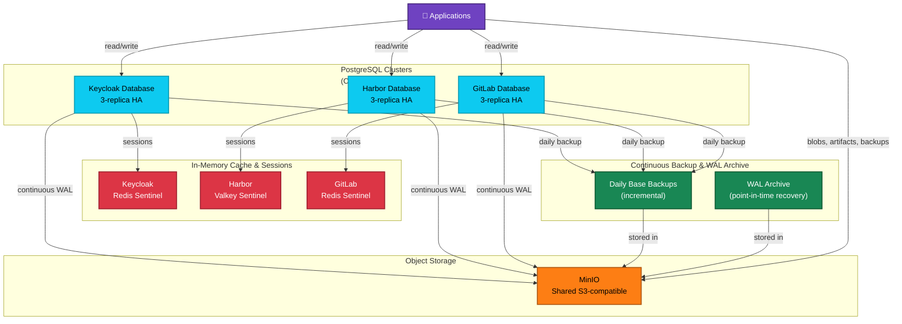
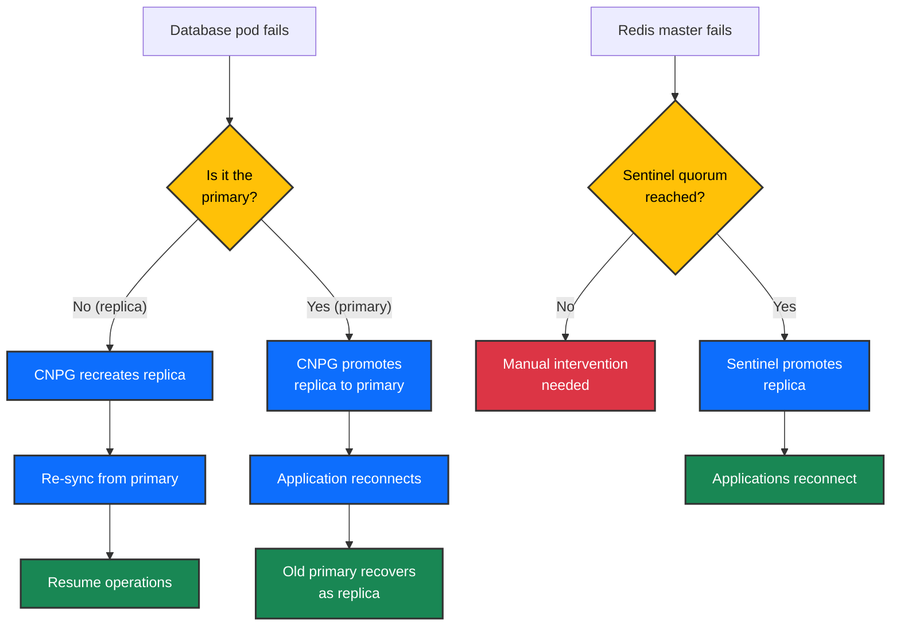

# Data & Storage Ecosystem

## Executive Summary

The platform distributes data across three separate, independently managed PostgreSQL clusters (one per critical service), Redis/Valkey for in-memory caching and session management, and a shared MinIO object store for backup and artifact storage. Each database cluster automatically replicates across three nodes for high availability, with continuous backups to MinIO for point-in-time recovery. This design isolates database failure domains (if Keycloak's database fails, Harbor and GitLab remain unaffected) while keeping backup and session infrastructure centralized.

---

## Overview Diagram: How Data Flows Through the Platform

The following diagram shows the data storage architecture and backup flows:



### Database Failure Decision Tree



**The Flow (Plain English):**

1. **Three independent databases** — Keycloak, Harbor, and GitLab each run a separate PostgreSQL cluster. This isolation prevents a database bug or corruption in one service from affecting the others.

2. **High availability within each cluster** — Each PostgreSQL cluster runs on three separate nodes with automatic failover. If one node fails, another node is elected as the new primary in seconds.

3. **In-memory session cache** — Each service uses its own Redis or Valkey instance (with Sentinel for automatic master election) to cache frequently-accessed data and store user sessions. Sessions are not replicated between services.

4. **Shared object storage** — Harbor stores image blobs, GitLab stores job artifacts, and all three databases send their backups to a single MinIO instance. This consolidates backup infrastructure while keeping databases isolated.

5. **Continuous backup pipeline** — Every database continuously ships Write-Ahead Logs (WAL) to MinIO for point-in-time recovery. Once per day, a full backup is created and stored alongside the WAL files.

---

## How It Works: The Data Tier Strategy

### Why Three Separate Databases?

Each critical service (Keycloak, Harbor, GitLab) has its own PostgreSQL cluster. This design provides **failure isolation**: if one service's database becomes unavailable, the others continue to operate independently. For example, if Keycloak's PostgreSQL cluster fails, users cannot authenticate — but Harbor remains able to serve images and GitLab can still accept commits and trigger pipelines.

### Why PostgreSQL + Cache Layers?

PostgreSQL stores persistent state (user accounts, registry metadata, GitLab repositories). Redis/Valkey instances cache frequently-accessed data (sessions, temporary state, access tokens) and are intentionally **not** replicated between services. If a cache fails, it is re-populated on-demand from the database.

### Why Shared MinIO?

MinIO provides three functions:

1. **Harbor blob storage** — Container images are stored as objects in MinIO
2. **Database backups** — All three PostgreSQL clusters send their backups to MinIO
3. **GitLab artifacts** — CI/CD job artifacts are stored as objects in MinIO

A single MinIO instance simplifies backup infrastructure and cost. If MinIO fails, the platform cannot write new backups or store new images, but existing data remains safe in PostgreSQL and existing backups are preserved on disk.

### Why Continuous WAL Archival?

Each database continuously ships its Write-Ahead Log (WAL) to MinIO. Combined with daily base backups, this enables **point-in-time recovery** — if data is accidentally corrupted or deleted, the platform can restore to any moment within the last day. Without WAL archival, recovery would only be possible to the nearest hourly or daily backup, potentially losing recent transactions.

---

## Database Inventory

| Service | Database Name | PostgreSQL Version | Replicas | Cluster | Storage | Backup Location |
|---------|---------------|--------------------|----------|---------|---------|------------------|
| Keycloak | keycloak | 16.6 | 3 | keycloak-pg | 10Gi | s3://cnpg-backups/keycloak-pg |
| Harbor | registry | 16.6 | 3 | harbor-pg | 20Gi | s3://cnpg-backups/harbor-pg |
| GitLab | gitlabhq_production | 17.6 | 3 | gitlab-postgresql | 50Gi | s3://cnpg-backups/gitlab-postgresql |

**Additional Databases:**

- **Grafana** (monitoring) — CNPG cluster in the Monitoring stack, 10Gi storage, 3-replica HA. Stores dashboards, datasources, and user preferences. No external backup required (configuration is code-driven via ConfigMaps).

**Cache Layer Details:**

| Service | Cache Type | High Availability | Replicas | Operator |
|---------|------------|--------------------|----------|----------|
| Keycloak | Redis | Sentinel quorum | 3 sentinels + 1 master + 2 replicas | OpsTree Redis |
| Harbor | Valkey | Sentinel quorum | 3 sentinels + 1 master + 2 replicas | Spotahome Valkey |
| GitLab | Redis | Sentinel quorum | 3 sentinels + 3 master+replica pods | OpsTree Redis |
| ArgoCD | Valkey | Built-in cluster | 3-node cluster | Helm subchart |

---

## Backup & Recovery Strategy

### Backup Process

**Continuous WAL Archival** (Real-time, no downtime)
- Each PostgreSQL cluster continuously ships Write-Ahead Logs to MinIO
- WAL contains every transaction that modifies the database
- Enables point-in-time recovery to any second within the retention window

**Daily Base Backups** (Scheduled, 1 per day)
- CloudNativePG's Barman integration takes a full backup of each database
- Backups are incremental when possible (only changed data blocks are backed up)
- All backups are stored in MinIO under the cluster-specific path

#### Backup Retention

- Retention policy: `1d` (one day of backups retained)
- Backups older than 1 day are automatically deleted
- WAL files for the same retention window are kept alongside backups

### Recovery Procedure

#### Restore to Latest State

```
1. kubectl get cluster -n database <cluster-name> -o yaml > cluster-backup.yaml
2. Edit cluster-backup.yaml: change metadata.name to <cluster-name>-recovered
3. Add bootstrap.recovery section pointing to MinIO backup
4. kubectl apply -f cluster-backup.yaml
5. Wait for cluster to reach Ready condition (typically 5-10 minutes)
6. Update service DNS/connection strings to point to recovered cluster
```

#### Restore to Specific Point in Time

- Include targetTime parameter in bootstrap.recovery section
- CNPG will restore to the nearest base backup, then replay WAL files until the specified time

#### Verification

- Check cluster health: `kubectl get cluster <name> -o wide`
- Verify data by querying the recovered database
- Validate application connectivity

---

## High Availability & Failure Scenarios

### PostgreSQL High Availability (CNPG)

#### Automatic Failover

- Each PostgreSQL cluster runs 3 replicas (1 primary + 2 read replicas)
- If the primary fails, CNPG automatically promotes one replica to primary (typically within 10-30 seconds)
- Applications transparently reconnect to the new primary

#### Pod Anti-Affinity

- Each PostgreSQL pod is pinned to a separate database node (`workload-type: database`)
- CNPG ensures only one replica per node — if a node fails, one replica is lost but the cluster remains healthy

#### Read Scaling

- Read replicas are accessible via the `-ro` service endpoint
- Reporting and monitoring queries can be directed to replicas to reduce primary load

#### Node Failure Recovery

- If a database node becomes unavailable, CNPG automatically re-creates the pod on a healthy node
- Data is re-synced from the primary via streaming replication

### Redis/Valkey High Availability (Sentinel)

#### Automatic Master Election

- Each Redis/Valkey cluster has 3 Sentinel pods watching the primary
- If the primary becomes unavailable, Sentinels hold an election and promote a replica to primary
- Promotion typically takes 30-60 seconds

#### Session Loss Tolerance

- If a Sentinel node fails, the remaining 2 Sentinels continue monitoring (requires 2/3 quorum)
- If the entire cluster fails, sessions are lost but the application continues to operate (database contains the authoritative state)

### MinIO Availability

**Single-Instance Design** (Known Limitation)
- MinIO runs as a single pod with a 200Gi PVC
- If the MinIO pod fails, new backups cannot be created and new artifacts cannot be stored
- **Mitigation**: Monitoring alerts immediately notify operators if MinIO becomes unavailable
- **Future improvement**: Deploy MinIO in distributed mode (4+ disks across multiple nodes) for automatic failover

### Vault Raft Storage

- Vault stores encryption keys and PKI credentials across a 3-replica Raft cluster
- Automatically elects a leader and maintains quorum — tolerates 1 node failure
- Data is replicated in real-time; all replicas hold identical state

---

## Operational Characteristics

### Monitoring & Observability

#### PostgreSQL Metrics

- CNPG exports Prometheus metrics for all clusters
- Grafana dashboards display replica lag, connection count, transaction rate, and cache hit ratio
- Alerts fire if any replica falls more than 10MB behind the primary

#### Redis/Valkey Metrics

- Redis Exporter exposes memory usage, command latency, and keyspace statistics
- Sentinel-specific metrics track failover count and quorum status
- Grafana dashboards display cache hit ratio and eviction rate

#### MinIO Metrics

- MinIO exposes object count, bucket size, and S3 request latency
- Alerts fire if available disk space drops below 10%

#### Backup Status

- CNPG logs all backup operations (start time, duration, size, completion status)
- Prometheus alerts notify operators if a backup fails or if WAL archival falls behind

### Capacity Planning

#### Storage Growth

- PostgreSQL storage is monitored for growth rate per cluster
- GitLab-pg grows fastest (~500MB/week) due to CI/CD artifacts and project data
- All PVCs use VolumeAutoscaler CRs to auto-expand at 80% capacity

#### Backup Storage

- MinIO capacity must accommodate: 1 day × 3 clusters × (base backup + WAL files)
- Estimate: ~30-50GB per day for typical workload
- Current allocation: 200Gi (sufficient for 4-5 days of backups)

### Compliance & Standards

#### ACID Guarantees

- PostgreSQL enforces ACID compliance — all transactions are durable
- No data loss occurs in normal operation or after planned restarts

#### Encryption at Rest

- All PVCs use Harvester's storage encryption (via LUKS or similar)
- Backup encryption is inherited from MinIO's storage backend

#### Audit Trail

- PostgreSQL `log_connections` and `log_disconnections` parameters log all access
- Vault audit logs track all PKI operations
- MinIO S3 access logs record all object operations (if enabled)

---

## Technical Reference

### CloudNativePG Cluster Specification

Each PostgreSQL cluster follows this pattern:

```yaml
spec:
  instances: 3                      # 1 primary + 2 replicas
  imageName: ghcr.io/cloudnative-pg/postgresql:16.6  # or 17.6 for GitLab
  storage:
    size: 10Gi                      # Varies by service
    storageClass: harvester         # Uses Harvester's storage
  resources:
    requests:
      cpu: 250m                     # Modest base requests
      memory: 512Mi                 # Actual memory varies
  affinity:
    nodeSelector:
      workload-type: database       # Pinned to dedicated database nodes
    podAntiAffinityType: preferred  # Spreads replicas across nodes
  backup:
    barmanObjectStore:
      destinationPath: "s3://cnpg-backups/<cluster-name>"
      endpointURL: "http://minio.minio.svc.cluster.local:9000"
    retentionPolicy: "1d"           # Keep 1 day of backups
  monitoring:
    enablePodMonitor: true          # CNPG auto-creates Prometheus monitoring
```

### Redis/Valkey Sentinel Configuration

Each cache cluster uses Spotahome or OpsTree Redis operators:

```yaml
spec:
  redis:
    replicas: 3                     # 1 master + 2 read replicas
    image: valkey:7.0               # or redis:7.0
    resources:
      requests:
        cpu: 100m
        memory: 128Mi
  sentinel:
    replicas: 3                     # Quorum for failover
    resources:
      requests:
        cpu: 100m
        memory: 64Mi
```

### MinIO Configuration

MinIO is deployed as a single pod with persistent storage:

```yaml
spec:
  containers:
  - name: minio
    image: minio/minio:latest
    volumeMounts:
    - name: data
      mountPath: /data
  volumes:
  - name: data
    persistentVolumeClaim:
      claimName: minio-data  # 200Gi PVC
```

**Bucket Structure:**
```
cnpg-backups/
  keycloak-pg/          # WAL + base backups for Keycloak
  harbor-pg/            # WAL + base backups for Harbor
  gitlab-postgresql/    # WAL + base backups for GitLab
harbor-registry/        # Container image blobs
gitlab-artifacts/       # CI/CD job artifacts
```

### Accessing Databases from Applications

#### Connection Strings

Each CNPG cluster creates two Kubernetes services:

- `<cluster-name>-rw.database.svc.cluster.local` — Read-write (primary only)
- `<cluster-name>-ro.database.svc.cluster.local` — Read-only (load-balanced across replicas)

Applications receive credentials via External Secrets Operator:

```yaml
kind: SecretStore
metadata:
  name: vault-database
spec:
  provider:
    vault:
      auth:
        kubernetes:
          mountPath: "kubernetes"
          role: "app-role"
      path: "kv/data/services/databases"
      server: "http://vault.vault.svc.cluster.local:8200"
---
kind: ExternalSecret
metadata:
  name: database-credentials
spec:
  secretStoreRef:
    name: vault-database
  target:
    name: database-secret
  data:
  - secretKey: username
    remoteRef:
      key: keycloak
      property: username
  - secretKey: password
    remoteRef:
      key: keycloak
      property: password
```

### Service Monitor Configuration

CNPG and Redis exporters are monitored via ServiceMonitor CRs:

```yaml
kind: ServiceMonitor
metadata:
  name: cnpg-postgres
spec:
  selector:
    matchLabels:
      app: postgresql
  endpoints:
  - port: metrics
    interval: 30s
---
kind: ServiceMonitor
metadata:
  name: redis
spec:
  selector:
    matchLabels:
      app: redis
  endpoints:
  - port: metrics
    interval: 30s
```

---

## Integration with Other Ecosystems

### PKI & Certificates

- PostgreSQL servers expose metrics on TLS endpoints protected by cert-manager-issued certificates
- Backup S3 endpoint uses HTTPS (if configured) with certs from Root CA → Vault → cert-manager chain

### Secrets & Configuration

- All database credentials (passwords, access keys) are stored in Vault KV paths
- ESO fetches credentials from Vault and injects them as Kubernetes Secrets
- Applications mount these secrets as environment variables or volume files

### Observability & Monitoring

- Prometheus scrapes metrics from all PostgreSQL, Redis, and MinIO instances
- Grafana displays dashboards for database health, replica lag, and backup status
- Alertmanager notifies on-call engineers if any data service becomes unhealthy

### CI/CD Pipeline

- GitLab writes artifacts to MinIO buckets (via GitLab Runners)
- Harbor pushes backup images to MinIO
- ArgoCD reads backup metadata from MinIO to trigger disaster recovery workflows

---

## Related Ecosystems

- **[Secrets & Configuration](secrets-configuration.md)** — How database credentials are created, stored, and rotated in Vault
- **[Observability & Monitoring](observability-monitoring.md)** — Prometheus/Grafana dashboards for database health and performance
- **[PKI & Certificates](pki-certificates.md)** — TLS certificates protecting database replication and S3 endpoints
- **[CI/CD Pipeline](cicd-pipeline.md)** — How GitLab stores artifacts and Harbor uses MinIO for image blobs

---

## Runbooks & Operations

### Runbooks

- [Disaster Recovery: Point-in-Time Restore](../guides/disaster-recovery.md) — Step-by-step guide to recover a database to a specific moment in time
- [Database Failover Procedure](../guides/day2-operations.md#database-failover) — Manual failover if automatic promotion fails
- [MinIO Out-of-Space Recovery](../guides/troubleshooting.md#minio-disk-full) — Expand MinIO storage or delete old backups

### Monitoring Dashboards

- Grafana → CloudNativePG dashboard — Replica lag, transaction rate, checkpoint progress
- Grafana → Redis dashboard — Memory usage, commands/sec, keyspace statistics
- Grafana → MinIO dashboard — Object count, bucket size, S3 request latency

### Alert Policies

- `PostgreSQLReplicaLag` — Fires if any replica is &gt;10MB behind primary
- `MinIODiskFull` — Fires if available space &lt;10%
- `BackupFailure` — Fires if daily backup does not complete within 1 hour
