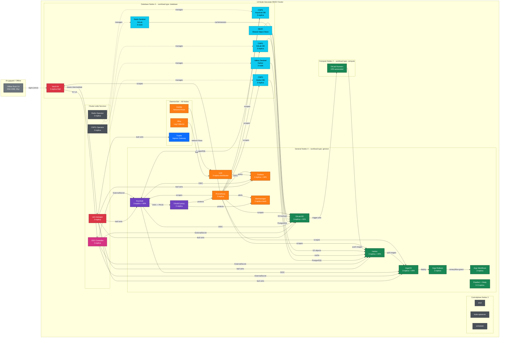
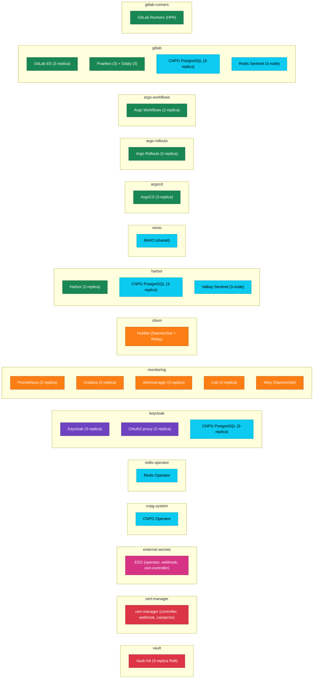

# Platform Landscape

Full visualization of the deployed Harvester RKE2 platform — all 26 services, their interconnections, and data flows across 13 nodes.

---

## Complete Platform Topology

This diagram shows every service, how they connect, and which infrastructure layer they depend on.

---

## Data Flow Legend

| Color | Ecosystem | Components |
|-------|-----------|------------|
| Red | PKI &amp; Certificates | Root CA, Vault, cert-manager |
| Purple | Identity &amp; Access | Keycloak, OAuth2-proxy |
| Orange | Observability | Prometheus, Grafana, Loki, Alloy, Hubble, Alertmanager |
| Green | CI/CD &amp; GitOps | GitLab, Runners, ArgoCD, Argo Rollouts, Argo Workflows |
| Cyan | Data &amp; Storage | CNPG (x3), Redis, Valkey, MinIO |
| Pink | Secrets &amp; Config | External Secrets Operator |
| Blue | Networking | Traefik (Gateway API) |
| Gray | Infrastructure | Controlplane, operators |

---

## Connection Types

| Line Style | Meaning |
|------------|---------|
| Solid arrow | Active data flow (runtime) |
| Dashed arrow | Lifecycle management or one-time operation |
| Label text | Protocol or relationship type |

---

## Deployment Bundle Sequence

Shows which bundle deploys each service and the strict dependency chain.

```mermaid
graph TB
    subgraph B1["Bundle 1 -- PKI &amp; Secrets"]
        direction LR
        b1_vault["Vault HA"]
        b1_cm["cert-manager"]
        b1_eso["ESO"]
        b1_cnpg_op["CNPG Operator"]
        b1_redis_op["Redis Operator"]
    end

    subgraph B2["Bundle 2 -- Identity"]
        direction LR
        b2_kc["Keycloak"]
        b2_oauth["OAuth2-proxy"]
        b2_cnpg["CNPG (Keycloak)"]
    end

    subgraph B3["Bundle 3 -- Monitoring"]
        direction LR
        b3_prom["Prometheus"]
        b3_graf["Grafana"]
        b3_loki["Loki"]
        b3_alloy["Alloy"]
        b3_hub["Hubble"]
        b3_am["Alertmanager"]
    end

    subgraph B4["Bundle 4 -- Harbor"]
        direction LR
        b4_harbor["Harbor"]
        b4_cnpg["CNPG (Harbor)"]
        b4_minio["MinIO"]
        b4_valkey["Valkey"]
    end

    subgraph B5["Bundle 5 -- GitOps"]
        direction LR
        b5_argo["ArgoCD"]
        b5_ro["Argo Rollouts"]
        b5_wf["Argo Workflows"]
    end

    subgraph B6["Bundle 6 -- Git &amp; CI"]
        direction LR
        b6_gl["GitLab EE"]
        b6_run["Runners"]
        b6_prae["Praefect + Gitaly"]
        b6_cnpg["CNPG (GitLab)"]
        b6_redis["Redis Sentinel"]
    end

    B1 --> B2 --> B3 --> B4 --> B5 --> B6

    classDef pki fill:#dc3545,color:#fff,stroke:#a02030,stroke-width:2px
    classDef identity fill:#6f42c1,color:#fff,stroke:#4a2a7f,stroke-width:2px
    classDef obs fill:#fd7e14,color:#fff,stroke:#b15810,stroke-width:2px
    classDef cicd fill:#198754,color:#fff,stroke:#0d5a32,stroke-width:2px
    classDef data fill:#0dcaf0,color:#000,stroke:#0a9db5,stroke-width:2px

    class b1_vault,b1_cm,b1_eso,b1_cnpg_op,b1_redis_op pki
    class b2_kc,b2_oauth,b2_cnpg identity
    class b3_prom,b3_graf,b3_loki,b3_alloy,b3_hub,b3_am obs
    class b4_harbor,b4_cnpg,b4_minio,b4_valkey data
    class b5_argo,b5_ro,b5_wf cicd
    class b6_gl,b6_run,b6_prae,b6_cnpg,b6_redis cicd
```

---

## Namespace Map

Shows how services are distributed across Kubernetes namespaces.

---

## Related Documentation

- [Platform Overview](overview.md) -- Executive summary and service catalog
- [Diagram Reference](DIAGRAM_REFERENCE.md) -- Color scheme and naming conventions
- [Authentication &amp; Identity](authentication-identity.md) -- OIDC flows and access control
- [PKI &amp; Certificates](pki-certificates.md) -- Certificate lifecycle and trust chain
- [CI/CD Pipeline](cicd-pipeline.md) -- Code to production workflow
- [Observability &amp; Monitoring](observability-monitoring.md) -- Metrics, logs, and alerts
- [Data &amp; Storage](data-storage.md) -- Database and object storage architecture
- [Secrets &amp; Configuration](secrets-configuration.md) -- Vault and ESO integration
- [Networking &amp; Ingress](networking-ingress.md) -- Traffic routing and TLS termination
