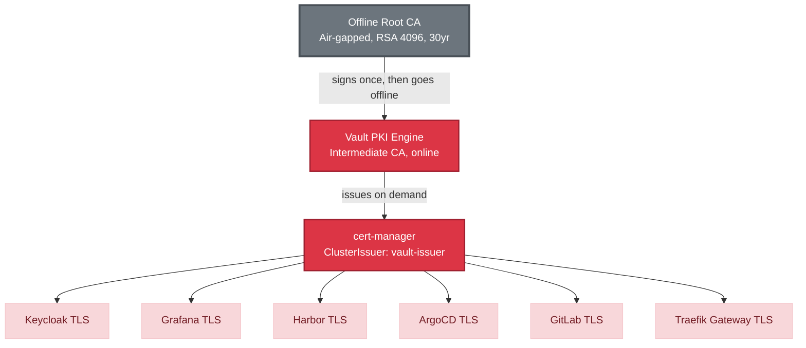
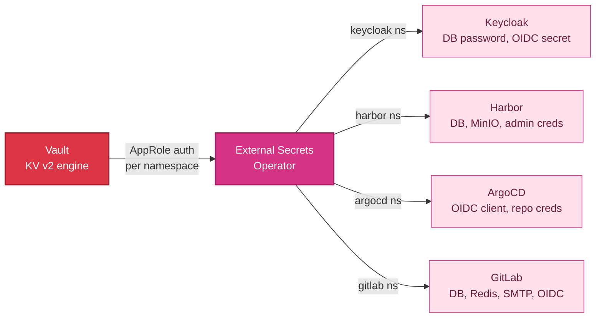
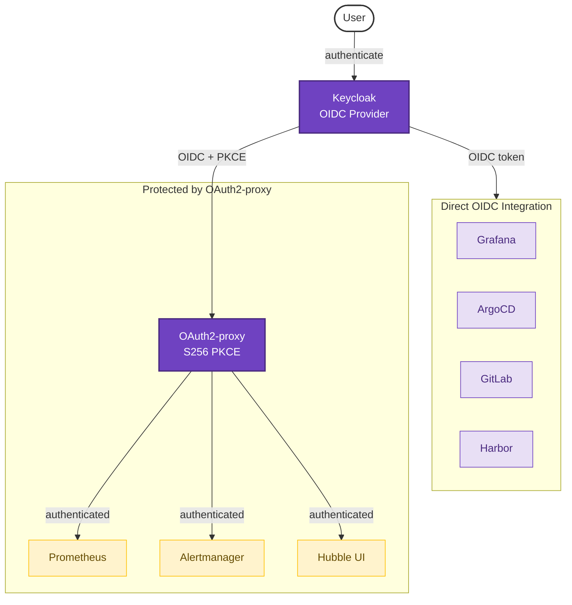
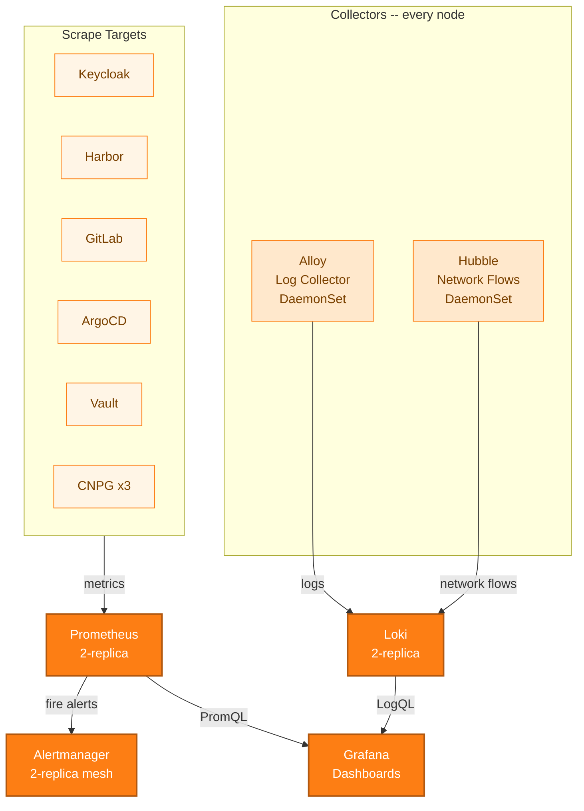
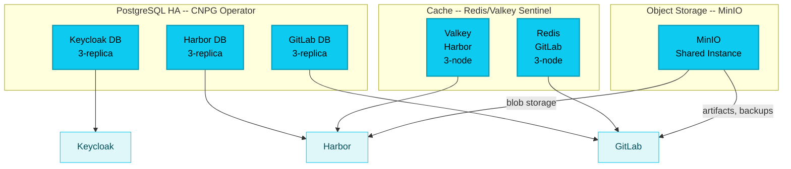
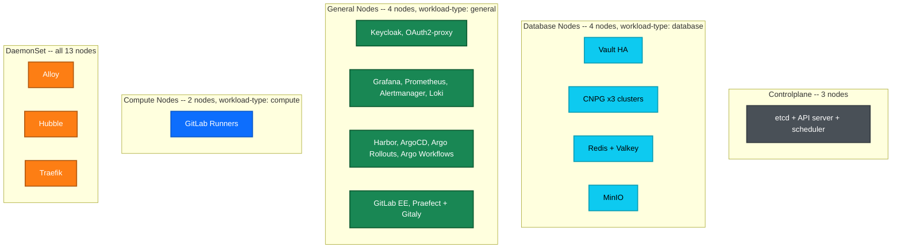

# Platform Landscape

A visual tour of the complete Harvester RKE2 platform — 26 services across 13 nodes, explained one layer at a time.

---

## The Platform at 10,000 Feet

Six stacks build on each other. Security underpins everything, identity enables access control, and the remaining stacks layer on top. Read left-to-right: each stack depends on the ones before it.

```mermaid
graph LR
    subgraph S1["1. Security &amp; PKI"]
        direction TB
        Vault["Vault HA"]
        CM["cert-manager"]
        ESO["ESO"]
    end

    subgraph S2["2. Identity"]
        direction TB
        KC["Keycloak"]
        OAuth["OAuth2-proxy"]
    end

    subgraph S3["3. Observability"]
        direction TB
        Prom["Prometheus"]
        Grafana["Grafana"]
        Loki["Loki"]
    end

    subgraph S4["4. Registry"]
        direction TB
        Harbor["Harbor"]
    end

    subgraph S5["5. GitOps"]
        direction TB
        ArgoCD["ArgoCD"]
        Rollouts["Argo Rollouts"]
    end

    subgraph S6["6. CI/CD"]
        direction TB
        GitLab["GitLab EE"]
        Runners["Runners"]
    end

    S1 --> S2 --> S3 --> S4 --> S5 --> S6

    classDef pki fill:#dc3545,color:#fff,stroke:#a02030,stroke-width:2px
    classDef identity fill:#6f42c1,color:#fff,stroke:#4a2a7f,stroke-width:2px
    classDef obs fill:#fd7e14,color:#fff,stroke:#b15810,stroke-width:2px
    classDef data fill:#0dcaf0,color:#000,stroke:#0a9db5,stroke-width:2px
    classDef cicd fill:#198754,color:#fff,stroke:#0d5a32,stroke-width:2px
    classDef blue fill:#0d6efd,color:#fff,stroke:#0a58ca,stroke-width:2px

    class Vault,CM,ESO pki
    class KC,OAuth identity
    class Prom,Grafana,Loki obs
    class Harbor data
    class ArgoCD,Rollouts cicd
    class GitLab,Runners blue
```

The rest of this document zooms into each major interaction pattern, one at a time.

---

## How Certificates Flow

Every HTTPS endpoint on the platform gets its certificate through this chain. The Root CA is air-gapped and used exactly once — to sign Vault's intermediate. After that, cert-manager handles everything automatically.

---

## How Secrets Get to Services

No service reads secrets directly. Vault stores everything, and ESO syncs credentials into Kubernetes Secrets per namespace. Each namespace has its own SecretStore with a scoped Vault role — no service can read another's secrets.

---

## Who Logs In Where

Keycloak is the single identity provider. Some services integrate directly via OIDC; others sit behind OAuth2-proxy, which handles authentication at the gateway level so the service itself doesn't need to.

---

## The CI/CD Pipeline

Code flows from left to right: a developer pushes to GitLab, Runners build and test, images land in Harbor, and ArgoCD deploys to the cluster. Argo Rollouts handles progressive delivery (canary or blue-green) for production workloads.

```mermaid
graph LR
    Dev(["Developer"])
    GL["GitLab EE<br/>Source + Pipelines"]
    Run["GitLab Runners<br/>Build + Test"]
    Harb["Harbor<br/>Container Registry"]
    Argo["ArgoCD<br/>GitOps Sync"]
    Roll["Argo Rollouts<br/>Canary / Blue-Green"]
    Cluster(["Production<br/>Workloads"])

    Dev -- "git push" --> GL
    GL -- "trigger pipeline" --> Run
    Run -- "push image" --> Harb
    Harb -- "image available" --> Argo
    Argo -- "sync manifests" --> Roll
    Roll -- "progressive rollout" --> Cluster

    classDef user fill:#fff,color:#333,stroke:#333,stroke-width:2px
    classDef cicd fill:#198754,color:#fff,stroke:#0d5a32,stroke-width:2px
    classDef registry fill:#0dcaf0,color:#000,stroke:#0a9db5,stroke-width:2px

    class Dev,Cluster user
    class GL,Run,Argo,Roll cicd
    class Harb registry
```

---

## What Watches Everything

Observability runs on every node and scrapes every service. Logs and metrics flow into separate stores but converge in Grafana for a unified view. Alertmanager routes notifications when thresholds are breached.

---

## Where Data Lives

Three services need relational databases (PostgreSQL via CNPG), two need caches (Redis/Valkey), and two need object storage (MinIO). Each database cluster runs 3 replicas with automatic failover. MinIO is shared but with isolated access keys per consumer.

---

## Node Placement

The cluster has 4 node types. Stateful workloads land on database nodes (fast disks), stateless services on general nodes (HPA scales them), CI jobs on dedicated compute nodes, and DaemonSets run everywhere.

---

## Deployment Bundle Sequence

Each bundle is deployed in order via Fleet GitOps. A bundle cannot deploy until its dependencies are running. The entire platform stands up in about 50 minutes.

```mermaid
graph TB
    subgraph B1["Bundle 1 -- PKI &amp; Secrets"]
        direction LR
        b1_vault["Vault HA"]
        b1_cm["cert-manager"]
        b1_eso["ESO"]
        b1_cnpg_op["CNPG Operator"]
        b1_redis_op["Redis Operator"]
    end

    subgraph B2["Bundle 2 -- Identity"]
        direction LR
        b2_kc["Keycloak"]
        b2_oauth["OAuth2-proxy"]
        b2_cnpg["CNPG Keycloak"]
    end

    subgraph B3["Bundle 3 -- Monitoring"]
        direction LR
        b3_prom["Prometheus"]
        b3_graf["Grafana"]
        b3_loki["Loki"]
        b3_alloy["Alloy"]
        b3_hub["Hubble"]
        b3_am["Alertmanager"]
    end

    subgraph B4["Bundle 4 -- Harbor"]
        direction LR
        b4_harbor["Harbor"]
        b4_cnpg["CNPG Harbor"]
        b4_minio["MinIO"]
        b4_valkey["Valkey"]
    end

    subgraph B5["Bundle 5 -- GitOps"]
        direction LR
        b5_argo["ArgoCD"]
        b5_ro["Argo Rollouts"]
        b5_wf["Argo Workflows"]
    end

    subgraph B6["Bundle 6 -- Git &amp; CI"]
        direction LR
        b6_gl["GitLab EE"]
        b6_run["Runners"]
        b6_prae["Praefect + Gitaly"]
        b6_cnpg["CNPG GitLab"]
        b6_redis["Redis Sentinel"]
    end

    B1 -- "TLS + secrets ready" --> B2
    B2 -- "OIDC available" --> B3
    B3 -- "monitoring online" --> B4
    B4 -- "registry available" --> B5
    B5 -- "GitOps engine ready" --> B6

    classDef pki fill:#dc3545,color:#fff,stroke:#a02030,stroke-width:2px
    classDef identity fill:#6f42c1,color:#fff,stroke:#4a2a7f,stroke-width:2px
    classDef obs fill:#fd7e14,color:#fff,stroke:#b15810,stroke-width:2px
    classDef data fill:#0dcaf0,color:#000,stroke:#0a9db5,stroke-width:2px
    classDef cicd fill:#198754,color:#fff,stroke:#0d5a32,stroke-width:2px
    classDef blue fill:#0d6efd,color:#fff,stroke:#0a58ca,stroke-width:2px

    class b1_vault,b1_cm,b1_eso,b1_cnpg_op,b1_redis_op pki
    class b2_kc,b2_oauth,b2_cnpg identity
    class b3_prom,b3_graf,b3_loki,b3_alloy,b3_hub,b3_am obs
    class b4_harbor,b4_cnpg,b4_minio,b4_valkey data
    class b5_argo,b5_ro,b5_wf cicd
    class b6_gl,b6_run,b6_prae,b6_cnpg,b6_redis blue
```

---

## Namespace Map

Every service lives in a dedicated namespace. Services that work together (like Keycloak and its database) share a namespace. This table maps where everything runs.

| Namespace | Services | Ecosystem |
|-----------|----------|-----------|
| `vault` | Vault HA (3-replica Raft) | Security |
| `cert-manager` | cert-manager (controller, webhook, cainjector) | Security |
| `external-secrets` | ESO (operator, webhook, cert-controller) | Security |
| `cnpg-system` | CNPG Operator | Operators |
| `redis-operator` | Redis Operator | Operators |
| `keycloak` | Keycloak (3-replica), OAuth2-proxy (2-replica), CNPG PostgreSQL (3-replica) | Identity |
| `monitoring` | Prometheus (2-replica), Grafana (2-replica), Alertmanager (2-replica), Loki (2-replica), Alloy (DaemonSet) | Observability |
| `cilium` | Hubble (DaemonSet + Relay) | Observability |
| `harbor` | Harbor (2-replica), CNPG PostgreSQL (3-replica), Valkey Sentinel (3-node) | Registry |
| `minio` | MinIO (shared instance) | Storage |
| `argocd` | ArgoCD (3-replica) | GitOps |
| `argo-rollouts` | Argo Rollouts (2-replica) | GitOps |
| `argo-workflows` | Argo Workflows (2-replica) | GitOps |
| `gitlab` | GitLab EE (3-replica), Praefect (3) + Gitaly (3), CNPG PostgreSQL (3-replica), Redis Sentinel (3-node) | CI/CD |
| `gitlab-runners` | GitLab Runners (HPA autoscaled) | CI/CD |

---

## Related Documentation

- [Platform Overview](overview.md) -- Executive summary and service catalog
- [Diagram Reference](DIAGRAM_REFERENCE.md) -- Color scheme and naming conventions
- [Authentication &amp; Identity](authentication-identity.md) -- OIDC flows and access control
- [PKI &amp; Certificates](pki-certificates.md) -- Certificate lifecycle and trust chain
- [CI/CD Pipeline](cicd-pipeline.md) -- Code to production workflow
- [Observability &amp; Monitoring](observability-monitoring.md) -- Metrics, logs, and alerts
- [Data &amp; Storage](data-storage.md) -- Database and object storage architecture
- [Secrets &amp; Configuration](secrets-configuration.md) -- Vault and ESO integration
- [Networking &amp; Ingress](networking-ingress.md) -- Traffic routing and TLS termination
