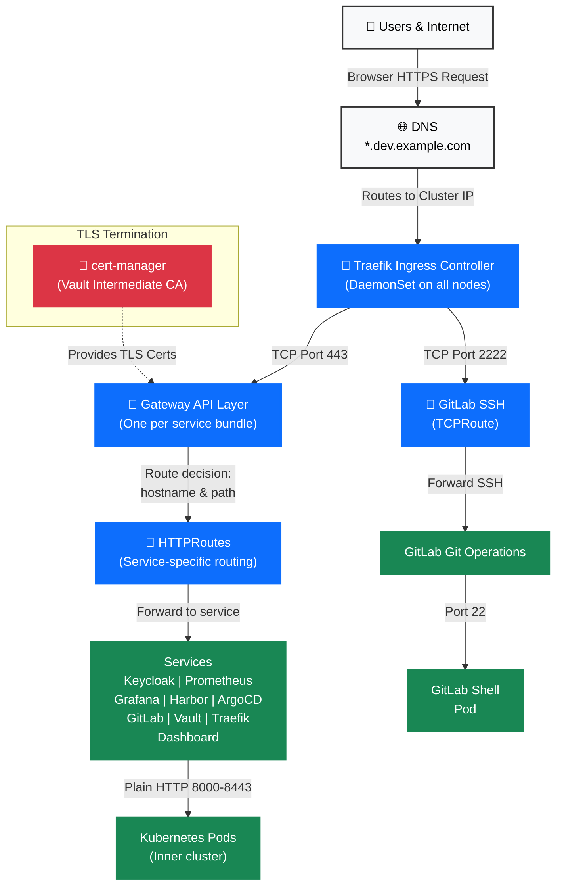

# Networking & Ingress Ecosystem

## Executive Summary

Traffic flows from the internet through DNS to the Traefik ingress controller, which routes requests based on the hostname and path to the appropriate service. TLS is terminated at the Gateway layer with certificates managed by cert-manager, authenticated by Vault's intermediate CA. All services are exposed at `*.dev.example.com`, except for GitLab SSH traffic which flows separately on port 2222.

---

## Leadership Diagram: Traffic Flow



**What this diagram shows:**
- Users request services by hostname (e.g., `keycloak.dev.example.com`)
- Traefik (the blue layer) is the single entry point for all traffic
- TLS is terminated at the Gateway layer before routing to services
- GitLab SSH is a special case: separate port (2222), TCP-based routing, same Traefik
- All services run inside Kubernetes (plain HTTP) and Traefik handles all encryption

---

## How It Works: A Browser Request

When a user opens their browser to `https://grafana.dev.example.com/`:

1. **DNS resolution**: User's DNS resolver asks "where is grafana.dev.example.com?" and gets back the cluster's public IP (managed externally, not shown in diagram)

2. **Traefik receives the request**: The request arrives at Traefik (running on every node as a DaemonSet). Traefik listens on port 443 (standard HTTPS) and sees the hostname `grafana.dev.example.com`.

3. **Gateway decrypts and routes**: The appropriate Gateway (monitoring-gateway) terminates the TLS connection using a certificate provided by cert-manager. Once decrypted, Traefik reads the hostname and path.

4. **HTTPRoute decides destination**: An HTTPRoute rule says "if hostname is `grafana.dev.example.com`, forward to the Grafana service on port 3000 inside the cluster."

5. **Service receives plain HTTP**: Grafana Pod receives a plain HTTP request (inside the cluster network, no encryption needed — Kubernetes network is trusted).

6. **Response returns**: Grafana responds with the dashboard. Traefik re-encrypts with TLS and sends back to the browser.

**Special case — GitLab SSH**: When a developer runs `git clone git@gitlab.dev.example.com:namespace/project.git`, the request goes to port 2222 (not 443). Traefik sees TCP traffic on port 2222 and uses a TCPRoute to forward directly to the GitLab SSH service, no HTTP parsing needed.

---

## Service Endpoints

All services are exposed via Gateway API. Most are HTTPS only; GitLab also accepts SSH.

| Service | URL | Protocol | Authentication |
|---------|-----|----------|-----------------|
| Keycloak (OAuth2 Provider) | `https://keycloak.dev.example.com` | HTTPS | Public OAuth2 server |
| Prometheus | `https://prometheus.dev.example.com` | HTTPS | OAuth2-proxy (Keycloak) |
| Alertmanager | `https://alertmanager.dev.example.com` | HTTPS | OAuth2-proxy (Keycloak) |
| Grafana | `https://grafana.dev.example.com` | HTTPS | OAuth2-proxy (Keycloak) |
| Hubble (Cilium Network Visibility) | `https://hubble.dev.example.com` | HTTPS | OAuth2-proxy (Keycloak) |
| Harbor (Container Registry) | `https://harbor.dev.example.com` | HTTPS | Basic auth (users/passwords) |
| ArgoCD | `https://argo.dev.example.com` | HTTPS | OAuth2-proxy (Keycloak PKCE) |
| Argo Rollouts | `https://argo-rollouts.dev.example.com` | HTTPS | OAuth2-proxy (Keycloak) |
| Argo Workflows | `https://argo-workflows.dev.example.com` | HTTPS | OAuth2-proxy (Keycloak) |
| GitLab Web | `https://gitlab.dev.example.com` | HTTPS | OAuth2 / SAML (Keycloak) |
| GitLab SSH | `git@gitlab.dev.example.com:22` (port 2222) | SSH/TCP | SSH key authentication |
| Vault | `https://vault.dev.example.com` | HTTPS | OAuth2-proxy (Keycloak) |
| Traefik Dashboard | `https://traefik.dev.example.com` | HTTPS | OAuth2-proxy (Keycloak) |

---

## Gateway API Pattern

Every service bundle introduces a Gateway and associated HTTPRoutes (or TCPRoutes for SSH).

### What is a Gateway?

A Gateway is a Kubernetes object that:
- Listens on a hostname (e.g., `keycloak.dev.example.com`)
- Holds a TLS certificate for that hostname
- Acts as the entry point for all routes attached to it

### What is an HTTPRoute?

An HTTPRoute is a Kubernetes object that:
- Attaches to a Gateway
- Defines routing rules (match hostname/path)
- Specifies the backend Service and port

### What is a TCPRoute?

A TCPRoute is like HTTPRoute but for raw TCP traffic (no HTTP parsing). Used for GitLab SSH.

### The Pattern

One Gateway per major service or bundle:

```
Gateway: keycloak
├─ Listener: HTTPS on keycloak.dev.example.com
├─ TLS Cert: provided by cert-manager
└─ HTTPRoute: keycloak → Service:keycloak:8080

Gateway: grafana (in monitoring namespace)
├─ Listener: HTTPS on grafana.dev.example.com
├─ TLS Cert: provided by cert-manager
└─ HTTPRoute: grafana → Service:grafana:3000

Gateway: gitlab
├─ Listener: HTTPS on gitlab.dev.example.com
├─ Listener: TCP on port 2222 (SSH)
├─ TLS Certs: provided by cert-manager
├─ HTTPRoute: /webhooks → Service:gitlab-webservice
└─ TCPRoute: ssh → Service:gitlab-shell:22
```

All Gateways use the same GatewayClass (`traefik`), which tells Kubernetes to use Traefik as the ingress controller.

---

## Network Security

### Current State
No NetworkPolicies are deployed on the cluster. This was a deliberate decision made during Bundle 2 (Identity) deployment when NetworkPolicies conflicted with the CNPG operator's rolling upgrade behavior.

### Why?
The CNPG operator performs rolling updates (one pod at a time, old and new running simultaneously). NetworkPolicies that restrict pod-to-pod traffic can break the cluster's ability to promote a new primary during these upgrades. The trade-off: we have an open pod-to-pod network (within the cluster), but all external traffic is protected by TLS at the Gateway layer.

### TLS Everywhere
- **External entry point**: All traffic from the internet to services is HTTPS (except DNS, which is outside the cluster)
- **Certificate authority**: Vault provides the intermediate CA that signs all TLS certificates
- **Certificate automation**: cert-manager watches Gateway specs and automatically creates/renews certificates
- **Rotation**: Certificates are valid for 30 days and renewed 7 days before expiration

### Cilium CNI & Hubble
The cluster uses Cilium as its Container Network Interface. Cilium provides:
- Default-allow pod networking (no restrictions)
- Hubble: network visibility and observability
- Flow tracking and metrics (visible in Grafana dashboards)
- Cilium alerts in Prometheus for network anomalies

---

## Technical Reference

### Gateway API CRD Versions
- **HTTPRoute**: `gateway.networking.k8s.io/v1` (stable)
- **TCPRoute**: `gateway.networking.k8s.io/v1alpha2` (alpha, for GitLab SSH)
- **Gateway**: `gateway.networking.k8s.io/v1`

### Traefik GatewayClass

The cluster defines one GatewayClass named `traefik`:

```yaml
kind: GatewayClass
metadata:
  name: traefik
spec:
  controllerName: traefik.io/gateway-controller
```

All Gateways reference this class. RKE2 comes with Traefik pre-installed.

### Certificate Management

Annotations on every Gateway tell cert-manager to issue and manage certificates:

```yaml
annotations:
  cert-manager.io/cluster-issuer: vault-issuer   # Use Vault intermediate CA
  cert-manager.io/duration: "720h"               # Valid for 30 days
  cert-manager.io/renew-before: "168h"           # Renew 7 days early
```

The Vault Issuer (ClusterIssuer resource) connects to Vault and requests intermediate certificates for each service hostname.

### Typical Gateway Spec

```yaml
apiVersion: gateway.networking.k8s.io/v1
kind: Gateway
metadata:
  name: example-gateway
  namespace: example
  annotations:
    cert-manager.io/cluster-issuer: vault-issuer
spec:
  gatewayClassName: traefik
  listeners:
    - name: https
      protocol: HTTPS
      port: 8443                              # Internal port (Traefik listens)
      hostname: example.dev.example.com     # Matches HTTPRoute
      tls:
        mode: Terminate
        certificateRefs:
          - name: example-dev-aegisgroup-ch-tls  # Secret (auto-created by cert-manager)
      allowedRoutes:
        namespaces:
          from: Same                          # Only routes in same namespace
```

### Typical HTTPRoute Spec

```yaml
apiVersion: gateway.networking.k8s.io/v1
kind: HTTPRoute
metadata:
  name: example
  namespace: example
spec:
  parentRefs:
    - name: example-gateway
      namespace: example
      sectionName: https                      # Matches the listener name
  hostnames:
    - example.dev.example.com
  rules:
    - matches:
        - path:
            type: PathPrefix
            value: /
      backendRefs:
        - name: example-service              # Kubernetes Service
          port: 8080                          # Service port
```

### TCPRoute for GitLab SSH

```yaml
apiVersion: gateway.networking.k8s.io/v1alpha2
kind: TCPRoute
metadata:
  name: gitlab-ssh
  namespace: gitlab
spec:
  parentRefs:
    - name: gitlab                           # Gateway name
      sectionName: ssh                       # Listener name (TCP on port 2222)
  rules:
    - backendRefs:
        - name: gitlab-gitlab-shell          # Service name
          port: 22                           # Service port (SSH runs on 22 inside container)
```

### Traefik DaemonSet

Traefik runs as a DaemonSet so that every node can receive traffic:

```
daemonset.apps/traefik
├─ Running on 13 nodes (3 control, 4 database, 4 general, 2 compute)
├─ Listens on host port 443 (HTTPS)
├─ Listens on host port 2222 (GitLab SSH)
└─ Watches Gateways and HTTPRoutes for changes
```

Traefik automatically picks up new Gateways/HTTPRoutes and updates its routing table.

---

## DNS & Load Balancing

### Cluster Ingress IP
The cluster has a single public IP address that all `*.dev.example.com` domains point to via DNS A records. External load balancing (DNS round-robin or cloud LB) is outside the scope of this document.

### Internal Service Discovery
Inside the cluster, Kubernetes DNS (`coredns`) resolves service names. Traefik connects to services by name, e.g., `grafana.monitoring:3000`, and Kubernetes DNS resolves the Service IP automatically.

---

## Monitoring & Observability

### Traefik Metrics
Prometheus scrapes Traefik metrics:
- Request rate, latency, error rate per route
- TLS certificate expiration time (alerting)
- Connection counts and duration

### Gateway/HTTPRoute Validation
Kubernetes validates all Gateway and HTTPRoute specs. Invalid specs are rejected immediately:

```bash
kubectl apply -f bad-gateway.yaml
# error: invalid hostname format
```

### Hubble Network Flow Visibility
Cilium's Hubble agent runs on every node and captures network flows. Grafana dashboards show:
- Service-to-service communication
- Dropped packets (would indicate network policies in effect)
- DNS queries and responses
- Flow timeline (packet-level tracing)

---

## Common Patterns & Best Practices

### Adding a New Service
To expose a new service, create:

1. **A Kubernetes Service** (e.g., `my-app-service`)
2. **A Gateway** with the new hostname and TLS cert reference
3. **An HTTPRoute** that attaches to the Gateway and forwards to the Service

See `docs/getting-started.md` for step-by-step example.

### Updating a Service's Hostname
Edit the Gateway and HTTPRoute to change the hostname. cert-manager automatically issues a new certificate if the hostname changes.

### Adding Authentication
Place an OAuth2-proxy Deployment in front of the service, and update the HTTPRoute to forward to oauth2-proxy instead of the service directly. oauth2-proxy validates the token with Keycloak and forwards authenticated requests to the backend.

### Debugging a Broken Route
1. Check the HTTPRoute and Gateway exist: `kubectl get httproutes,gateways -A`
2. Check the Gateway is ready: `kubectl describe gateway <name>`
3. Check the cert-manager secret exists: `kubectl get secret -A | grep tls`
4. Check Traefik logs: `kubectl logs -n kube-system daemonset/traefik`
5. Test from inside the cluster: `curl -k https://service.dev.example.com`

---

## Cross-Ecosystem Links

- **Authentication & Identity** → Keycloak is the OAuth2 provider; see [authentication-identity.md](authentication-identity.md) for how users log in
- **PKI & Certificates** → cert-manager issues TLS certificates; see [pki-certificates.md](pki-certificates.md) for certificate lifecycle
- **Observability & Monitoring** → Prometheus scrapes Traefik metrics; Grafana dashboards show request latency and errors
- **Secrets & Configuration** → OAuth2-proxy secrets are stored in Vault and synced via External Secrets Operator (ESO)
