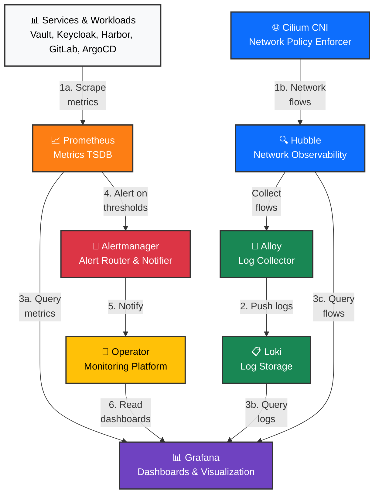
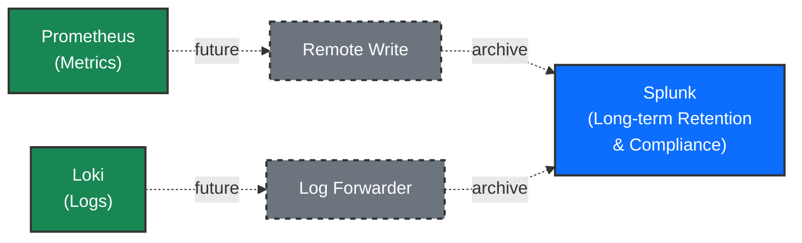
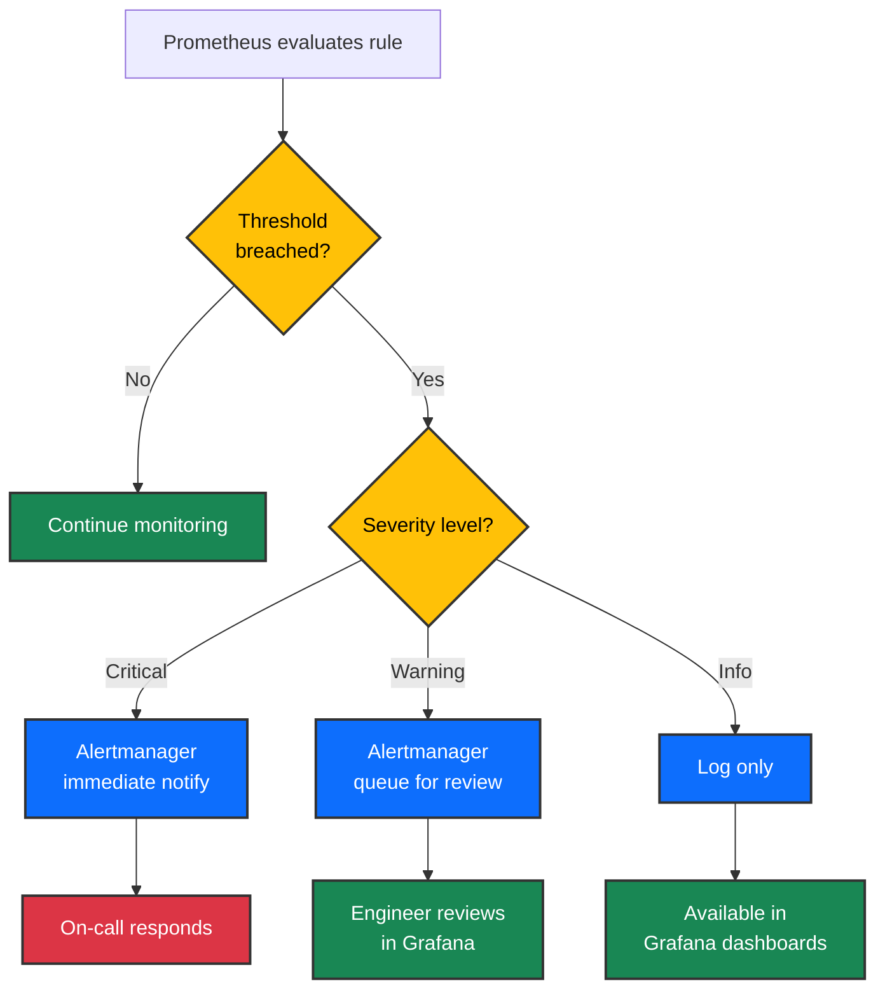

# Observability & Monitoring Ecosystem

## Executive Summary

The platform provides complete visibility into everything running on it through three complementary observability pillars: **metrics** (what is happening numerically), **logs** (what happened and why), and **network flows** (how services communicate). These three data streams converge in Grafana, a unified dashboard platform where operators monitor system health, diagnose problems, and receive alerts when thresholds are breached. Alertmanager automatically routes critical issues to on-call teams, ensuring no problem goes unnoticed.

---

## Overview Diagram: How Observability Works

The following diagram shows the three observability pipelines converging into a unified view:



### Future: Log & Metrics Archival to Splunk



Planned integration to archive metrics and logs to Splunk for long-term retention, compliance reporting, and cross-platform correlation. Prometheus remote-write and Alloy/Loki log forwarding provide native export paths without disrupting current monitoring pipelines.

### Alert Response Decision Tree



**The Flow (Plain English):**

1. **Metrics Pipeline**: Services expose metrics (CPU, memory, requests, latency). Prometheus scrapes these endpoints every 60 seconds and stores them in a time-series database. When values breach thresholds, Prometheus triggers alerts.

2. **Logs Pipeline**: Container logs are collected by Alloy (a DaemonSet running on every node), which parses and structures them. Alloy forwards logs to Loki, a log aggregation system optimized for searching and filtering by pod, namespace, or label.

3. **Network Flows Pipeline**: The Cilium CNI network policy engine observes all network traffic at Layer 4 (TCP/UDP) and Layer 7 (HTTP, DNS). Hubble aggregates these flows and exposes them as metrics and searchable logs.

4. **Convergence at Grafana**: All three pipelines feed into Grafana, which provides a unified dashboard platform. Operators can visualize metrics on one panel, logs on another, and network flows on a third—all within the same dashboard and correlated by time.

5. **Alerting**: Alertmanager receives alerts from Prometheus, groups them by severity, and routes them to the appropriate team (critical issues go to on-call, warnings go to a default channel).

---

## How It Works: The Three Observability Pillars

### Metrics: What Is Happening Numerically?

Metrics answer questions like:
- Is this service healthy? (uptime, restarts, pod status)
- How fast is it running? (latency percentiles, request rates)
- Is it using resources efficiently? (CPU, memory, disk I/O)
- Are users getting the right responses? (success rate, error rate)

Every service exposes metrics on a `/metrics` endpoint in Prometheus format. Prometheus scrapes all endpoints every 60 seconds and stores the time-series data for 30 days. Grafana queries Prometheus to plot trends and calculate alerts.

**Example**: A pod crashes 5 times in 10 minutes → Prometheus detects the restart pattern → Alertmanager notifies the on-call engineer within 10 seconds.

### Logs: What Happened and Why?

Logs answer questions like:
- Why did this request fail? (error message from the service)
- What did this user try to do? (audit trail of actions)
- Was there a security issue? (authentication failures, authorization denials)
- How long did the operation take? (structured timing logs)

Alloy runs on every node as a DaemonSet and collects:
- Container stdout/stderr (application logs)
- System journal (node-level events)
- Kubernetes events (pod scheduling, evictions, etc.)
- Hubble network events (connection setup/teardown, DNS queries)

Logs are stored in Loki with 30-day retention. Unlike traditional log aggregators (ELK, Splunk), Loki is optimized for label-based queries—you can search by namespace, service, pod name, or any custom label, and Loki returns matching logs instantly.

**Example**: A user reports that Grafana is slow. Operator searches Loki for all logs from the Grafana pod in the last hour, sees database connection timeouts, and discovers the database is overloaded.

### Network Flows: How Services Communicate?

Network flows answer questions like:
- Which services talk to each other? (service dependency map)
- Is traffic encrypted? (TLS vs. plaintext)
- Are network policies being enforced? (allowed/denied connections)
- Is DNS working? (successful/failed DNS queries)
- Is there latency in the network? (per-hop latency)

Hubble (part of the Cilium CNI) observes all network traffic at the kernel level. It captures:
- **L4 flows**: TCP/UDP connections (source IP, destination IP, port, protocol)
- **L7 flows**: HTTP requests (method, path, status code, latency), DNS queries (domain, response code)
- **Metrics**: bytes sent/received, connection duration, retransmissions

Hubble exposes flows in two ways:
1. As **metrics** in Prometheus (e.g., total requests per service, per HTTP method)
2. As **logs** in Loki (e.g., individual HTTP requests with status code and latency)

Grafana dashboard panels show these as topology maps (service A calls service B) and flow tables (per-request details).

**Example**: A deployment causes network latency spike. Operator opens Hubble UI, sees that service X is sending traffic to an unreachable IP, and realizes the DNS lookup is failing.

---

## What We Monitor

The following table shows all monitored services and what is tracked for each:

| Service | Metrics | Logs | Alerts | Dashboard |
|---------|---------|------|--------|-----------|
| Vault (PKI & Secrets) | ✓ (auth/unseal) | ✓ | ✓ (health, sealing) | ✓ |
| cert-manager (TLS) | ✓ (cert expiry) | ✓ | ✓ (certificate near expiry) | ✓ |
| ESO (secrets sync) | ✓ (sync success) | ✓ | ✓ (sync failures) | ✓ |
| Keycloak (Identity) | ✓ (login/logout) | ✓ (audit) | ✓ (auth failures) | — |
| Prometheus (Metrics) | ✓ (self-monitoring) | ✓ | ✓ (storage full, scrape errors) | ✓ |
| Grafana (Dashboards) | ✓ (query latency) | ✓ | ✓ (health, plugin errors) | ✓ |
| Alertmanager (Routing) | ✓ (alerts routed) | ✓ | ✓ (dispatcher health) | — |
| Loki (Logs) | ✓ (ingestion rate) | ✓ | ✓ (storage full, parser errors) | ✓ |
| Alloy (Collection) | ✓ (collection rate) | ✓ | ✓ (collector lag) | ✓ |
| Hubble Relay (Network) | ✓ (flow rate) | ✓ (flow events) | ✓ (relay lag) | ✓ |
| Cilium (CNI) | ✓ (policy enforced) | ✓ (policy events) | ✓ (policy errors) | ✓ |
| Harbor (Registry) | ✓ (scan jobs) | ✓ (push/pull) | ✓ (storage full, scan failures) | ✓ |
| MinIO (Object Store) | ✓ (bucket ops) | ✓ | ✓ (disk full, replication lag) | — |
| Valkey (Cache) | ✓ (hits/misses) | ✓ | ✓ (evictions, memory pressure) | ✓ |
| ArgoCD (GitOps) | ✓ (sync/health) | ✓ | ✓ (out-of-sync apps) | ✓ |
| Argo Rollouts (Deployments) | ✓ (canary progress) | ✓ (rollout events) | ✓ (rollout failed) | ✓ |
| Argo Workflows (Jobs) | ✓ (task duration) | ✓ (task logs) | ✓ (workflow failed) | ✓ |
| GitLab (SCM/CI) | ✓ (runner jobs) | ✓ (CI logs) | ✓ (job failure rate, runner offline) | ✓ |
| PostgreSQL (CNPG) | ✓ (replication lag, TPS) | ✓ (slow queries) | ✓ (replication failed, storage) | ✓ |
| Redis / Sentinel | ✓ (key ops, memory) | ✓ | ✓ (failover, evictions) | ✓ |
| CoreDNS (DNS) | ✓ (query rate, errors) | ✓ (query logs) | ✓ (high error rate) | ✓ |
| Traefik (Ingress) | ✓ (request rate, latency) | ✓ (access logs) | ✓ (high error rate) | ✓ |
| etcd (State) | ✓ (disk/memory, fsync) | ✓ | ✓ (leader election, corruption) | ✓ |

---

## Alert Groups

Alerts are organized by component and severity. The following table shows all alert groups and example alerts:

| Alert Group | # Rules | Example Alerts | Severity |
|-------------|---------|----------------|----------|
| **Kubernetes Core** | 15+ | Pod CrashLoopBackOff, Node NotReady, PVC 90% full, StatefulSet replicas mismatch | critical, warning |
| **Cilium / Network** | 10+ | Policy enforcement failed, DNS not resolving, Flow rate anomaly | warning, critical |
| **Loki / Logs** | 8+ | Ingester down, index not ready, cardinality explosion, ring inconsistent | warning, critical |
| **Prometheus Self** | 8+ | TSDB corruption, ingestion behind, scrape failures, WAL disk space | critical, warning |
| **Node Health** | 12+ | High CPU, high memory, disk space warning, inode exhaustion, thermal throttling | warning, critical |
| **Traefik Ingress** | 6+ | High error rate (>1%), route misconfiguration, certificate expiry soon | warning, critical |
| **PostgreSQL (CNPG)** | 10+ | Replication lag >30s, write conflicts, transaction abort rate, cache hit ratio low | warning, critical |
| **Redis / Valkey** | 8+ | Memory pressure, evictions happening, replication lag, keyspace shrinking | warning, critical |
| **OAuth2-proxy Auth** | 5+ | Authentication failures spiking, token refresh failing, certificate validation error | warning, critical |

**Severity Levels**:
- **Critical**: Immediate action needed (service down, data loss, security breach). Alertmanager routes to on-call immediately.
- **Warning**: Investigate soon (threshold breached but not yet impacting users). Alertmanager groups and batches these every 5 minutes.

---

## Dashboards

Grafana includes 18 pre-built dashboards, auto-provisioned via ConfigMap. Each dashboard focuses on one component or ecosystem:

### Platform Overview & Health

- **Home** — Single-page executive dashboard: cluster status, critical alert count, top error services, recent deployments
- **Firing Alerts** — Real-time list of all active alerts, grouped by severity and component, with action links

### Infrastructure & Kubernetes

- **API Server** — Request rate, latency percentiles, etcd read/write latency, authentication/authorization decisions
- **etcd** — Leader election, commit latency, disk size, backend bytes, defragmentation status
- **Node Detail** — Per-node CPU, memory, disk I/O, thermal throttling, kernel OOM kills, network errors
- **Pod Monitoring** — Pod count by namespace, restart counts, eviction history, resource requests vs. usage

### Networking & Security

- **Cilium / Network Policies** — Policy enforcement rate, denied connections, DNS query rate and failures, L4 vs. L7 protocols
- **CoreDNS** — DNS query rate, cache hit ratio, response time distribution, NXDOMAIN vs. success rate
- **Traefik** — Request rate by route, latency percentiles, status code distribution, certificate expiry countdown

### Observability Stack

- **Loki Logs** — Log volume by service, parser errors, ingester latency, index stats, search query latency
- **Loki Stack** — Complete health: ingesters, queriers, distributors, ring consistency, disk usage
- **Alloy** — Collection rate (pod logs, journal, K8s events), lag, batch size, error rate, scrape target count
- **Prometheus** — Self-monitoring: TSDB size, ingestion rate, query latency, scrape success rate, service discovery

### Application Services

- **Vault** — Seal status, auth method usage, token generation rate, policy enforcement, unseal progress
- **cert-manager** — Certificate count, expiry distribution, renewal success rate, ACME challenge failures
- **OAuth2-proxy** — Authentication success/failure rate, token refresh latency, cookie validation failures, allowed-group decisions
- **Harbor** — Image push/pull rate, scan queue depth, storage growth, replication status, vulnerability scanning

### Data & State

- **PostgreSQL (CNPG)** — Replication lag, TPS (transactions per second), slow query count, connection count, cache hit ratio, WAL size

---

## Technical Reference

### ServiceMonitors

ServiceMonitors declare which services expose metrics and how Prometheus should scrape them. The platform includes 15+ ServiceMonitors:

| Service | ServiceMonitor | Scrape Interval | Port |
|---------|----------------|-----------------|------|
| Vault | vault-server | 30s | 8200/metrics |
| cert-manager | cert-manager | 30s | 9402/metrics |
| ESO | external-secrets-operator | 30s | 8080/metrics |
| Keycloak | keycloak | 30s | 9990/metrics |
| Prometheus | prometheus-operated | 15s | 9090/metrics |
| Alertmanager | alertmanager-operated | 30s | 9093/metrics |
| Grafana | grafana | 30s | 3000/metrics |
| Loki | loki | 30s | 3100/metrics |
| Alloy | alloy | 30s | 12345/metrics |
| Hubble Relay | hubble-relay | 30s | 6943/metrics |
| Cilium | cilium-metrics | 30s | 6817/metrics |
| Harbor | harbor-core | 30s | 8001/metrics |
| MinIO | minio | 30s | 9000/minio/v2/metrics |
| Valkey | valkey-sentinel | 30s | 26379/metrics |
| ArgoCD | argocd-metrics | 30s | 8082/metrics |
| Argo Rollouts | argo-rollouts | 30s | 8080/metrics |
| Argo Workflows | argo-workflows | 30s | 6666/metrics |
| GitLab | gitlab-metrics | 30s | 3000/metrics |
| PostgreSQL (CNPG) | cnpg | 30s | 9187/metrics |
| CoreDNS | coredns | 30s | 9153/metrics |
| Traefik | traefik | 30s | 9100/metrics |

ServiceMonitors are created by services in their deployment. Prometheus Operator automatically discovers all ServiceMonitors (no manual configuration needed).

### PrometheusRule Format

Alert rules are written as PrometheusRule CRDs. Example structure:

```yaml
apiVersion: monitoring.coreos.com/v1
kind: PrometheusRule
metadata:
  name: example-alerts
  namespace: monitoring
spec:
  groups:
    - name: example
      interval: 30s
      rules:
        - alert: HighErrorRate
          expr: |
            (
              sum(rate(http_requests_total{job="myservice",status=~"5.."}[5m]))
              /
              sum(rate(http_requests_total{job="myservice"}[5m]))
            ) > 0.05
          for: 5m
          labels:
            severity: warning
          annotations:
            summary: "Error rate > 5% for {{ $labels.job }}"
            description: "{{ $labels.job }} has error rate of {{ $value | humanizePercentage }}"
```

Key fields:
- **expr**: PromQL query that calculates the metric (supports aggregation, arithmetic, thresholds)
- **for**: Duration that the condition must be true before alert fires (prevents flapping)
- **severity**: Label used by Alertmanager to route alerts (critical, warning, etc.)
- **annotations**: Human-readable alert message with templated variables

### Alloy Pipeline Configuration

Alloy uses a declarative pipeline architecture. Example:

```yaml
logging {
  level = "info"
  format = "json"
}

discovery.kubelet "k8s_nodes" {
  bearer_token_file = "/var/run/secrets/kubernetes.io/serviceaccount/token"
}

loki.source.kubernetes "pods" {
  targets    = discovery.kubelet.k8s_nodes.targets
  forward_to = [loki.process.parse_json.receiver]
}

loki.process "parse_json" {
  stage {
    json {
      expressions = {
        level = "level",
        msg   = "msg",
      }
    }
  }
  forward_to = [loki.write.loki.receiver]
}

loki.write "loki" {
  loki_push_api {
    url = "http://loki:3100/loki/api/v1/push"
  }
}
```

Alloy runs as a DaemonSet and collects from:
- **Pod logs**: All container stdout/stderr
- **System journal**: Node events (kubelet, containerd, kernel)
- **Kubernetes events**: Pod scheduling, node status changes
- **Hubble**: Network flow events

### Loki Query Examples

LogQL is Loki's query language (similar to PromQL but for logs):

```logql
# All logs from Grafana pod
{pod="grafana-0"}

# All error-level logs from monitoring namespace
{namespace="monitoring"} | level="error"

# HTTP 5xx responses from Traefik in the last hour
{job="traefik"} | json | status >= 500 | since(1h)

# Pod restart count over time (rate of "Started container" logs)
sum(rate({job="kubelet"} | "Started container"[5m]))
```

### Hubble Metrics Endpoints

Hubble exposes network flow metrics at:
- **Prometheus metrics**: `http://hubble-relay:6943/metrics`
  - `hubble_flows_processed_total` — total flows seen
  - `hubble_http_requests_total` — total HTTP requests by method and path
  - `hubble_dns_requests_total` — total DNS queries by domain
  - `hubble_drop_total` — dropped packets (reasons: rate limit, no buffer, etc.)

- **Flow API** (JSON): `http://hubble-relay:50051` (gRPC)
  - Used by Hubble UI to display individual flow events
  - Filters by namespace, pod, protocol, direction

- **Hubble UI**: `https://hubble.&lt;DOMAIN&gt;` (behind OAuth2-proxy)
  - Shows service topology (which services call which)
  - Flows table (individual requests with latency, status)
  - Network policy enforcement status (allowed/denied rules)

---

## Related Documentation

- **[Authentication & Identity](authentication-identity.md)** — How Grafana, Prometheus, and Alertmanager authenticate users via Keycloak
- **[Networking & Ingress](networking-ingress.md)** — How traffic reaches Grafana, Prometheus, and Hubble UI through Traefik
- **[PKI & Certificates](pki-certificates.md)** — How TLS certificates are issued for all monitoring endpoints
- **[Secrets & Configuration](secrets-configuration.md)** — How OIDC client secrets and database passwords are stored in Vault and delivered via ESO
- **[Data & Storage](data-storage.md)** — How Prometheus TSDB and Loki storage work, replication, retention policies, backups
- **Services Documentation**: See [`services/monitoring-stack/README.md`](../../services/monitoring-stack/README.md) for per-component architecture
- **Operational Guides**: See `docs/operations/` for troubleshooting and runbooks
