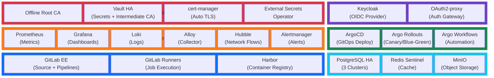

# Platform Overview

## Executive Summary

This platform delivers a production-grade GitOps foundation on a 13-node Harvester RKE2 cluster, providing secure, observable, self-healing infrastructure for containerized workloads. It combines identity management (Keycloak + OAuth2-proxy), container registry (Harbor), policy-driven deployments (ArgoCD), and Git-native CI/CD (GitLab + Runners), all protected by zero-trust PKI and automated secrets management. Integrated monitoring (Prometheus, Grafana, Loki) and audit trails provide visibility across all ecosystems.

---

## Platform at a Glance

The platform is organized into six stacks. Each stack is self-contained and deployed as a bundle.

### How the Stacks Relate

| Stack | Depends On | Provides To |
|-------|-----------|-------------|
| Security &amp; PKI | — (foundation) | TLS certificates and secrets to all stacks |
| Identity &amp; Access | Security (certs, secrets) | Single sign-on to Platform, CI/CD, Observability |
| Observability | Security, Identity | Metrics, logs, alerts for all stacks |
| Data &amp; Storage | Security (secrets) | PostgreSQL, Redis, MinIO for Platform and CI/CD |
| Platform | Security, Identity, Data | GitOps deployment for all applications |
| CI/CD | All of the above | Source control, pipelines, container registry |

---

## Ecosystem Index

| Ecosystem | Document | Purpose |
|-----------|----------|---------|
| 1. Authentication &amp; Identity | [authentication-identity.md](./authentication-identity.md) | User authentication, service authorization, OIDC federation |
| 2. Networking &amp; Ingress | [networking-ingress.md](./networking-ingress.md) | Traffic routing, TLS termination, gateway policies |
| 3. PKI &amp; Certificates | [pki-certificates.md](./pki-certificates.md) | Certificate lifecycle, trust hierarchy, automated issuance |
| 4. CI/CD Pipeline | [cicd-pipeline.md](./cicd-pipeline.md) | Code commit to production, GitOps-driven deployment |
| 5. Observability &amp; Monitoring | [observability-monitoring.md](./observability-monitoring.md) | Metrics, logs, traces, alerts, and dashboards |
| 6. Data &amp; Storage | [data-storage.md](./data-storage.md) | Databases, caching, object storage, persistence |
| 7. Secrets &amp; Configuration | [secrets-configuration.md](./secrets-configuration.md) | Vault, credential management, external secret sync |

---

## Infrastructure Overview

### Cluster Layout

The Harvester RKE2 cluster spans 13 nodes optimized for different workload types:

- **3 Controlplane nodes** — Kubernetes API, etcd, scheduler (HA across failure domains)
- **4 Database nodes** — StatefulSet storage for PostgreSQL, Redis, Vault (labeled `workload-type: database`)
- **4 General nodes** — Stateless replicated services, HPA targets (labeled `workload-type: general`)
- **2 Compute nodes** — CI/CD job execution, batch workloads (labeled `workload-type: compute`)

### Node Selector Strategy

| Workload | Selector | Reason |
|----------|----------|--------|
| Vault, CNPG, Redis, MinIO | `workload-type: database` | Persistent storage, high I/O |
| Keycloak, Grafana, OAuth2-proxy, ArgoCD, Harbor | `workload-type: general` | Stateless with HPA |
| GitLab services, Prometheus | `workload-type: general` | Query aggregation, moderate state |
| GitLab Runners | `workload-type: compute` | CPU-intensive job execution |
| Monitoring agents (Alloy, Hubble) | DaemonSet on all nodes | Observability everywhere |

### Proactive Cluster Autoscaling

The platform uses **cluster-autoscaler overprovisioning** to ensure nodes are added before production workloads experience resource contention. Low-priority pause pods reserve capacity in each pool:

| Pool | Pause Pod Replicas | Reserved Capacity | Preemption |
|------|-------------------|-------------------|-----------|
| General | 2 | 4 CPU, 12 Gi memory | Production workloads trigger preemption → autoscaler adds nodes |
| Database | 2 | 4 CPU, 20 Gi memory | Storage-intensive services trigger preemption → autoscaler adds nodes |

When a real workload needs resources, pause pods are preempted and become Pending, immediately triggering cluster-autoscaler to provision a new node. This ensures production services never experience scheduling failures due to resource exhaustion.

### Domain and TLS

- **Primary domain**: `&lt;DOMAIN&gt;`
- **Service FQDNs**: `<service>.&lt;DOMAIN&gt;` (e.g., `harbor.&lt;DOMAIN&gt;`, `argocd.&lt;DOMAIN&gt;`)
- **TLS**: All external ingress encrypted with cert-manager-issued leaf certificates (3-year validity, auto-renewal at 30 days)
- **Root CA**: Offline, air-gapped; signs Vault intermediate; never touches cluster

---

## Service Catalog

| # | Service | Namespace | Ecosystem | HA Mode | Bundle | Deployed |
|---|---------|-----------|-----------|---------|--------|----------|
| 1 | Vault | `vault` | Secrets | 3-replica Raft | 1 | ✓ |
| 2 | cert-manager | `cert-manager` | PKI | 2-replica (controller, webhook, cainjector) + topology spread | 1 | ✓ |
| 3 | ESO Controller | `external-secrets` | Secrets | 2-replica (operator, webhook, cert-controller) + topology spread | 1 | ✓ |
| 4 | CNPG Operator | `cnpg-system` | Data | 2-replica leader/follower + topology spread | 1 | ✓ |
| 5 | Redis Operator | `redis-operator` | Data | 2-replica + topology spread | 1 | ✓ |
| 6 | Keycloak | `keycloak` | Identity | 3-replica + HPA | 2 | ✓ |
| 7 | CNPG (Keycloak DB) | `keycloak` | Data | 3-replica PostgreSQL | 2 | ✓ |
| 8 | OAuth2-proxy | `keycloak` | Identity | 2-replica | 2 | ✓ |
| 9 | Prometheus | `monitoring` | Observability | 2-replica with `__replica__` external label for dedup + topology spread | 3 | ✓ |
| 10 | Grafana | `monitoring` | Observability | 2-replica + HPA | 3 | ✓ |
| 11 | Alertmanager | `monitoring` | Observability | 2-replica with mesh clustering + topology spread | 3 | ✓ |
| 12 | Loki | `monitoring` | Observability | 2-replica distributed (safe-to-evict=false for RWO PVC) | 3 | ✓ |
| 13 | Alloy | `monitoring` | Observability | DaemonSet (all nodes) | 3 | ✓ |
| 14 | Hubble | `cilium` | Observability | DaemonSet (all nodes) | 3 | ✓ |
| 15 | Harbor | `harbor` | CI/CD | 2-replica + HPA | 4 | ✓ |
| 16 | CNPG (Harbor DB) | `harbor` | Data | 3-replica PostgreSQL | 4 | ✓ |
| 17 | MinIO | `minio` | Data | 1-replica distributed (safe-to-evict=false for RWO PVC) | 4 | ✓ |
| 18 | Valkey Sentinel | `harbor` | Data | 3-node Sentinel + replicas | 4 | ✓ |
| 19 | ArgoCD | `argocd` | CI/CD | 3-replica + HPA | 5 | ✓ |
| 20 | Argo Rollouts | `argo-rollouts` | CI/CD | 2-replica | 5 | ✓ |
| 21 | Argo Workflows | `argo-workflows` | CI/CD | 2-replica | 5 | ✓ |
| 22 | GitLab EE | `gitlab` | CI/CD | 3-replica + HPA | 6 | ✓ |
| 23 | Praefect/Gitaly | `gitlab` | CI/CD | 3-replica Praefect + 3 Gitaly | 6 | ✓ |
| 24 | CNPG (GitLab DB) | `gitlab` | Data | 3-replica PostgreSQL | 6 | ✓ |
| 25 | Redis Sentinel | `gitlab` | Data | 3-node Sentinel + replicas | 6 | ✓ |
| 26 | GitLab Runners | `gitlab-runners` | CI/CD | Horizontal pod autoscaling | 6 | ✓ |

---

## Deployment Method

All platform services are deployed **via Fleet GitOps** from the `fleet-gitops/` subdirectory. Clusters are provisioned via **Rancher API script** (not Terraform). The deployment workflow is:

1. Push Helm charts to Harbor: `fleet-gitops/scripts/push-charts.sh`
2. Push OCI bundle artifacts to Harbor: `fleet-gitops/scripts/push-bundles.sh`
3. Create HelmOps on Rancher management cluster: `fleet-gitops/scripts/deploy-fleet-helmops.sh`

Fleet reconciles bundles in dependency order on the target cluster.

## Deployment Order

Stacks deploy in sequence via Fleet GitOps because each depends on earlier stacks for TLS, secrets, or OIDC:

1. **PKI &amp; Secrets** — foundation; everything depends on this
2. **Identity** — enables OIDC for downstream services
3. **Monitoring** — recommended before application stacks
4. **Harbor** — container registry; required before CI/CD
5. **GitOps** — ArgoCD + Rollouts; requires Git source from step 6
6. **Git &amp; CI** — GitLab + Runners complete the loop

---

## What's Next?

- **Full Landscape**: See [landscape.md](landscape.md) for a complete visual map of all 26 services and their interconnections
- **Getting Started**: Follow [../../getting-started.md](../../getting-started.md) for step-by-step deployment
- **Deep Dives**: Pick an ecosystem from the index above for technical architecture and configuration
- **Operations**: See [../operations/day2-operations.md](../operations/day2-operations.md) for runbooks and troubleshooting
