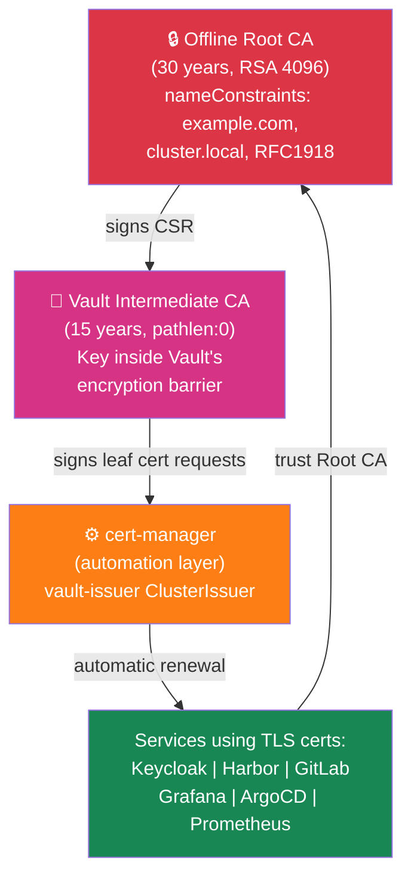

# Ecosystem: PKI & Certificates

**Focus Story:** How we issue and manage TLS certificates for every service on the platform.

## Executive Summary

The PKI & Certificates ecosystem establishes trust across the entire platform. We maintain a two-tier certificate hierarchy: an offline Root CA that never touches the cluster, and a Vault Intermediate CA that lives protected inside Vault's encryption layer. Every service — from Keycloak to GitLab to Grafana — receives TLS certificates automatically through cert-manager, which requests leaf certificates from the Vault intermediate. This design provides strong security (air-gapped root key), automation (no manual cert renewal), and compliance (certificate lifecycle is audited and controlled).

## Certificate Hierarchy

The diagram below shows how certificates flow through the ecosystem, from the protected Root CA down to every service.



**How to read this diagram:**
- **Red box (Offline Root CA)** = the foundation of all trust. Lives offline, secured in a vault, never exposed to the cluster.
- **Pink box (Vault Intermediate CA)** = the operational CA. Lives inside Vault, protected by encryption. It's the only CA that can actually sign certificates used in the cluster.
- **Orange box (cert-manager)** = the automation. It watches for services that need certificates and automatically requests them from Vault.
- **Green boxes (Services)** = all the applications on the platform. Each one has a TLS certificate signed by the Vault intermediate, and each one trusts the Root CA.
- **Arrows** = the flow of trust. Services trust the Root CA, which authorized Vault, which authorized cert-manager to issue their certificates.

## How It Works

### Certificate Lifecycle

Every certificate on the platform follows the same journey:

1. **Service is deployed** → it's configured to use a TLS certificate (via Kubernetes Ingress or Gateway API annotation)
2. **cert-manager detects** the request and creates a Certificate resource
3. **cert-manager calls Vault** using the vault-issuer ClusterIssuer (authenticated via Kubernetes ServiceAccount)
4. **Vault signs the request** using the Intermediate CA private key (which never leaves Vault's encryption layer)
5. **Signed certificate is returned** to cert-manager, which stores it in a Kubernetes Secret
6. **Gateway (Traefik) uses the secret** for TLS termination when serving requests to that service
7. **Automatic renewal** happens at 66% of certificate lifetime — cert-manager notices expiration approaching and repeats steps 3-6

### Trust Chain

Every certificate issued on this platform carries a complete chain of trust:

```
Leaf Certificate (e.g., for keycloak.dev.example.com)
    ↓ signed by
Vault Intermediate CA Certificate
    ↓ signed by
Offline Root CA Certificate
    ↓ root (self-signed, trusted offline)
```

When a client connects to any service on the platform:
1. The service presents its leaf certificate
2. The client validates it was signed by Vault Intermediate CA
3. The client checks that Vault Intermediate CA was signed by Root CA
4. The client trusts Root CA (it's mounted on every node and in every pod as `root-ca.pem`)
5. Connection is established securely

This means all 23 services on the platform share a single trust boundary — if you trust the Root CA, you trust every certificate on the platform.

## Certificate Inventory

All services on the platform receive automatically-managed TLS certificates:

| Service | Domain | Valid For | Auto-Renewed | Issuer |
|---------|--------|-----------|--------------|--------|
| Vault | vault.dev.example.com | 1 year | Yes | vault-issuer |
| Keycloak | keycloak.dev.example.com | 90 days | Yes | vault-issuer |
| Harbor | harbor.dev.example.com | 90 days | Yes | vault-issuer |
| GitLab | gitlab.dev.example.com | 90 days | Yes | vault-issuer |
| Grafana | grafana.dev.example.com | 90 days | Yes | vault-issuer |
| Prometheus | prometheus.dev.example.com | 90 days | Yes | vault-issuer |
| Alertmanager | alertmanager.dev.example.com | 90 days | Yes | vault-issuer |
| ArgoCD | argocd.dev.example.com | 90 days | Yes | vault-issuer |
| Argo Workflows | workflows.dev.example.com | 90 days | Yes | vault-issuer |
| Argo Rollouts | rollouts.dev.example.com | 90 days | Yes | vault-issuer |
| Internal Services* | *.cluster.local | 90 days | Yes | vault-issuer |

*Internal services (CNPG clusters, Redis, MinIO) use cluster.local certificates for mTLS.

## Security Model

The PKI ecosystem enforces defense in depth:

### Offline Root CA (Air-Gapped)
- Private key stored physically offline, never on any computer connected to the network
- Only used once during initial setup to sign the Vault intermediate
- 30-year validity ensures the root CA outlives any potential compromise
- Unreachable — eliminating entire classes of network attacks

### Vault Intermediate CA (Protected)
- Private key generated and stored inside Vault
- Key never exported to disk or to any other system
- Protected by Vault's barrier encryption (AES-256-GCM)
- Vault itself requires 3 out of 5 Shamir shares to unseal and access keys
- Audit log records every certificate signed

### nameConstraints (Capability Limiting)
The Root CA certificate includes name constraints that restrict what domains can ever be signed:
- `example.com` and all subdomains
- `cluster.local` and all subdomains (for internal mTLS)
- RFC 1918 private IP ranges

These constraints are cryptographically enforced — even if the Root CA key were compromised, no certificate for `example.com` or any external domain could ever be issued.

### pathlen:0 (No Sub-Intermediates)
The Vault Intermediate CA has a critical constraint: it can only sign leaf certificates. It cannot create subordinate CAs. This means:
- No attacker could create a new CA under Vault
- No service could mint its own certificates
- All certificate issuance remains under central control

### Automated Renewal (No Human Intervention)
- cert-manager monitors all certificates continuously
- At 66% of lifetime, it automatically renews (no manual steps, no break-glass)
- If renewal fails, alerts fire within 15 minutes
- Renewal happens in-place without service interruption

## Operational Characteristics

### Reliability
- **No single point of failure**: Vault runs as 3 replicas with raft consensus. The loss of one Vault pod does not interrupt certificate signing.
- **High availability unseal**: Shamir shares are split among offline administrators. No single person can unseal Vault.
- **Automatic renewal**: Certificates renew continuously in the background. Operators don't need to schedule certificate renewals.

### Observability
- **Vault audit log**: Every certificate request, CSR, and signing event is logged
- **Prometheus metrics**: Vault exposes metrics on seal/unseal operations, storage operations, and request times
- **Grafana dashboard**: Shows seal status, Raft health, certificate issuance rate, and intermediate CA expiration
- **Alerts**:
  - `VaultSealed`: Vault is sealed (requires manual intervention with Shamir shares)
  - `VaultDown`: Vault pod is not running
  - `CertExpiringSoon`: Certificate will expire in less than 7 days (usually indicates renewal failed)
  - `CertNotReady`: Certificate resource failed to issue (usually due to Vault communication error)

### Compliance
- **Cryptographic standards**: RSA 4096 (root), RSA 2048 (intermediate and leaves)
- **Certificate transparency**: All certificates are logged in Vault's audit backend
- **Tamper detection**: Vault's seal state provides integrity checking
- **Key rotation**: Intermediate CA can be rotated without touching Root CA (generate new intermediate, sign with root, import to new Vault cluster)

## Technical Reference

This section is for platform engineers. For more detail, see the individual service READMEs.

### Vault PKI Mounts

The Vault instance maintains two PKI mounts:

| Mount | Path | Purpose | TTL | Notes |
|-------|------|---------|-----|-------|
| Root CA | `pki_root` | Read-only storage of Root CA cert | 30 years | Used only to verify cert chains |
| Intermediate CA | `pki_int` | Operational CA for signing leaf certs | 15 years | Key never exported, always in Vault |

### cert-manager ClusterIssuer

The `vault-issuer` ClusterIssuer configures cert-manager to request certificates from Vault:

```yaml
apiVersion: cert-manager.io/v1
kind: ClusterIssuer
metadata:
  name: vault-issuer
spec:
  vault:
    server: https://vault.vault.svc:8200
    path: pki_int/sign/default
    auth:
      kubernetes:
        role: cert-manager-issuer
        mountPath: /v1/auth/kubernetes
```

The role `cert-manager-issuer` in Vault is bound to the cert-manager ServiceAccount, allowing it to authenticate without a static token.

### Kubernetes Auth Configuration

When Vault starts, these auth roles are created:

| Role | Bound to | Permissions | TTL |
|------|----------|-------------|-----|
| `cert-manager-issuer` | `cert-manager/cert-manager` SA | `pki_int/sign/default` | 15m |
| `eso-sync-<namespace>` | `external-secrets/external-secrets` SA | `kv/data/services/<namespace>/*` | 15m |

Each role uses Kubernetes authentication — no static tokens needed.

### Certificate Rotation Procedure

If the Vault Intermediate CA needs to be rotated (rare, usually only at cluster migration):

1. Initialize a new Vault cluster with new intermediate
2. Re-sign all in-flight Certificate resources using the new issuer
3. Services continue running — existing TLS sessions are unaffected
4. Once all certs have renewed (automatic), decommission the old Vault cluster

### Key Backup & Recovery

The Root CA key is backed up offline:
- Printed on paper and stored in a physical safe
- Digital copy encrypted with AES-256 and stored in offline media (USB key in safe)
- Recovery procedure: decrypt offline copy, reimport to air-gapped system, sign new intermediate CSR

The Vault Intermediate CA key is backed up via Vault's integrated snapshots:
- Vault writes snapshots to persistent storage
- Snapshots are encrypted and included in cluster backups
- Recovery: restore Vault from snapshot, intermediate key recovers automatically

## Related Ecosystems

- **Networking & Ingress**: Gateway API and Traefik use certificates issued here to terminate TLS
- **Secrets & Configuration**: Vault KV mount stores certificate-related secrets (CSR passwords, renewal configs)
- **Observability & Monitoring**: Prometheus scrapes Vault metrics, Grafana displays certificate expiry timelines

## Runbooks

- [Vault Unseal SOP](../guides/vault-unseal-sop.md) — step-by-step procedure for unsealing Vault after pod restarts
- [Certificate Renewal Troubleshooting](../guides/troubleshooting.md#certificate-renewal) — what to do if certificates fail to renew
- [Intermediate CA Rotation](../guides/disaster-recovery.md#intermediate-ca-rotation) — rare procedure to replace Vault intermediate CA

---

**Last Updated:** 2026-03-08
**Maintained By:** tech-doc-keeper
**Cross-Reference:** Service READMEs — [Vault](../../services/vault/README.md), [cert-manager](../../services/cert-manager/README.md)
**Design Document:** [PKI & Secrets Bundle Design](../plans/2026-03-04-pki-secrets-bundle-design.md)
