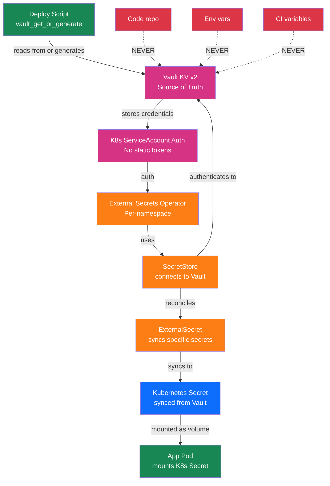
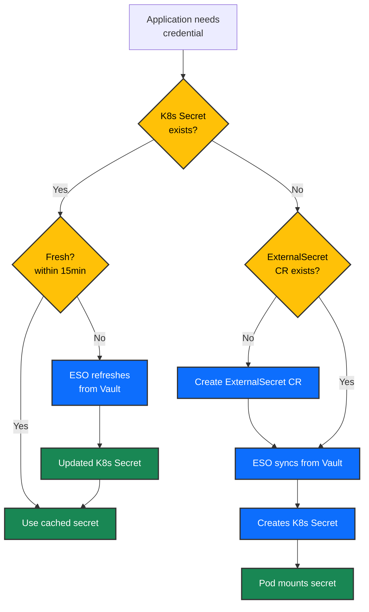

# Secrets & Configuration Ecosystem

## Executive Summary

All credentials, API tokens, and sensitive configuration data flow through a single source of truth: HashiCorp Vault. We store secrets in Vault's KV v2 engine, authenticate using Kubernetes service accounts (no static tokens), and synchronize credentials to applications via External Secrets Operator. Applications never access Vault directly—they mount Kubernetes Secrets created by ESO from Vault data. This creates an auditable, rotating, and centrally managed secrets lifecycle with zero exposed credentials in code or environment variables.

---

## Overview Diagram

This diagram shows how secrets move from creation → storage → delivery → consumption:



### Secret Request Decision Tree



---

## How It Works

### The Secrets Journey (6 Steps + Phase 6 Post-Deploy)

**Step 1: Initialization During Bundle Deployment**
When bundle groups 05-pki-secrets (Vault) through 50-gitlab deploy:
- init Jobs create Vault KV mounts and auth roles
- PushSecret generators create credentials automatically (see below)
- ServiceAccounts and ESO controllers stand up per-namespace

**Step 2: CI Secret Generation via PushSecret (during Bundle 41: gitlab-credentials)**
The `gitlab-credentials` bundle (Bundle 41, deployed right after `gitlab-redis`) contains **PushSecret** resources that auto-generate CI secrets and push them to Vault:
- These credentials are required by `gitlab-core` at startup
- They're also required by `gitlab-runner-terraform` to access CI systems
- By deploying `gitlab-credentials` before `gitlab-core`, we ensure credentials exist before consumption

**Step 3: Manual Secret Seeding (Phase 6 Post-Deploy)**
After all 58 HelmOps are created, Phase 6 of `deploy.sh` seeds manual secrets that cannot be auto-generated (vendor-provided, limited-time tokens, external system credentials):
- **GitLab License**: `kv/services/gitlab/activation-code` (set via `GITLAB_LICENSE` in `.env`, optional)
- **Golden Image Watcher Credentials**: `kv/services/ci/golden-image-watcher` (GitLab service account for image build pipeline, optional)
- **Harvester Kubeconfig**: `kv/services/ci/harvester-kubeconfig` (kubeconfig for runners to orchestrate VM builds, optional)

All other service credentials are auto-generated during bundle deployment via init Jobs or PushSecret generators.

**Step 4: Auto-Generation & Storage**
When services deploy, init Jobs and PushSecret generators create credentials automatically:
- Database passwords: random 32-char alphanumeric via `openssl rand` (stored in `kv/services/database/<service>-pg`)
- API tokens: generated by each service at startup via init Jobs (e.g., `keycloak-init` creates realm tokens)
- Service credentials: generated by init Jobs (e.g., `harbor-init` creates Harbor admin credentials)
- GitLab service tokens: generated by `gitlab-credentials` PushSecret and stored in `kv/services/gitlab/*` paths

Credentials are stored in Vault under the path `kv/services/<service>/<secret-name>` with KV v2 versioning enabled.

**Step 5: Authentication Setup**
Each namespace that needs secrets gets:
- A Kubernetes ServiceAccount named `eso-secrets`
- A Vault Kubernetes auth role named `eso-<namespace>`
- A policy that allows reading specific Vault paths

This means ESO never needs a static token. Instead, it uses Kubernetes' native RBAC to prove its identity to Vault.

**Step 6: Synchronization (Vault → K8s Secrets)**
External Secrets Operator runs a controller in each namespace. It reads ExternalSecret resources that map Vault paths to Kubernetes Secret keys. Every 5 minutes (default, can be tuned per ExternalSecret via `refreshInterval`), it checks Vault for updates and syncs new/changed secrets into the Kubernetes Secret. During initial bundle deployment, ESO syncs credentials immediately to unblock service startup.

**Step 7: Pod Mounting**
Applications don't talk to Vault. They don't read from ESO. They simply mount a Kubernetes Secret as a volume and read the files, or mount it as environment variables. The Secret is already up-to-date because ESO synced it from Vault.

**Step 8: Rotation**
When a credential needs to rotate (password reset, key rollover, token refresh), it's rotated in Vault first. ESO picks up the change within 5 minutes. New pods automatically get the updated Secret; existing pods that use volume mounts see the updated file; env-var pods need a restart to pick up the new value.

### Why This Architecture?

**Vault as Source of Truth:** All credentials live in one place. Rotation, auditing, and access control happen at the center, not scattered across 23 services.

**No Static Tokens:** ESO authenticates using Kubernetes service accounts. If a cluster node is compromised, the attacker cannot extract Vault tokens from the ESO pod—the service account is tied to that node, and revocation is immediate.

**Kubernetes Secrets as Cache:** Applications read Kubernetes Secrets, not Vault. This decouples application startup from Vault availability. If Vault temporarily goes down, running pods continue working with their cached Secret data.

**Audit Trail:** Every credential read, write, and access is logged in Vault's audit backend. Every sync by ESO is visible in pod logs and Kubernetes events.

---

## Secret Inventory

| Service | Secret Path | Type | Rotation Policy | Created By |
|---------|-------------|------|-----------------|-----------|
| **Keycloak** | `kv/services/keycloak/admin-secret` | Password | Manual on admin reset | `deploy-keycloak.sh` |
| **Keycloak** | `kv/services/keycloak/platform-admin` | Password | Manual on admin reset | `deploy-keycloak.sh` |
| **Keycloak PostgreSQL** | `kv/services/database/keycloak-pg` | Username + Password | Manual on DB rotation | `deploy-keycloak.sh` |
| **MinIO (shared)** | `kv/services/minio/root-credentials` | Access Key + Secret Key | Manual | `deploy-keycloak.sh` |
| **MinIO (Harbor)** | `kv/services/minio/harbor-credentials` | Access Key + Secret Key | Manual | `deploy-harbor.sh` |
| **MinIO (GitLab)** | `kv/services/minio/gitlab-credentials` | Access Key + Secret Key | Manual | `deploy-gitlab.sh` |
| **Harbor PostgreSQL** | `kv/services/database/harbor-pg` | Username + Password | Manual on DB rotation | `deploy-harbor.sh` |
| **Harbor Valkey** | `kv/services/harbor/valkey` | Password | Manual on cache restart | `deploy-harbor.sh` |
| **Harbor Admin** | `kv/services/harbor/admin-secret` | Password | Manual on admin reset | `deploy-harbor.sh` |
| **Harbor OIDC** | `kv/services/harbor/oidc-secret` | Client Secret | Manual on reauth | `deploy-harbor.sh` |
| **GitLab PostgreSQL** | `kv/services/database/gitlab-pg` | Username + Password | Manual on DB rotation | `deploy-gitlab.sh` |
| **GitLab Redis** | `kv/services/gitlab/redis-password` | Password | Manual on cache restart | `deploy-gitlab.sh` |
| **GitLab Gitaly** | `kv/services/gitlab/gitaly-token` | Bearer Token | Manual on token rotation | `deploy-gitlab.sh` |
| **GitLab Praefect** | `kv/services/gitlab/praefect-token` | Bearer Token | Manual on token rotation | `deploy-gitlab.sh` |
| **GitLab Praefect DB** | `kv/services/gitlab/praefect-db-password` | Password | Manual on DB rotation | `deploy-gitlab.sh` |
| **GitLab Root** | `kv/services/gitlab/root-password` | Password | Manual on admin reset | `deploy-gitlab.sh` |
| **GitLab OIDC** | `kv/services/gitlab/oidc-secret` | Client Secret | Manual on reauth | `deploy-gitlab.sh` |
| **Prometheus BasicAuth** | `kv/services/monitoring/prometheus-basic-auth` | Username + Password | Manual on auth reset | `deploy-monitoring.sh` |
| **Alertmanager BasicAuth** | `kv/services/monitoring/alertmanager-basic-auth` | Username + Password | Manual on auth reset | `deploy-monitoring.sh` |
| **Grafana Admin** | `kv/services/monitoring/grafana-admin` | Password | Manual on admin reset | `deploy-monitoring.sh` |
| **Grafana PostgreSQL** | `kv/services/database/grafana-pg` | Username + Password | Manual on DB rotation | `deploy-monitoring.sh` |
| **ArgoCD OIDC** | `kv/services/argocd/oidc-secret` | Client Secret | Manual on reauth | `deploy-argo.sh` |
| **CI Deploy Key** | `kv/services/ci/platform-deploy-key` | SSH Private Key | Manual on key rotation | `gitlab-admin-setup` Job |
| **CI Service Account** | `kv/services/keycloak/gitlab-ci` | Username + Password | Manual on rotation | `keycloak-config` Job |
| **Vault Init** | `vault-init.json` | Root + Unseal Tokens | Never rotated (offline backup) | Manual (offline) |

---

## Access Control

### The Principle

Each namespace gets exactly what it needs. This follows the principle of least privilege—a compromise of one service cannot be leveraged to steal credentials for unrelated services.

### Rancher API Token Lifecycle

The Rancher API token (used by Fleet deployment scripts) is not stored in Vault—instead, it is managed via the interactive `prepare.sh` script:

**Initial Setup:**
1. Run `./scripts/prepare.sh` in `fleet-gitops/` directory
2. Enter Rancher admin username and password when prompted
3. Script logs in to Rancher API, creates a no-expiry global-scope API token, stores in `.env`

**Token Refresh:**
When your Rancher token expires, refresh it without re-entering credentials:
```bash
./scripts/prepare.sh --token-only
```

This logs in again with your username/password, deletes old `fleet-gitops-deploy` tokens from Rancher, and creates a new API token in `.env`.

**Why not in Vault?**
The Rancher token is needed *before* Vault is deployed (during Fleet bundle creation). Storing it in `.env` keeps the bootstrap sequence simple: prepare `.env` → push bundles → deploy Fleet bundles → Vault comes online → ESO syncs secrets from Vault.

### Per-Namespace Vault Roles

For example, the `keycloak` namespace has:

- **ServiceAccount:** `eso-secrets` in the keycloak namespace
- **Vault Role:** `eso-keycloak`
- **Policy:** Can read only paths matching `kv/services/keycloak/*` and `kv/services/database/keycloak-pg`

The `harbor` namespace has:

- **ServiceAccount:** `eso-secrets` in the harbor namespace
- **Vault Role:** `eso-harbor`
- **Policy:** Can read only paths matching `kv/services/harbor/*`, `kv/services/database/harbor-pg`, `kv/services/minio/harbor-credentials`

### No Shared Keys

Each application gets its own credentials for shared services (e.g., Harbor and GitLab each get separate MinIO access keys). If one service is compromised, the attacker cannot use its credentials to access MinIO as another service.

### Vault Audit

Every read, write, and authentication event is logged in Vault's audit backend. This creates an immutable record:
- Who accessed which secret
- When
- Success or failure
- Source IP (if accessible from Vault's perspective)

---

## Credential Lifecycle

### Immutable Generation (Deploy → Vault)

When a service is deployed for the first time:

```
$ vault_get_or_generate <token> "kv/services/gitlab/root-password" "password" "openssl rand -base64 24"

# Outcome:
# 1. Check if kv/services/gitlab/root-password exists
# 2a. If YES: return existing password (idempotent)
# 2b. If NO: generate new random password, store in Vault, return it
```

This pattern ensures:
- **Idempotency:** Rerunning the deploy script doesn't generate a new password
- **Auditability:** All credentials are created and stored in Vault with timestamps
- **No console history:** The generated credential is never echoed to shell history; it flows directly into Vault

### Storage in Vault KV v2

Vault's KV v2 engine provides:
- **Versioning:** Every write creates a new version. Old versions can be recovered if needed.
- **Soft delete:** A secret can be marked as deleted but remains recoverable until 10+ days pass (hard delete).
- **Encryption at rest:** Vault's barrier encryption protects all data on disk.
- **Leases:** Some secrets (database creds, API tokens) can be configured with TTLs and auto-renewal.

### Delivery via ESO (Vault → K8s Secret)

External Secrets Operator syncs credentials every 15 minutes by default:

1. **Reconcile loop:** ESO reads each ExternalSecret in the cluster
2. **Pull from Vault:** For each remote Vault path, fetch the current value
3. **Compare:** If the value differs from the existing Kubernetes Secret, update it
4. **Update Secret:** Write the new data to the Kubernetes Secret
5. **Log:** Record the sync in ESO pod logs and Kubernetes events

This is pull-based, not push-based. Vault doesn't actively notify ESO of changes. The 15-minute interval is a compromise: frequent enough for security (rotation within minutes), but not so frequent as to hammer Vault with requests.

### Consumption by Applications

Applications consume secrets in three ways:

#### 1. Volume Mount (Recommended)

```yaml
volumeMounts:
  - name: db-credentials
    mountPath: /etc/secrets/db
volumes:
  - name: db-credentials
    secret:
      secretName: grafana-pg-credentials
```
The pod reads `/etc/secrets/db/username` and `/etc/secrets/db/password` as files.

#### 2. Environment Variables

```yaml
env:
  - name: DATABASE_PASSWORD
    valueFrom:
      secretKeyRef:
        name: grafana-pg-credentials
        key: password
```
The Kubernetes scheduler injects the Secret value as an environment variable at pod startup.

**3. Init Containers**
For one-time initialization (writing config files, seeding databases), an init container can read the Secret before the main container starts.

### Credential Generation via PushSecrets (Bundle 41 Pattern)

When a service needs to generate credentials at deployment time and push them to Vault (rather than pulling pre-existing secrets from Vault), the **External Secrets PushSecret** resource is used:

**Use Case:** GitLab CI pipeline credentials (Gitaly token, Praefect token, Praefect DB secret, MinIO storage credentials) must be generated and stored in Vault before `gitlab-core` and `gitlab-runner-terraform` can pull and use them.

**Bundle Deployment Order (Critical):**
1. **Bundle 39** (`gitlab-cnpg`) deploys — database ready
2. **Bundle 40** (`gitlab-redis`) deploys — cache ready
3. **Bundle 41** (`gitlab-credentials`) deploys — PushSecrets push generated credentials to Vault
4. **Bundle 42** (`gitlab-core`) deploys — pulls credentials from Vault via ExternalSecret
5. **Bundle 47** (`gitlab-runner-terraform`) pulls same credentials for infrastructure builds

**PushSecret Process:**

1. **PushSecret CRs** in Bundle 41 define password generators (ESO Password Generator)
2. **Generators create random K8s Secrets** with generated passwords during sync
3. **PushSecret operator watches** the Secrets and pushes them to Vault KV paths
4. **ExternalSecret CRs** in later bundles (42, 47, etc.) pull these credentials from Vault
5. **Within 5 minutes**, all consuming services have the synced credentials

**Example Flow (Bundle 41: gitlab-credentials):**

```
gitlab-credentials bundle (Bundle 41)
  ├── PushSecret: gitaly-secret → Vault kv/services/gitlab/gitaly-secret
  ├── PushSecret: praefect-secret → Vault kv/services/gitlab/praefect-secret
  ├── PushSecret: praefect-dbsecret → Vault kv/services/gitlab/praefect-dbsecret
  └── PushSecret: minio-storage → Vault kv/services/gitlab/minio-storage

gitlab-core bundle (Bundle 42, depends on 41)
  └── ExternalSecret pulls kv/services/gitlab/* paths (already populated by 41)

gitlab-runner-terraform bundle (Bundle 47, depends on 41)
  └── ExternalSecret pulls kv/services/gitlab/* paths (same source)
```

**This pattern ensures:**
- **Automatic credential generation:** No manual password creation
- **Dependency order:** Credentials are generated (Bundle 41) before consumption (Bundles 42+)
- **Idempotency:** PushSecret operators check existing Vault values before overwriting (safe to re-run Phase 4)
- **Single source of truth:** All credentials flow through Vault KV v2
- **No bootstrap secrets:** Every credential is auto-generated; no pre-shared secrets in code

### Manual Rotation Process

Credentials are rotated manually today (automated rotation is planned):

1. **Trigger:** Administrator decision (password expiry, security incident, key rotation schedule)
2. **Generate:** Use the service's admin API or UI to generate a new credential
3. **Store in Vault:** Update the Vault secret path with the new credential
4. **ESO Picks Up:** Within 15 minutes, ESO syncs the new credential to all consuming pods
5. **Pod Restart:** Applications may need to be restarted to pick up the new credential (depending on how they read the Secret)
6. **Cleanup:** Revoke the old credential in the service if possible

---

## Emergency Procedures

### Vault Unsealing

Vault starts in a sealed state. To unseal it:

**Trigger:** After Vault pod restarts or cluster reboot

#### Quick Unseal

```bash
./scripts/deploy-pki-secrets.sh --unseal-only
```

#### Manual Unseal

1. Retrieve 3 of the 5 Shamir unseal keys from offline storage (vault-init.json backup)
2. Run `vault operator unseal <key1>`
3. Run `vault operator unseal <key2>`
4. Run `vault operator unseal <key3>`
5. Vault transitions from `Sealed: true` to `Sealed: false`

#### Verification

```bash
kubectl exec -n vault vault-0 -- vault status | grep "Sealed"
# Expected: Sealed false
```

See [Vault Unseal SOP](../guides/vault-unseal-sop.md) for step-by-step procedures.

### Break-Glass Access

If Vault is inaccessible and credentials are needed:

1. **Use local cached Kubernetes Secrets:** Running pods have already synced credentials in their Kubernetes Secrets. These remain valid until Vault is restored.
2. **Scale new pods using cached secrets:** New pods that mount the same Secret will get the cached value from the Kubernetes Secret, not from Vault.
3. **Restore Vault:** Once Vault is back online, refresh all ExternalSecrets to ensure freshness.

**When Vault Cannot Be Restored:**
1. Extract credentials from the vault-init.json offline backup
2. Manually recreate the necessary credentials in the Kubernetes Secret (not recommended; use only as last resort)
3. Plan for credential rotation once Vault is restored

### Compromised Credential Response

**If a credential is leaked (e.g., password found in logs):**

1. **Generate new credential** in the service (e.g., reset user password in Keycloak, generate new token in GitLab)
2. **Store in Vault:** Update the KV secret with the new credential
3. **Wait for ESO sync:** Within 15 minutes, the new credential appears in all ExternalSecrets
4. **Verify:** Check that applications are using the new credential
5. **Audit Vault logs:** Review who accessed the leaked secret and when

---

## High Availability & Resilience

Critical secret management services are configured for high availability to prevent a single node failure from blocking credential access:

### External Secrets Operator (2 Replicas)

ESO controller runs with 2 replicas (controller, webhook, cert-controller) and topology spread constraints to ensure no two replicas run on the same node.

**Configuration:**
- **Replicas**: 2 (controller, webhook, cert-controller each)
- **Topology spread**: max-skew 1, prefer different nodes
- **Node selector**: `workload-type: general`

**Benefits:**
- If one ESO pod is evicted by cluster-autoscaler, the other continues syncing Vault secrets to K8s Secrets
- ExternalSecret reconciliation continues without gaps
- Webhook (used by K8s admission control) remains available

**Design note**: The webhook is replicated because it validates ExternalSecret resources during creation/update. A single evicted webhook would block new secret creation until the webhook pod restarts.

### cert-manager (2 Replicas)

cert-manager controller runs with 2 replicas (controller, webhook, cainjector) and topology spread constraints.

**Configuration:**
- **Replicas**: 2 (controller, webhook, cainjector each)
- **Topology spread**: max-skew 1, prefer different nodes
- **Node selector**: `workload-type: general`

**Benefits:**
- If one cert-manager pod is evicted, the other continues monitoring Certificate resources and renewing expiring certs
- Webhook remains available to validate Certificate and ClusterIssuer resources
- CA injector continues updating ConfigMaps/Secrets with CA bundles

**Critical function**: The webhook blocks Certificate creation if unavailable. Two replicas ensure TLS certificate issuance continues even during node scale-down.

### Vault (3-Replica Raft HA)

Vault runs with 3 replicas using Raft for distributed consensus. See Technical Reference section for details.

**Benefits:**
- Tolerates 1 node failure (requires 2/3 quorum)
- Automatic leader election
- Real-time replication

---

## Technical Reference

### Vault Architecture

#### 3-Replica HA Cluster

- StatefulSet: `vault` in namespace `vault`
- Storage: Integrated Raft (not external; stored as StatefulSet PVCs)
- Persistence: PVCs managed by Harvester, backed by Ceph
- TLS: Terminated at Traefik Gateway; Vault listens on HTTP internally

#### KV v2 Engine

- Mount path: `/kv`
- Versioning: 10 versions retained per secret
- Soft delete: 30-day recovery window

#### Auth Methods

- Kubernetes: `auth/kubernetes` for ESO
- Userpass (manual): For administrative access
- AppRole: For CI/CD pipelines (future)

#### PKI Engine

- Mount path: `/pki_int`
- Role: `<namespace>/sign/<hostname>` for cert-manager
- Intermediate CA: Signed by offline Root CA (outside cluster)

### External Secrets Operator

#### Deployment

- Helm chart: `external-secrets` (NGINX maintainer)
- Namespace: `external-secrets`
- Replicas: 1 (stateless; high availability not required for this control plane function)

#### Per-Namespace SecretStore

Each namespace that needs secrets creates a SecretStore resource:

```yaml
apiVersion: external-secrets.io/v1
kind: SecretStore
metadata:
  name: vault-backend
  namespace: harbor
spec:
  provider:
    vault:
      server: "http://vault.vault.svc.cluster.local:8200"
      path: "kv"
      version: "v2"
      auth:
        kubernetes:
          mountPath: "kubernetes"
          role: "eso-harbor"
          serviceAccountRef:
            name: "eso-secrets"
```

#### ServiceAccount Creation

Each namespace that uses ESO must have an `eso-secrets` ServiceAccount created before the SecretStore can authenticate to Vault. This ServiceAccount is referenced by the SecretStore's `serviceAccountRef` field.

The `vault-init` Job creates this ServiceAccount in all namespaces that will access Vault:
- `keycloak` — for Keycloak credentials
- `harbor` — for Harbor credentials
- `gitlab` — for GitLab credentials
- `monitoring` — for Prometheus, Grafana, Loki, Alloy credentials
- `argocd` — for ArgoCD credentials
- `argo-rollouts` — for Argo Rollouts credentials
- `argo-workflows` — for Argo Workflows credentials
- `external-secrets` — for ESO itself
- `kube-system` — for cluster-level components (external-dns, cilium)
- `external-dns` — for external-dns credentials

#### ExternalSecret Template

Each service defines ExternalSecret resources mapping Vault paths to Kubernetes Secrets:

```yaml
apiVersion: external-secrets.io/v1
kind: ExternalSecret
metadata:
  name: harbor-pg-credentials
  namespace: harbor
spec:
  refreshInterval: 1h
  secretStoreRef:
    name: vault-backend
    kind: SecretStore
  target:
    name: harbor-pg-credentials
    creationPolicy: Owner
  data:
    - secretKey: username
      remoteRef:
        key: services/database/harbor-pg
        property: username
    - secretKey: password
      remoteRef:
        key: services/database/harbor-pg
        property: password
```

### vault_get_or_generate Pattern

Used in all deploy scripts to ensure credentials are idempotent:

```bash
# Definition
vault_get_or_generate() {
  local token="$1"
  local path="$2"
  local field="$3"
  local generate_cmd="$4"

  # Try to read existing value
  local existing=$(vault kv get -field="$field" "$path" 2>/dev/null)

  if [ -n "$existing" ]; then
    echo "$existing"
  else
    # Generate new value
    local value=$($generate_cmd)
    vault kv put "$path" "$field=$value"
    echo "$value"
  fi
}

# Usage
PASSWORD=$(vault_get_or_generate "$root_token" "kv/services/keycloak/admin-secret" "password" "openssl rand -base64 24")
```

### Vault Policies for ESO Roles

Example policy for `eso-keycloak` role:

```hcl
# Read secrets for Keycloak service
path "kv/data/services/keycloak/*" {
  capabilities = ["read"]
}

# Read secrets for Keycloak PostgreSQL database
path "kv/data/services/database/keycloak-pg" {
  capabilities = ["read"]
}

# Metadata read for listing (required by some ESO sync checks)
path "kv/metadata/services/keycloak/*" {
  capabilities = ["read"]
}

path "kv/metadata/services/database/keycloak-pg" {
  capabilities = ["read"]
}
```

---

## Monitoring & Alerting

### Vault Alerts

- **VaultSealed:** Vault is sealed (operator must unseal)
- **VaultDown:** Vault pod is not responding (pod crash or network issue)
- **VaultLeaderLost:** Raft consensus lost (quorum issue, node failure)

### ESO Alerts

- **ESODown:** ESO controller pod not running
- **SyncFailure:** ExternalSecret failed to sync with Vault (auth, network, or Vault error)
- **ReconcileErrors:** High reconciliation error rate (indicates widespread sync issues)

### Vault Metrics

Scraped by Prometheus at `/v1/sys/metrics`:

- `vault_core_unsealed` — Vault sealed/unsealed state
- `vault_raft_peers` — Number of Raft cluster members
- `vault_raft_election_leader` — Current Raft leader identity
- `vault_raft_storage_raft_log_*` — Raft log operations
- `vault_core_handle_login_request` — Login attempts (counter)

### Grafana Dashboards

- **Vault Overview:** Seal status, Raft health, barrier encryption operations
- **Vault Telemetry:** Request latency, auth method usage, KV operations
- **ESO Status:** Sync success rate, reconciliation time, error tracking

---

## Related Ecosystems

- **[Authentication & Identity](./authentication-identity.md)** — Keycloak client secrets are stored here and distributed to identity services
- **[PKI & Certificates](./pki-certificates.md)** — Vault holds the intermediate CA private key for cert-manager leaf cert signing
- **[Data & Storage](./data-storage.md)** — Database passwords and encryption keys are managed via this ecosystem
- **[CI/CD Pipeline](./cicd-pipeline.md)** — GitLab, ArgoCD, and Argo Workflows use secrets from here for authentication

---

## See Also

- **Vault Unsealing:** [docs/guides/vault-unseal-sop.md](../guides/vault-unseal-sop.md)
- **External Secrets Operator:** [services/external-secrets/README.md](../../services/external-secrets/README.md)
- **Vault Service:** [services/vault/README.md](../../services/vault/README.md)
- **Deployment Scripts:** [scripts/deploy-pki-secrets.sh](../../scripts/deploy-pki-secrets.sh), [scripts/deploy-keycloak.sh](../../scripts/deploy-keycloak.sh), and others
