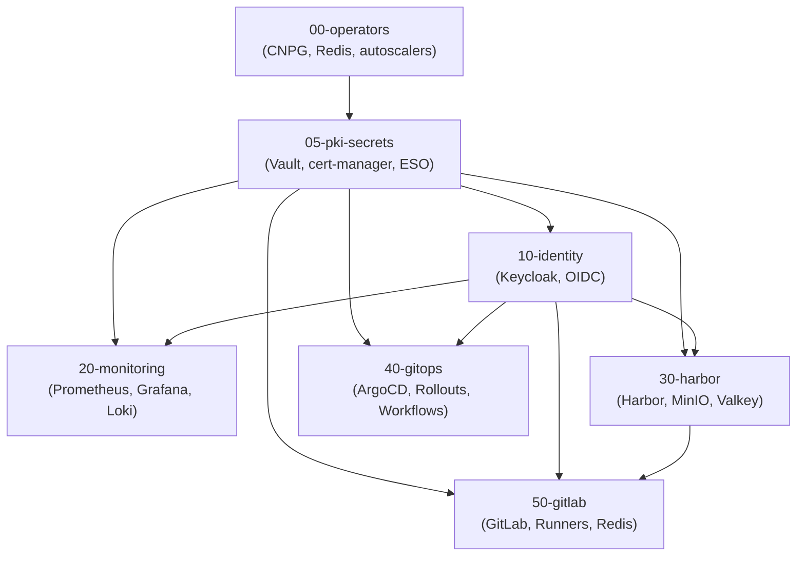

# Bundle Reference

Complete reference for all 7 Fleet bundles, what they contain, and their dependencies.

For step-by-step deployment instructions, see [Fleet Deployment Guide](fleet-deployment.md).
For maintenance and troubleshooting, see [Day-2 Operations](day2-operations.md).

## Bundle 00-operators

### What It Contains

- **CNPG operator** (CloudNativePG v0.27.1) -- PostgreSQL Kubernetes operator
- **Redis operator** (OpsTree v0.23.0) -- Redis and Sentinel lifecycle management
- **cluster-autoscaler** -- Automatic Harvester node scaling based on pod pressure
- **node-labeler** -- Labels nodes by workload type (`database`, `general`, `compute`)
- **storage-autoscaler** -- Auto-expands PVCs when usage exceeds threshold

### Why It Matters

Operators are cluster-level controllers that manage stateful services and infrastructure automation. Every subsequent bundle relies on at least one operator from this bundle -- CNPG for PostgreSQL clusters, Redis operator for Sentinel-managed caches, and storage-autoscaler for PVC growth. This bundle must deploy first.

### Depends On

- None (foundation bundle)

### Provides To

- All other bundles (00 through 50)

### Key Resources

| Kind | Namespace | Name |
|------|-----------|------|
| Deployment | `cnpg-system` | CNPG operator (Helm) |
| Deployment | `redis-operator` | Redis operator (Helm) |
| Deployment | `cluster-autoscaler` | cluster-autoscaler |
| Deployment | `node-labeler` | node-labeler |
| Deployment | `storage-autoscaler` | storage-autoscaler |
| CRD | cluster-scoped | `clusters.postgresql.cnpg.io` |
| CRD | cluster-scoped | `redis.redis.opstreelabs.in` |
| CRD | cluster-scoped | `redissentinels.redis.opstreelabs.in` |
| CRD | cluster-scoped | `volumeautoscalers.autoscaling.volume-autoscaler.io` |
| HPA | `node-labeler` | node-labeler |
| HPA | `storage-autoscaler` | storage-autoscaler |
| ServiceMonitor | `cluster-autoscaler` | cluster-autoscaler metrics |

### Customization

- **Node pool labeling**: node-labeler rules determine which nodes get `workload-type` labels
- **HPA scaling**: adjust `minReplicas`/`maxReplicas` on node-labeler and storage-autoscaler HPAs
- **Volume autoscaler thresholds**: default 80% usage trigger, 20-25% increase per event -- configurable per VolumeAutoscaler CR
- **Cluster autoscaler**: respects node labels and pool constraints for scale-up/scale-down decisions

---

## Bundle 05-pki-secrets

### What It Contains

- **Vault** (v0.32.0) -- 3-replica HA with Raft storage, Intermediate CA, KV v2 secrets
- **vault-init** -- One-time Job that initializes and unseals Vault, configures PKI engine
- **vault-unsealer** -- CronJob/controller for automatic Vault unsealing after restarts
- **cert-manager** (v1.19.4) -- Automated X.509 certificate issuer
- **External Secrets Operator** (v2.0.1) -- Syncs secrets from Vault to Kubernetes Secrets
- **vault-pki-issuer** -- ClusterIssuer (`vault-issuer`) that signs all TLS certificates via Vault PKI

### Why It Matters

Foundation for all security. Vault stores every credential and the Intermediate CA. cert-manager issues TLS certificates for all ingress endpoints. ESO syncs credentials from Vault KV v2 to Kubernetes Secrets so pods never access Vault directly. Without this bundle, no other service can obtain secrets or TLS certificates.

### Depends On

- Bundle 00-operators (CNPG CRDs needed by vault-init)

### Provides To

- All other bundles (TLS certificates, secrets via ESO, ClusterIssuer)

### Key Resources

| Kind | Namespace | Name |
|------|-----------|------|
| StatefulSet | `vault` | vault (3 replicas, Raft) |
| Job | `vault` | vault-init (one-time) |
| Deployment | `cert-manager` | cert-manager (Helm) |
| Deployment | `cert-manager` | cert-manager-webhook |
| Deployment | `external-secrets` | external-secrets (Helm) |
| Deployment | `external-secrets` | external-secrets-webhook |
| ClusterIssuer | cluster-scoped | `vault-issuer` |

### Customization

- **Vault storage backend**: currently Raft (integrated storage), can be changed in Helm values
- **Certificate validity**: default 90 days, configurable in ClusterIssuer TTL settings
- **ESO refresh interval**: how often ExternalSecret CRs re-sync from Vault (default 1h)
- **Vault auth methods**: AppRole enabled by default for ESO; additional methods configurable

---

## Bundle 10-identity

### What It Contains

- **Keycloak** (3-replica + HPA) -- OIDC/OAuth2 identity provider
- **keycloak-config** -- Job that configures the `aegis` realm, OIDC clients, groups, and mappers
- **CNPG PostgreSQL cluster** -- 3-replica Keycloak database in `database` namespace
- **SecretStore** -- Vault-backed SecretStore for Keycloak namespace

### Why It Matters

All platform services authenticate through Keycloak via OIDC. The keycloak-config Job creates OIDC clients for Grafana, ArgoCD, Harbor, GitLab, and OAuth2-proxy. OAuth2-proxy (deployed in monitoring and gitops bundles) acts as the auth gateway for services without native OIDC support.

### Depends On

- Bundle 05-pki-secrets (TLS certificates, secrets from Vault)

### Provides To

- Bundles 20, 30, 40, 50 (OIDC authentication for all services)

### Key Resources

| Kind | Namespace | Name |
|------|-----------|------|
| Deployment | `keycloak` | keycloak (3 replicas + HPA) |
| Cluster (CNPG) | `database` | keycloak-pg (3 replicas) |
| Job | `keycloak` | keycloak-config |
| ExternalSecret | `keycloak` | keycloak credentials |
| SecretStore | `keycloak` | vault-backend |
| Gateway | `keycloak` | keycloak gateway |
| HTTPRoute | `keycloak` | keycloak route |
| ServiceMonitor | `keycloak` | keycloak metrics |

### Customization

- **OIDC clients**: add new clients via keycloak-config Job or Keycloak Admin Console
- **Session management**: Keycloak uses Infinispan clustering for distributed sessions
- **User federation**: LDAP/AD connectors configurable in Keycloak Admin Console
- **PKCE**: S256 enabled on all OAuth2-proxy clients; disabled for ArgoCD and GitLab (neither sends PKCE params)
- **Post-logout redirect URIs**: use explicit wildcards `https://<service>.<domain>/*` (not `"+"` shorthand)

---

## Bundle 20-monitoring

### What It Contains

- **kube-prometheus-stack** (v82.10.0) -- Prometheus, Grafana, Alertmanager (Helm chart)
- **Loki** -- 2-replica log aggregation (StatefulSet)
- **Alloy** -- DaemonSet log collector (replaces Promtail/Fluent Bit)
- **CNPG PostgreSQL cluster** -- Grafana database backend in `database` namespace
- **Hubble** -- Cilium network flow visualization (relay + UI)
- **ServiceMonitors** -- Automatic Prometheus scrape config for all services
- **PrometheusRules** -- Alert definitions (node, Kubernetes, Cilium, PostgreSQL, Redis, Traefik, Loki, OAuth2-proxy)
- **Grafana dashboards** -- 20+ pre-built dashboards as ConfigMaps
- **monitoring-secrets** -- SecretStores and ExternalSecrets for Grafana admin, additional scrape configs
- **Ingress (Gateway API)** -- Grafana, Prometheus, Alertmanager, Hubble UI, Traefik dashboard, Vault UI

### Why It Matters

Complete observability stack: metrics (Prometheus), logs (Loki + Alloy), network flows (Hubble). Alertmanager routes alerts to on-call teams. Grafana provides unified dashboarding across all services. Every other bundle exports metrics via ServiceMonitors that this bundle scrapes.

### Depends On

- Bundle 05-pki-secrets (TLS certificates, secrets)
- Bundle 10-identity (OIDC authentication for Grafana, OAuth2-proxy for Prometheus/Alertmanager)

### Provides To

- All other bundles (metrics collection, log aggregation, alerting)

### Key Resources

| Kind | Namespace | Name |
|------|-----------|------|
| StatefulSet | `monitoring` | prometheus (kube-prometheus-stack) |
| Deployment | `monitoring` | grafana (kube-prometheus-stack) |
| StatefulSet | `monitoring` | alertmanager (kube-prometheus-stack) |
| StatefulSet | `monitoring` | loki (2 replicas) |
| DaemonSet | `monitoring` | alloy |
| Cluster (CNPG) | `database` | grafana-pg |
| HPA | `monitoring` | grafana |
| ConfigMap | `monitoring` | 20+ Grafana dashboard definitions |
| Gateway | `monitoring` | grafana, prometheus, alertmanager, hubble, traefik, vault |
| HTTPRoute | `monitoring` | routes for each gateway |

### Customization

- **Retention**: Prometheus default 30 days; Loki retention configurable in statefulset args
- **Alert receivers**: configure in Alertmanager config (Slack, PagerDuty, email, webhook)
- **Dashboards**: add new ones as ConfigMaps with `grafana_dashboard: "1"` label in `monitoring` namespace
- **Scrape targets**: additional scrape configs via `monitoring-secrets/additional-scrape-configs.yaml`
- **Hubble metrics**: network flow metrics configurable via HelmChartConfig on the system Cilium CNI

---

## Bundle 30-harbor

### What It Contains

- **Harbor** (v1.18.2) -- Container registry with Trivy vulnerability scanning
- **MinIO** -- Single-node object storage for Harbor artifacts (S3-compatible)
- **CNPG PostgreSQL cluster** -- 3-replica Harbor database in `database` namespace
- **Valkey Sentinel** -- Redis-compatible cache for Harbor sessions
- **harbor-manifests** -- Supplementary resources: dashboards, alerts, service monitors, OIDC config, external secrets
- **SecretStores** -- Vault-backed for MinIO and Valkey namespaces

### Why It Matters

Container registry for all built images. Trivy automatically scans pushed images for CVEs. MinIO provides S3-compatible object storage for container layers, Helm charts, and OCI artifacts. Harbor also serves as a pull-through cache for upstream registries (Docker Hub, ghcr.io, quay.io), ensuring the cluster never pulls directly from the internet.

### Depends On

- Bundle 05-pki-secrets (TLS certificates, secrets)
- Bundle 10-identity (OIDC authentication)

### Provides To

- Bundle 50-gitlab (GitLab CI pushes images here; runners pull base images from pull-through cache)

### Key Resources

| Kind | Namespace | Name |
|------|-----------|------|
| Deployment | `harbor` | harbor-core, harbor-registry, harbor-trivy (Helm) |
| Deployment | `minio` | minio |
| Cluster (CNPG) | `database` | harbor-pg (3 replicas) |
| StatefulSet | `harbor` | valkey replication + sentinel |
| HPA | `harbor` | harbor-core, harbor-registry, harbor-trivy |
| PDB | `harbor` | harbor components |
| ServiceMonitor | `harbor` | harbor, valkey |
| ServiceMonitor | `minio` | minio |
| Job | `minio` | create-buckets (one-time bucket provisioning) |
| VolumeAutoscaler | `harbor` | PVC auto-expansion |
| Gateway | `harbor` | harbor gateway |
| HTTPRoute | `harbor` | harbor route |

### Customization

- **Pull-through cache**: configure upstream registries (Docker Hub, ghcr.io, quay.io) in Harbor Admin UI
- **Retention policy**: configure per-project tag retention rules for image lifecycle
- **Vulnerability scanning**: Trivy scanner runs automatically on push; configurable severity thresholds
- **MinIO storage**: PVC-backed; VolumeAutoscaler handles growth automatically
- **Webhook notifications**: send events on image push/scan completion

---

## Bundle 40-gitops

### What It Contains

- **ArgoCD** (v9.4.7) -- GitOps deployment controller with OIDC via Keycloak
- **Argo Rollouts** (v2.40.6) -- Progressive delivery (canary, blue-green) with OAuth2-proxy
- **Argo Workflows** (v0.47.4) -- Workflow automation with OAuth2-proxy
- **AnalysisTemplates** -- Prometheus-based canary validation (error-rate, latency-check, success-rate)
- **argocd-manifests** -- Supplementary resources: dashboards, alerts, OIDC config, GitLab setup
- **argo-rollouts-manifests** / **argo-workflows-manifests** -- Dashboards, OAuth2-proxy, root CA injection

### Why It Matters

GitOps: Git is the source of truth for desired cluster state. ArgoCD continuously syncs Git repositories to the cluster. Argo Rollouts enables metrics-driven canary and blue-green deployments with automatic rollback on failure. AnalysisTemplates query Prometheus to validate canary health before promotion.

### Depends On

- Bundle 05-pki-secrets (TLS certificates, secrets)
- Bundle 10-identity (OIDC authentication)

### Provides To

- Bundle 50-gitlab (GitLab triggers ArgoCD syncs for application deployments)

### Key Resources

| Kind | Namespace | Name |
|------|-----------|------|
| Deployment | `argocd` | argocd-server, argocd-repo-server, argocd-applicationcontroller (Helm) |
| Deployment | `argo-rollouts` | argo-rollouts controller (Helm) |
| Deployment | `argo-workflows` | argo-workflows-server (Helm) |
| Deployment | `argo-rollouts` | oauth2-proxy |
| Deployment | `argo-workflows` | oauth2-proxy |
| AnalysisTemplate | `argo-rollouts` | error-rate, latency-check, success-rate |
| PDB | `argocd` | argocd components |
| PDB | `argo-rollouts` | argo-rollouts |
| ServiceMonitor | `argocd` | argocd metrics |
| ServiceMonitor | `argo-rollouts` | argo-rollouts metrics |
| ServiceMonitor | `argo-workflows` | argo-workflows metrics |
| VolumeAutoscaler | `argocd` | PVC auto-expansion |
| Gateway | `argocd` | argocd gateway |
| Gateway | `argo-rollouts` | argo-rollouts gateway |
| Gateway | `argo-workflows` | argo-workflows gateway |

### Customization

- **Git repositories**: configure ArgoCD to watch your GitLab instance
- **RBAC / AppProjects**: create per-team AppProjects with namespace restrictions
- **Rollout strategy**: configure canary step percentages, pause durations, and analysis runs
- **AnalysisTemplate thresholds**: adjust error-rate and latency thresholds per service
- **OAuth2-proxy**: shared Keycloak client for Rollouts and Workflows UIs

---

## Bundle 50-gitlab

### What It Contains

- **GitLab EE** (v9.9.2 chart) -- Full GitLab instance with webservice, Sidekiq, Gitaly, GitLab Shell
- **CNPG PostgreSQL cluster** -- 3-replica GitLab database with PgBouncer poolers in `database` namespace
- **Redis Sentinel** -- 3-replica Redis with Sentinel for GitLab cache/sessions in `gitlab` namespace
- **GitLab Runners** -- Shared, security, and group runners in `gitlab-runners` namespace
- **gitlab-manifests** -- Supplementary resources: dashboards, alerts, OIDC config, admin setup, external secrets
- **SecretStores** -- Vault-backed for GitLab and runner namespaces

### Why It Matters

Complete CI/CD platform: Git repository hosting, merge request workflows, CI pipeline execution, package registry, and container registry integration. Runners execute jobs on compute nodes with dedicated runner types for different workloads (shared for general CI, security for SAST/DAST scans, group for team-specific jobs). Uses shared MinIO (from the `minio` namespace) for object storage.

### Depends On

- Bundle 05-pki-secrets (TLS certificates, secrets)
- Bundle 10-identity (OIDC authentication via Keycloak)
- Bundle 30-harbor (runners push built images to Harbor; pull-through cache for base images)

### Provides To

- None (terminal bundle -- consumes all previous bundles)

### Key Resources

| Kind | Namespace | Name |
|------|-----------|------|
| Deployment | `gitlab` | gitlab-webservice, gitlab-sidekiq (Helm) |
| StatefulSet | `gitlab` | gitlab-gitaly (Helm) |
| Cluster (CNPG) | `database` | gitlab-postgresql (3 replicas + PgBouncer) |
| StatefulSet | `gitlab` | redis replication + sentinel |
| Deployment | `gitlab-runners` | shared-runner, security-runner, group-runner |
| ExternalSecret | `gitlab` | db credentials, MinIO storage, OIDC, admin token |
| ServiceMonitor | `gitlab` | gitlab, redis |
| ServiceMonitor | `gitlab-runners` | runner metrics |
| VolumeAutoscaler | `gitlab` | Gitaly PVC auto-expansion |
| Gateway | `gitlab` | gitlab gateway |
| TCPRoute | `gitlab` | SSH access (port 22) |

### Customization

- **Runner tags**: match CI jobs to appropriate runner types via GitLab CI `tags:` keyword
- **Runner concurrency**: adjust `concurrent` setting per runner type
- **Object storage**: uses shared MinIO in `minio` namespace; access keys stored in Vault
- **OIDC**: GitLab OIDC client configured by keycloak-config Job (PKCE disabled)
- **License**: GitLab EE Ultimate license applied during deployment
- **Protected branches**: configure merge request approval requirements per project

---

## Deployment Order Rationale

Bundles must deploy in this exact order due to hard dependencies:

1. **00-operators** -- Foundation: installs CRDs and controllers that all other bundles need. CNPG operator is required before any PostgreSQL Cluster CR can be created. Redis operator is required before any Redis/Sentinel CR. Storage-autoscaler CRD must exist before VolumeAutoscaler CRs in later bundles.

2. **05-pki-secrets** -- Security foundation: every service needs TLS certificates (cert-manager + vault-issuer) and credentials (Vault + ESO). No service can start without its secrets.

3. **10-identity** -- Authentication: every service with a web UI authenticates through Keycloak OIDC. OAuth2-proxy instances in later bundles require Keycloak clients to exist.

4. **20-monitoring** -- Observability: recommended before application bundles so that deployment issues are immediately visible in Grafana. Technically independent of 30/40/50 but deploying it early means you can watch subsequent bundle health.

5. **30-harbor** -- Registry: must be running before GitLab CI can push built images. Also serves as pull-through cache for upstream registries used by all workloads.

6. **40-gitops** -- Deployment tooling: ArgoCD and Argo Rollouts must be running before applications can be deployed via GitOps workflows triggered by GitLab CI.

7. **50-gitlab** -- Terminal bundle: consumes all previous bundles. Runners need Harbor (image push), Keycloak (OIDC), Vault (secrets), and optionally ArgoCD (deployment triggers).

## Bundle Dependencies Graph

**Dependency summary (from Fleet `dependsOn` declarations):**

| Bundle | Depends On |
|--------|------------|
| 00-operators | None |
| 05-pki-secrets | 00-operators |
| 10-identity | 05-pki-secrets |
| 20-monitoring | 05-pki-secrets, 10-identity |
| 30-harbor | 05-pki-secrets, 10-identity |
| 40-gitops | 05-pki-secrets, 10-identity |
| 50-gitlab | 05-pki-secrets, 10-identity, 30-harbor |

Bundles 20, 30, and 40 are independent of each other and could theoretically deploy in parallel once 10-identity is ready. However, deploying 20-monitoring first is recommended so you have observability for the remaining bundles.

## What's Next

- [Fleet Deployment Guide](fleet-deployment.md) -- Step-by-step deployment instructions
- [Day-2 Operations](day2-operations.md) -- Maintenance, scaling, and troubleshooting
- [Monitoring & Alerts](monitoring-alerts.md) -- Using Grafana dashboards and responding to alerts
- [Secrets Management](secrets-management.md) -- Vault, ESO, and credential rotation
