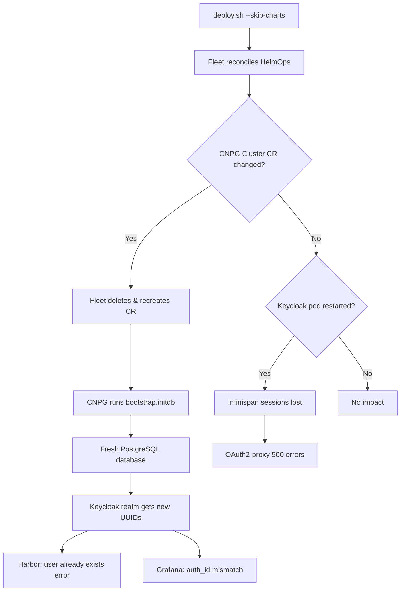

# Design: OIDC Resilience on Fleet GitOps Deploys

**Date:** 2026-03-28
**Status:** Proposed

---

## Summary

Three fixes to prevent Keycloak OIDC breakage when `deploy.sh --skip-charts` runs Fleet GitOps deployments. The root cause is twofold: CNPG PostgreSQL clusters using `bootstrap.initdb` can lose data if Fleet recreates the Cluster CR, and Keycloak stores sessions in-memory (Infinispan) which don't survive pod restarts. A bundled CI pipeline hardening is included in the same changeset.

---

## Problem

Running `deploy.sh --skip-charts` for security patches or config changes triggers Fleet to reconcile all managed resources. If Fleet deletes and recreates a CNPG Cluster CR, the `bootstrap.initdb` block causes PostgreSQL to initialize a fresh database. Keycloak's realm, users, and client configurations get new UUIDs. Downstream services that store Keycloak `sub` claims break immediately.

Additionally, Keycloak 26.x defaults to in-memory Infinispan session storage. Any pod restart (rolling upgrade, OOM, node drain) invalidates all active sessions. OAuth2-proxy instances fronting monitoring services return raw 500 errors when their upstream cookie sessions become invalid.

### Failure Flow



---

## Impact Assessment

| Service | Stores Keycloak sub UUID? | Failure Mode | Severity |
|---------|--------------------------|--------------|----------|
| Harbor | Yes (`oidc_user.subiss`) | Login broken, "user already exists" | Critical |
| Grafana | Yes (`user_auth.auth_id`) | Login broken, potential data loss | Critical |
| GitLab | No (uses `preferred_username`) | Not affected | None |
| ArgoCD | No (stateless OIDC tokens) | Transient token refresh | Low |
| OAuth2-proxy (6 instances) | No (cookie sessions) | 500 errors until cookies cleared | Medium |

---

## Fix 1: CNPG Cluster Deletion Protection

### Change

Add `helm.sh/resource-policy: keep` annotation to all 4 CNPG Cluster CRs:

- `keycloak-pg` (keycloak namespace)
- `grafana-pg` (monitoring namespace)
- `harbor-pg` (harbor namespace)
- `gitlab-postgresql` (gitlab namespace)

### How It Works

Helm recognizes `helm.sh/resource-policy: keep` and skips deletion of the annotated resource during `helm uninstall` or resource replacement. Fleet uses Helm under the hood for HelmOps, so this annotation prevents Fleet from ever deleting the CNPG Cluster CR. CNPG handles spec changes via in-place rolling upgrades — no delete/recreate needed.

### Alternatives Considered

| Alternative | Reason Rejected |
|-------------|-----------------|
| Kubernetes finalizer | Adds complexity; CNPG already has its own finalizer for PVC protection |
| PVC reclaim + recovery bootstrap | CNPG doesn't support conditional bootstrap (initdb vs recovery based on existing PVCs) |
| Fleet `diff.comparePatches` ignore | Hides drift rather than preventing deletion |

---

## Fix 2: Keycloak Persistent Sessions

### Change

Add environment variable to Keycloak Helm values:

```yaml
extraEnv: |
  - name: KC_PERSISTENT_USER_SESSIONS
    value: "true"
```

### How It Works

Keycloak 26.x (current: 26.5.6) natively supports JDBC-backed persistent sessions when `KC_PERSISTENT_USER_SESSIONS=true`. Sessions are stored in the `keycloak-pg` PostgreSQL database instead of Infinispan in-memory cache. Sessions survive pod restarts, rolling upgrades, and node drains. No schema migration needed — Keycloak creates the session tables automatically on startup.

### Alternatives Considered

| Alternative | Reason Rejected |
|-------------|-----------------|
| Custom Infinispan JDBC XML config | Overly complex; Keycloak 26 has native support |
| Shorter session TTLs | Doesn't fix the problem, just reduces the window |
| External Infinispan cluster | Operational overhead for a solved problem |

---

## Fix 3: OAuth2-proxy Graceful Error Handling

### Change

Add `--errors-to-info-page=true` to all 6 OAuth2-proxy deployments:

1. Traefik dashboard
2. Hubble UI
3. Prometheus
4. Alertmanager
5. Argo Rollouts
6. Argo Workflows

### How It Works

When an upstream error occurs (e.g., stale session cookie referencing an invalidated Keycloak session), OAuth2-proxy renders an informational page with a "Sign in" link instead of a raw HTTP 500 error. Users click "Sign in" to get a fresh session. All 6 instances use `--session-store-type=cookie` (stateless, no server-side session store).

### Alternatives Considered

| Alternative | Reason Rejected |
|-------------|-----------------|
| Redis session store | Adds operational overhead (another stateful service per proxy) |
| Traefik error page middleware | More moving parts; couples error handling to ingress layer |
| Auto-redirect on error | Could cause redirect loops if Keycloak itself is down |

---

## CI Pipeline Fixes

Bundled in the same changeset to ensure lint jobs validate the OIDC resilience changes.

### `.yamllint.yml`

- Added `rendered/` to ignore list (generated files, not lintable)
- Added 5 PEM template files containing `${ROOT_CA_PEM_INDENT*}` variables (yamllint cannot parse these)

### `.gitlab-ci.yml`

| Change | Rationale |
|--------|-----------|
| Removed `allow_failure: true` from lint jobs | Lint failures should block the pipeline |
| Added `needs: [shellcheck, yamllint, helm-lint]` to sync-to-github | Mirror only pushes when all lints pass |
| Added `when: on_success` to sync-to-github | Explicit success dependency |
| shellcheck uses `-S warning` | Ignore info/style noise, catch real issues |
| helm-lint handles OCI charts gracefully | Skips charts that require OCI pull (not available in CI) |

---

## Files Changed

| File | Change |
|------|--------|
| `.gitlab-ci.yml` | Lint job hardening, sync-to-github gating |
| `.yamllint.yml` | Ignore rendered/ and PEM template files |
| `fleet-gitops/10-identity/cnpg-keycloak/manifests/keycloak-pg-cluster.yaml` | `helm.sh/resource-policy: keep` |
| `fleet-gitops/20-monitoring/cnpg-grafana/manifests/grafana-pg-cluster.yaml` | `helm.sh/resource-policy: keep` |
| `fleet-gitops/30-harbor/cnpg-harbor/manifests/harbor-pg-cluster.yaml` | `helm.sh/resource-policy: keep` |
| `fleet-gitops/50-gitlab/gitlab-cnpg/manifests/cloudnativepg-cluster.yaml` | `helm.sh/resource-policy: keep` |
| `fleet-gitops/10-identity/keycloak/values.yaml` | `KC_PERSISTENT_USER_SESSIONS=true` |
| `fleet-gitops/10-identity/oauth2-proxy-traefik/manifests/deployment.yaml` | `--errors-to-info-page=true` |
| `fleet-gitops/20-monitoring/oauth2-proxy-hubble/manifests/deployment.yaml` | `--errors-to-info-page=true` |
| `fleet-gitops/20-monitoring/oauth2-proxy-prometheus/manifests/deployment.yaml` | `--errors-to-info-page=true` |
| `fleet-gitops/20-monitoring/oauth2-proxy-alertmanager/manifests/deployment.yaml` | `--errors-to-info-page=true` |
| `fleet-gitops/40-gitops/oauth2-proxy-rollouts/manifests/deployment.yaml` | `--errors-to-info-page=true` |
| `fleet-gitops/40-gitops/oauth2-proxy-workflows/manifests/deployment.yaml` | `--errors-to-info-page=true` |
| `fleet-gitops/30-harbor/harbor/values.yaml` | Comment spacing fix |

---

## Deployment

Standard Fleet GitOps workflow. No special ordering or phasing required.

1. Bump `BUNDLE_VERSION` in `fleet-gitops/.env`
2. `./scripts/render-templates.sh`
3. `./scripts/push-bundles.sh`
4. `./scripts/deploy-fleet-helmops.sh`

The `helm.sh/resource-policy: keep` annotation takes effect immediately on the next Helm reconciliation. Keycloak persistent sessions activate on the next pod restart (Keycloak reads the env var at startup). OAuth2-proxy changes take effect on pod rollout.

---

## Risks

| Risk | Likelihood | Impact | Mitigation |
|------|-----------|--------|------------|
| `resource-policy: keep` leaves orphaned CNPG clusters on intentional teardown | Low | Medium | `deploy.sh --delete` teardown scripts must explicitly delete CNPG Cluster CRs after Helm uninstall |
| Keycloak persistent sessions increase PostgreSQL load | Low | Low | Session table queries are indexed; Keycloak has had JDBC sessions since v24 |
| OAuth2-proxy info page confuses users unfamiliar with OIDC | Low | Low | Page includes clear "Sign in" link; self-resolving |
| Lint job strictness blocks previously-passing pipelines | Medium | Low | `.yamllint.yml` ignore list covers known false positives; can add more as needed |
